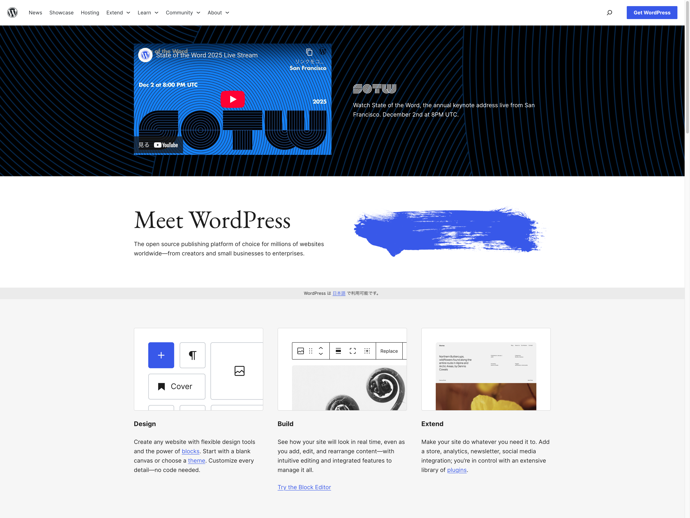
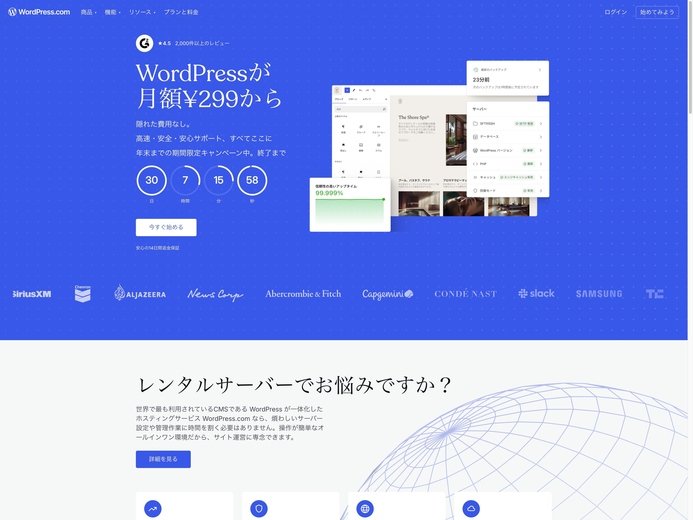
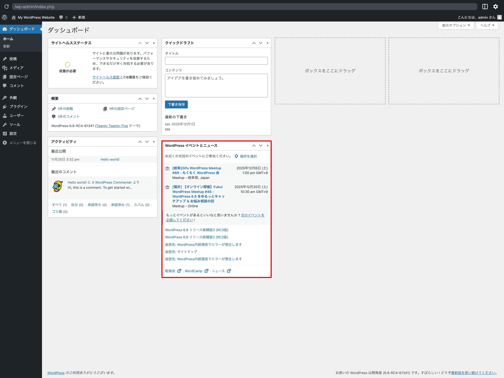

## WordPress とは

WordPress（ワードプレス）は、ブログから高機能なウェブサイトまで作れるオープンソースのソフトウェアです。世界のウェブ上の 43%以上のウェブサイトで利用されており、日本国内においては 80% を超える CMS（コンテンツ・マネージメント・システム）シェアを持っています。

## テーマとプラグイン

WordPress の大きな特徴として、「テーマ」と「プラグイン」の存在があります。WordPress.org 公式ディレクトリには、管理画面から検索し無料でインストールできるテーマやプラグインがたくさん公開されています。

テーマとは、ウェブサイトの見た目を管理する機能です。テーマを切り替えることで、ウェブサイトの見た目を簡単に変えられます。また、WordPress.org で公開されているテーマにおいては、テーマを切り替えてもコンテンツを維持した形でウェブサイトの運用を続けられるようになっています。

プラグインとは、ウェブサイトに機能を追加するものです。たとえば、ウェブサイトによくある機能としては、お問合せフォームや画像スライダーなどを見かけることがよくあるでしょう。そのような機能は（WordPress.org で公開されている）テーマには含まれていませんが、希望する機能を持ったプラグインをインストールし有効化することで、ウェブサイトに機能を追加できるのです。

これらテーマとプラグインをうまく使いこなすことが、WordPress を活用するための第一歩と言えるでしょう。

## ブロックテーマとクラシックテーマ

現在、WordPress には２つのテーマのスタイルがあります。1 つは **ブロックテーマ**、もう 1 つは **クラシックテーマ** です。これらはそれぞれ **テーマ** であることには変わりありませんが、それぞれ特徴に違いがあります。

### ブロックテーマ

ブロックテーマとは、ナビゲーションメニュー、サイトヘッダー、コンテンツ、サイトフッターなど、ウェブサイトのあらゆるパーツにブロックを使うテーマです。WordPress の最新機能を利用し、ウェブサイトのすべての部分を編集およびカスタマイズできるように構築されています。

そして、サイトエディターを使用して、コンテンツの内外にブロックを配置・編集ができます。あらかじめ用意されているテンプレートは、テーマによって違いがありますが、ユーザー独自に必要なテンプレートをサイトエディター上で用意できます。

### クラシックテーマ

クラシックテーマとは、旧来から WordPress で利用されているテーマの形で、PHP で記述されたテンプレートファイル（`single.php` など）が利用されます。

投稿や固定ページ内のコンテンツ部分はユーザーが手軽に管理できますが、サイトヘッダーやサイトフッターなどあらかじめレイアウトなどが固定されている部分をカスタマイズするためには、ユーザーが PHP ファイルを直接編集などする必要があります。

代表的な機能としては、

- カスタマイザー（外観内「カスタマイズ」にて利用可能）
- メニュー
- ウィジェット

などを使い、ウェブサイトの設定変更・カスタマイズが行えます。

WordPress デフォルトテーマでは、Twenty Twenty-One 以前がクラシックテーマ、Twenty Twenty-Two 以降がブロックテーマになります。

## 標準テーマとは

WordPress 標準テーマ（またはデフォルトテーマとも呼ぶ）とは、WordPress をインストールした際に最初から入っているテーマのことを言います。

現在、WordPress 6.9 の時点で最初に搭載されているテーマは Twenty Twenty-Five になっています。この標準テーマ以前にも多くの標準テーマが公開されており、年数にちなんだテーマ名が付けられることで知られています。

上述しているように、Twenty Twenty-One まではクラシックテーマというスタイルでしたが、Twenty Twenty-Two からはブロックテーマのスタイルで標準テーマが作られるようになっています。

また、運用しているウェブサイトに何か問題が発生した場合に、問題解決の糸口を見つける方法（デバッグとも呼ぶ）の 1 つとして、有効化しているテーマを標準テーマに切り替えて動作確認を行うという方法があります。 この動作確認を行うことで、テーマに問題があるのか、それ以外に問題があるのかを検証できます。

- `https://developer.wordpress.org/advanced-administration/wordpress/common-errors/`

## WordPress.org と WordPress.com の違い

WordPress には２種類あります。WordPress.org と WordPress.com です。

{width=91.22mm}

WordPress.org（ワードプレス・ドット・オルグ）は、WordPress のセルフホスティングインストール型の公式サイトです。前述しているテーマやプラグインを自由に選択しインストールが可能で、カスタマイズの幅をかなり広いです。

ユーザー自身が用意したサーバーにインストールして利用できます。近年、有名なレンタルサーバー会社の多くでは、WordPress の簡単インストール機能があらかじめ用意されている場合があります。

世間一般で「WordPress」と言われる場合、こちらを指すことが圧倒的に多いでしょう。

{width=91.22mm}

また、WordPress.com（ワードプレス・ドット・コム）は、WordPress をホスティングし提供してくれるサービスです。無料で WordPress を使い始められます。

独自ドメインや広告を非表示にする場合には、別途有料プランへの加入が必要になります。しかし、最低限の情報発信を行うのみであれば、無料版でこちらを利用する場合もあるでしょう。

このように名称は似ていますが、できることなどは大きく違うため、違いを知っておくと良いでしょう。

## WordPress コミュニティ

現在、世界中に 700 近くの WordPress Meetup が活動しており、日本国内においては 27（2025 年 12 月時点）のグループが定期的に交流や情報交換の場を提供しています。そして、WordCamp という少し規模の大きな WordPress イベントも日本国内を含む世界各地で開催されています。

- 参照 : `https://ja.wordpress.org/team/handbook/meetup-organizer-handbook/japan-wordpress-meetup/`

WordPress ダッシュボードのウィジェットで、皆さんがアクセスしているエリアの近くで開催される WordPress コミュニティイベントのお知らせを確認できます。ぜひ、お近くの WordPress Meetup や WordCamp に遊びに行ってみてはいかがでしょうか。

{width=91.22mm}