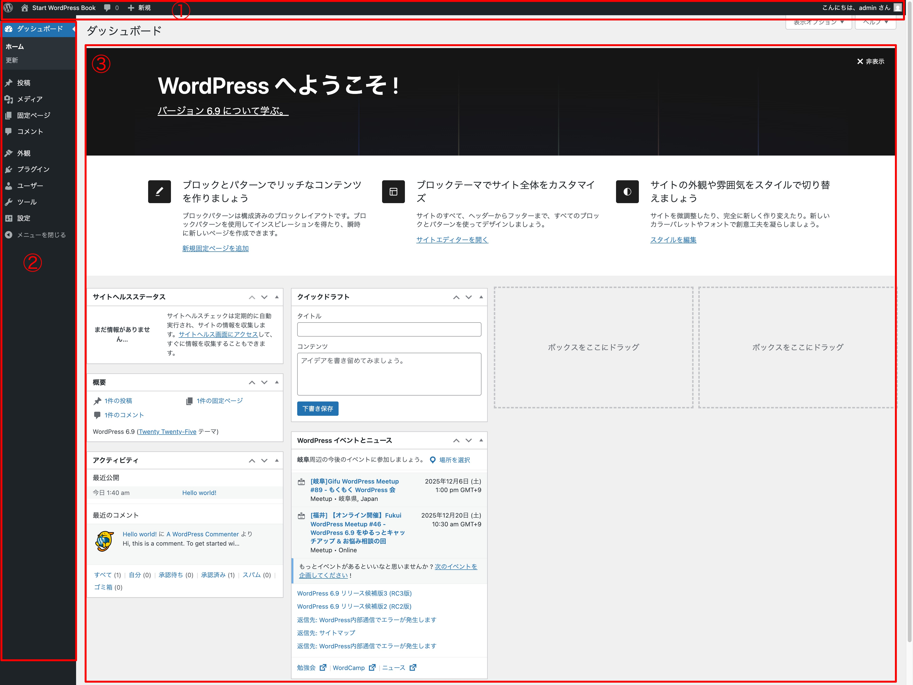

# 管理画面トップページ

WordPress の管理画面にログインすると、最初に表示されるのが下のような画面になっていると思います。本署で取り扱う各部分の名称を紹介します。公式ドキュメントにおいて複数の名称が使われている場合は、一番わかりやすいと判断した名称を本書では採用しています。

{width=91.22mm}

1. ツールバー 
2. メインナビゲーション（またはナビゲーションメニュー） 
3. ワークエリア