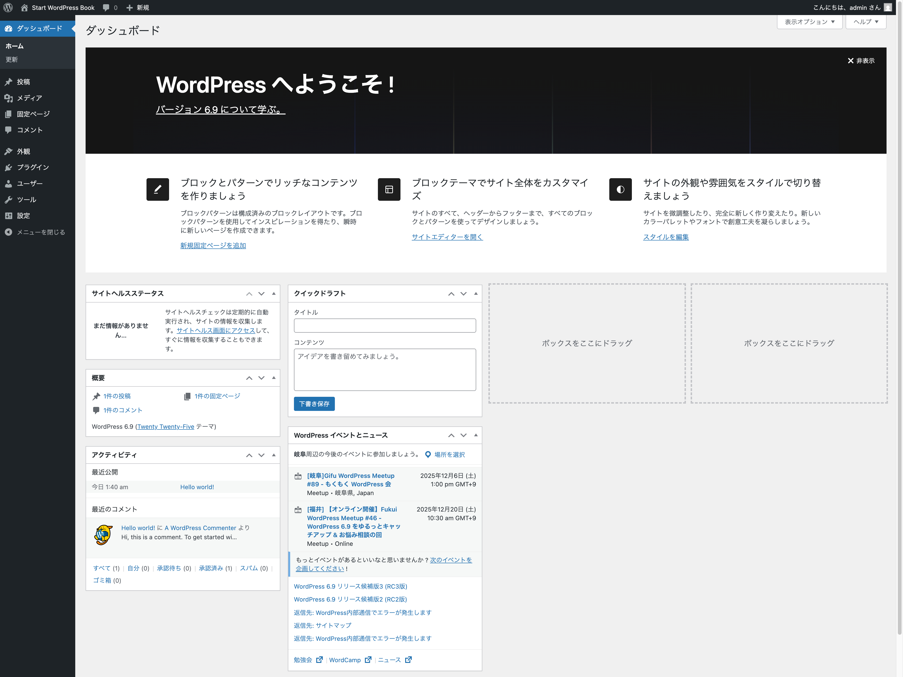
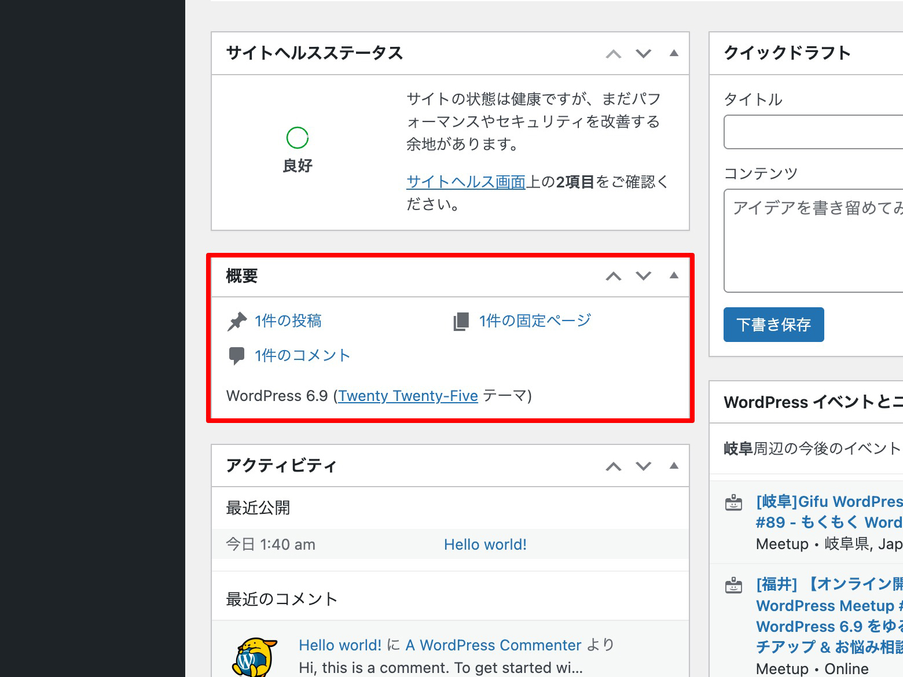
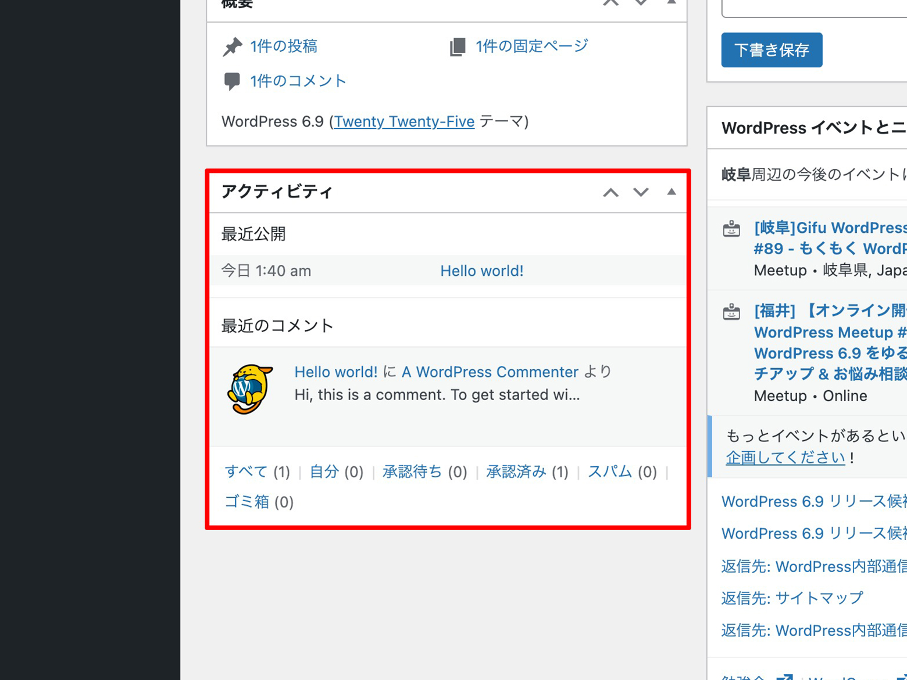
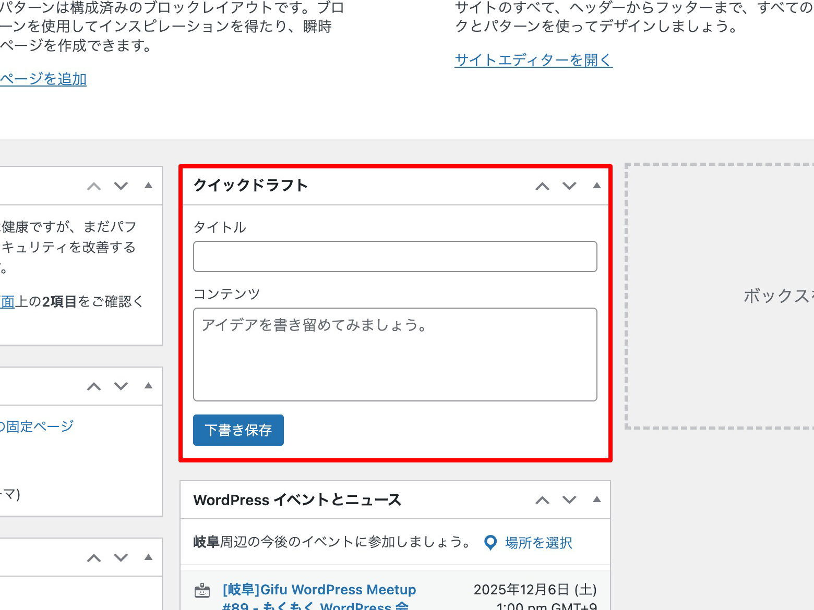
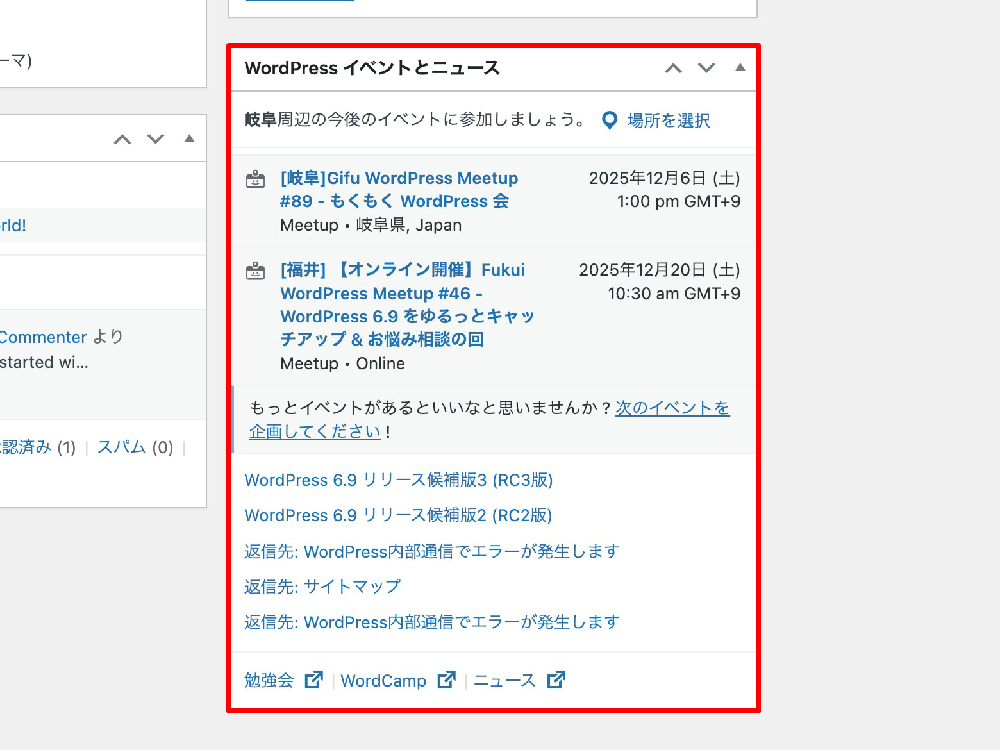

# ダッシュボード

{width=91.22mm}

ダッシュボードには、ウェブサイトと WordPress コミュニティの両方における最近のアクティビティと更新情報が表示されます。

また、利用するプラグインによっては、新たにダッシュボードにウィジェットが追加されることがあります。

## サイトヘルス

{width=91.22mm}

ウェブサイトの現在の状態の概要と、改善が必要な部分があるのかどうか簡単に確認できます。

## 概要

{width=91.22mm}

ウェブサイトのコンテンツの概要を表示し、使用している WordPress のテーマとバージョンを識別できます。

## アクティビティ

{width=91.22mm}

今後予定されている投稿や、最近公開された投稿、投稿に対する最新のコメントが表示され、それらを管理できます。

## クイックドラフト

{width=91.22mm}

新しい投稿を作成し、下書きとして保存できます。また、最近作成した下書き投稿５件へのリンクも表示されます。

## WordPress イベントとニュース

{width=91.22mm}

アクセスしている場所から近くで開催される予定の WordPress イベントと、直近に公開された WordPress に関するお知らせが表示されます。