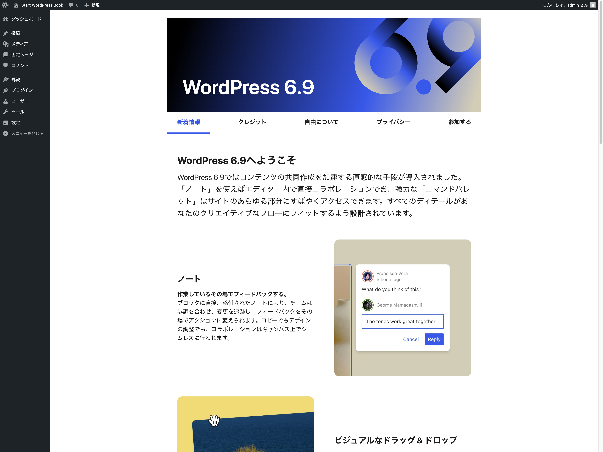
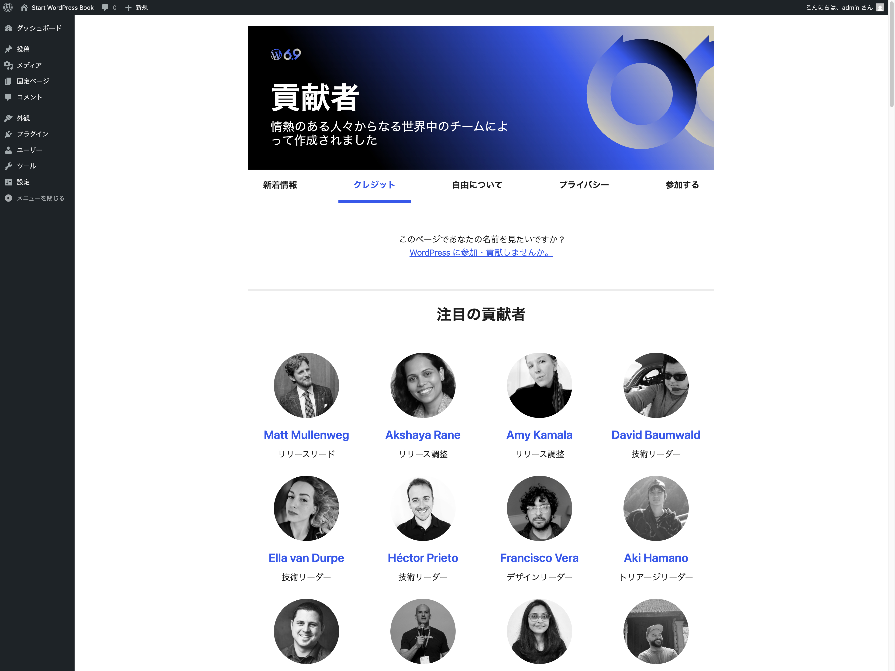
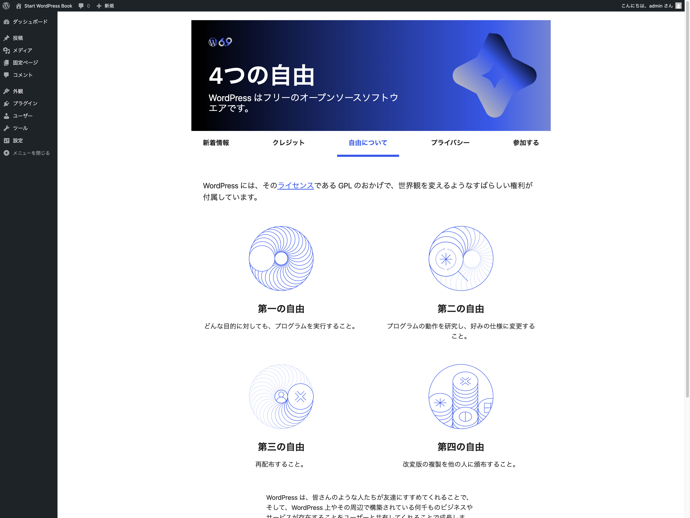
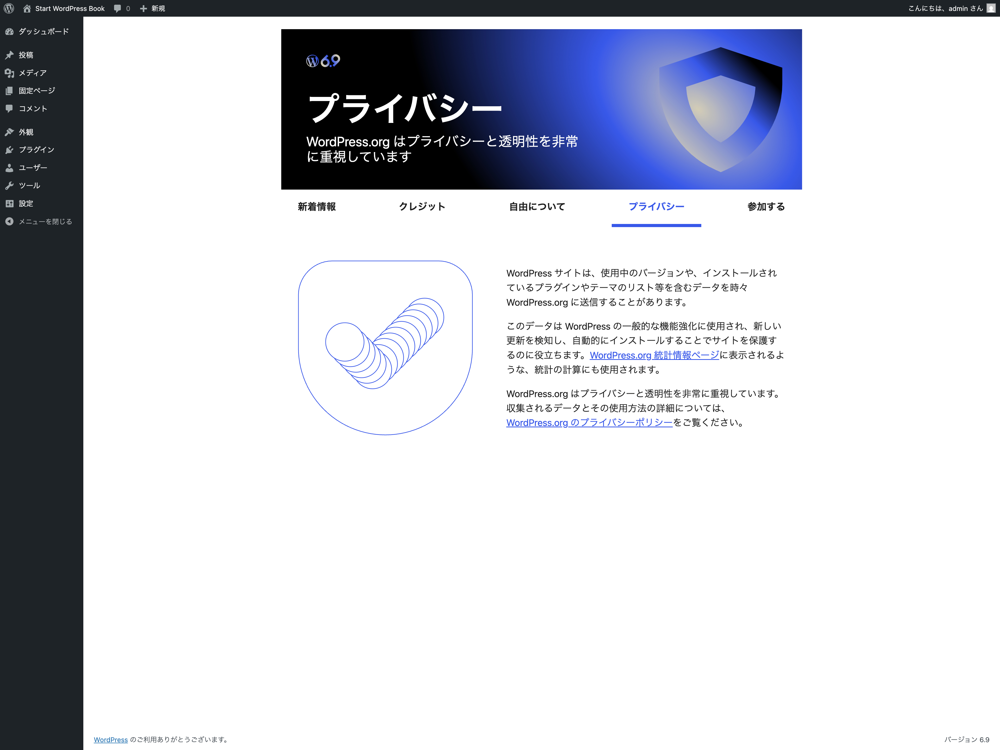
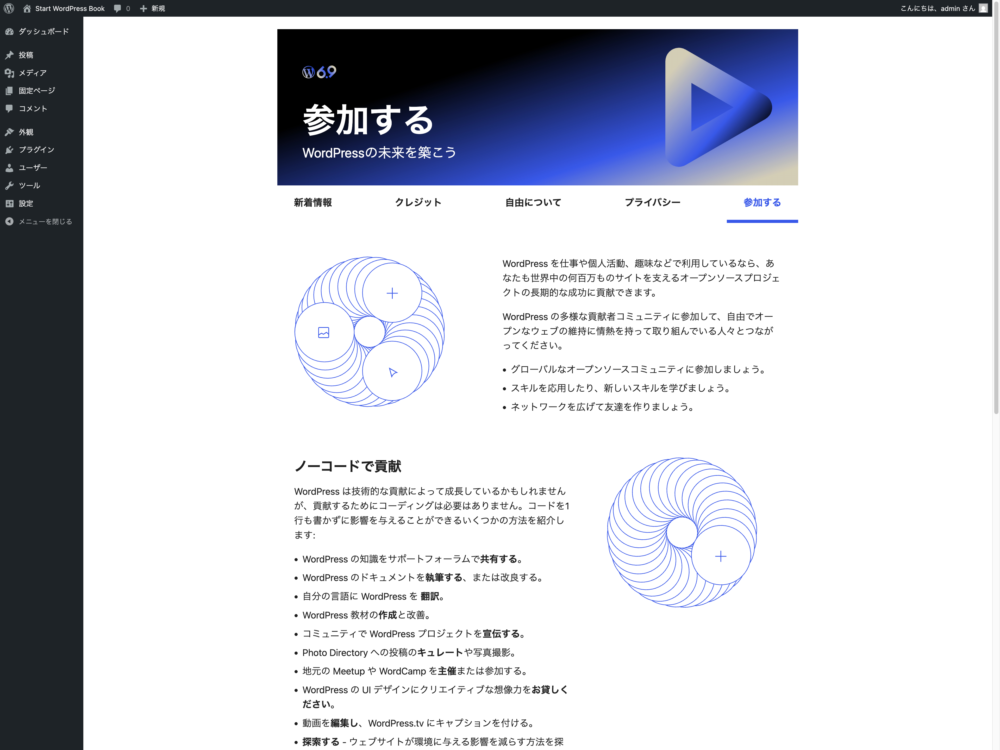
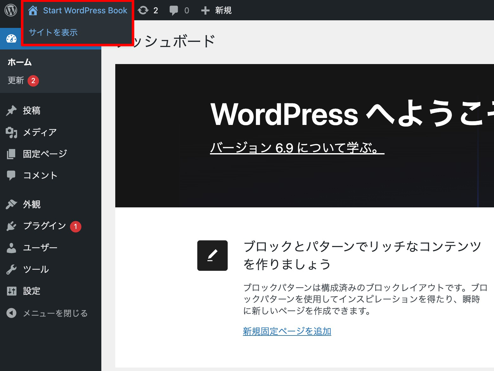
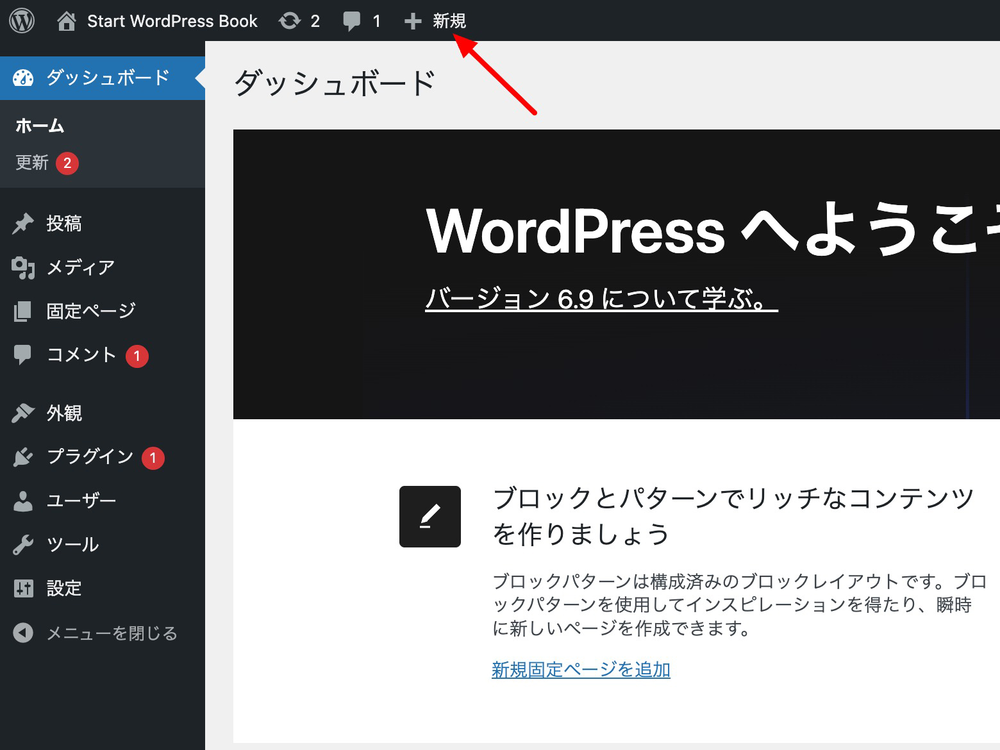
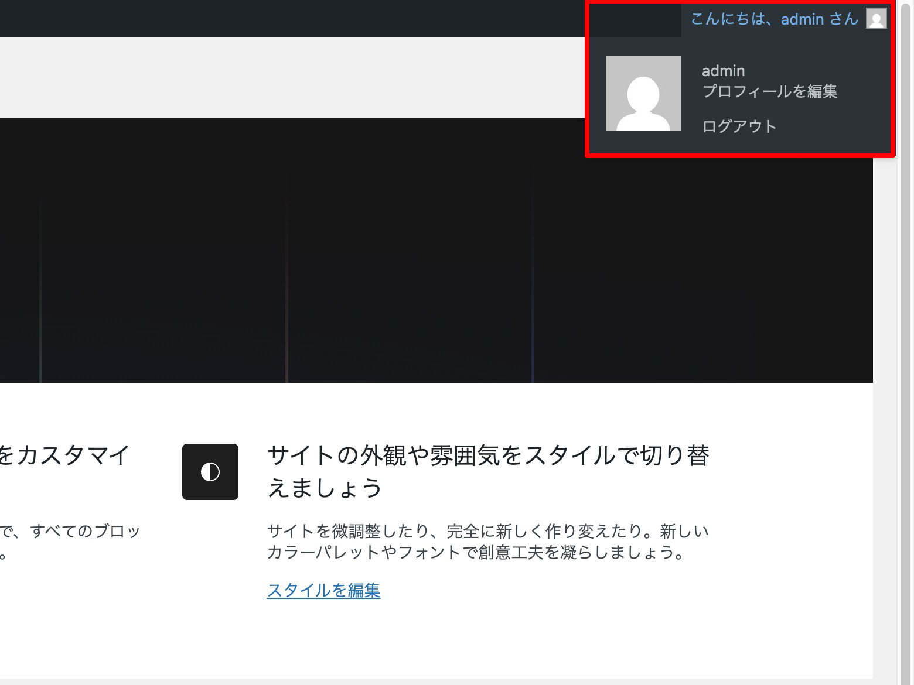

# ツールバー

ツールバーは、WordPress にログインしている状態であれば、管理画面内か実際の表示を確認している際かに関わらず、画面最上部に表示されるもので、新しい投稿の追加やプロフィールの編集など便利な管理画面へのリンク表示されます。

ツールバーの表示は、管理画面内で **ユーザー > あなたのプロフィール** の **ツールバー** から表示のオン/オフを切り替えられますが、管理画面を表示している際にはツールバーを非表示にすることはできなくなりました。

{width=91.22mm}

## WordPress ロゴメニュー

ツールバーの左端に位置する **WordPress ロゴメニュー** には、多くのメニューが含まれています。それらを紹介します。

### WordPress について

利用しているバージョンの WordPress についての情報が確認できます。

#### 新着情報

{width=91.22mm}

利用しているバージョンの WordPress の特徴を確認できます。そのバージョンで新しく使えるようになった機能や、リリースノート、フォールドガイドへのリンクも掲載されています。

#### クレジット

{width=91.22mm}

利用しているバージョンの WordPress がリリースされるにあたり、貢献活動に関わったコントリビューターを紹介しています。

#### 自由について

{width=91.22mm}

WordPress も採用している **GPL(GNU General Public License の略)** の **４つの自由** について紹介しています。

1. どんな目的に対しても、プログラムを実行すること。
2. プログラムの動作を研究し、好みの仕様に変更すること。
3. 再配布すること。
4. 改変版の複製を他の人に頒布すること。

また、WordPress の商標ガイドラインへのリンクや、GPL ではないプラグインやテーマをお勧めするというメッセージが掲載されています。

#### プライバシー

{width=91.22mm}

WordPress は、使用中のバージョンやインストールされているテーマやプラグインのリスト等を含むデータを、時折 WordPress.org に送信することがあります。 そのデータは、WordPress の機能強化の検討に仕様されたり、新しい更新を検知し自動的にインストールすることでウェブサイトを保護するために役立ちます。

これらのデータ取得などに関するプライバシーポリシーについての情報が紹介されています。

#### 参加する

WordPress は、世界中のユーザーの貢献活動によって支えられています。 コードを書くといった技術的な貢献活動だけではなく、コードを書かない **ノーコード** な貢献活動も可能です。 ここではさまざまな貢献活動を紹介し、未来の貢献者へのメッセージを紹介しています。

### 参加する

上に紹介した **WordPress について > 参加する** のページへ遷移します。

### WordPress.org

WordPress で設定されている言語に対応した WordPress.org 公式サイトへのリンクです。日本語環境の場合は、`https://ja.wordpress.org/` に遷移します。

### ドキュメンテーション

WordPress.org ウェブサイト内にあるサポートページへのリンクです。こちらでは、WordPress の基本的な使い方からカスタマイズ、トラブルシューティングなどに関する公式ドキュメントを確認できます。日本語環境の場合は `https://ja.wordpress.org/support/` へ遷移します。

### Learn WordPress

WordPress.org のコンテンツの一部である **Learn WordPress** へのリンクです。URL は `https://learn.wordpress.org/` になります。

WordPress が公式に提供する学習コンテンツで、これから使い始める方向けから開発者向けまで、幅広いコンテンツが提供されています。

### サポート

WordPress.org サポートフォーラムへのリンクです。選択している言語に対応したページへ遷移します。日本語の場合、URL は `https://ja.wordpress.org/support/forums/` になります。

WordPress.org サポートフォーラムは、コミュニティベースのサポートフォーラムです。質問者・回答者双方ともにリスペクトを忘れずに利用しましょう。そして、利用する前にリンクが用意されている「WordPress.org 日本語版サポートフォーラムへようこそ」ページを一読し、同様の質問が過去にされていないかを確認した後にフォーラムにトピックを作成するように心がけましょう。トピックを作成したり返答するためには WordPress.org アカウントが必要です。

### フィードバック

WordPress を使っていて、バグや不具合を発見した際にこちらから報告できます。

日本語環境の場合、`https://ja.wordpress.org/support/forum/feedback/` に遷移するので、WordPress.org アカウントにログインをしてトピックを作成して報告をします。

上記のサポートフォーラムと同じように、同様の報告が既にされていないかどうか確認した上でトピックを作成しましょう。

## サイト名

{width=91.22mm}

**設定 > 一般 > サイトのタイトル** で設定されているサイト名が表示されます。マウスカーソルでホバーすると「サイトを表示」というメニューが表示されますが、サイト名をクリックしても「サイトを表示」をクリックしても、遷移先は同じでウェブサイトのトップページへ遷移します。

## 更新

{width=91.22mm}

WordPress 本体、インストール済みのテーマやプラグインの中で、更新が可能なものがある場合に、こちらに更新マークと更新可能なプロダクトの数が表示されます。

## コメント数表示

{width=91.22mm}

投稿などに寄せられたコメントの中で、未承認状態のものがある際にここにその数が表示されます。

## 新規投稿等作成メニュー

{width=91.22mm}

投稿や固定ページ、メディアやユーザーなどを新規に作成したい場合に、こちらから素早く作業を進められます。

## アカウント情報メニュー

{width=91.22mm}

ツールバー右端に用意されているアカウント情報メニューについて紹介します。 こちらをホバーすると新たにメニューが表示されます。

### プロフィールを編集

ログインしているアカウントのプロフィールを編集できる画面へ遷移します。遷移先は、**管理画面 > ユーザー > プロフィール**と同じになります。

### ログアウト

ログインしているアカウントからログアウトします。

## 表示オプション

ツールバーの下にタブとして表示される表示オプションでは、特定の管理画面の作業領域に表示するフィールドやモジュールを変更できます。アクセスしている画面ごとに異なる画面オプション内容になるため、各ページでどんな表示オプションが選択できるのか注意深く確認してみると良いでしょう。

## ヘルプ

ツールバーの下、表示オプションの隣に表示される **ヘルプ** には、作業領域に表示されている画面に関連するヘルプ項目が表示されます。

ヘルプタブをクリックするとヘルプ項目が表示され、右下のタブをクリックすると折りたたまれます。