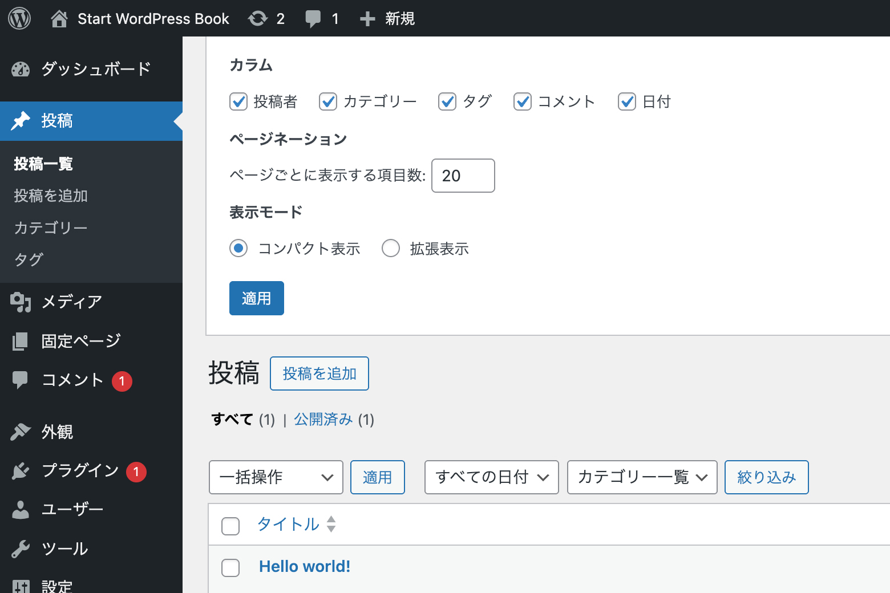
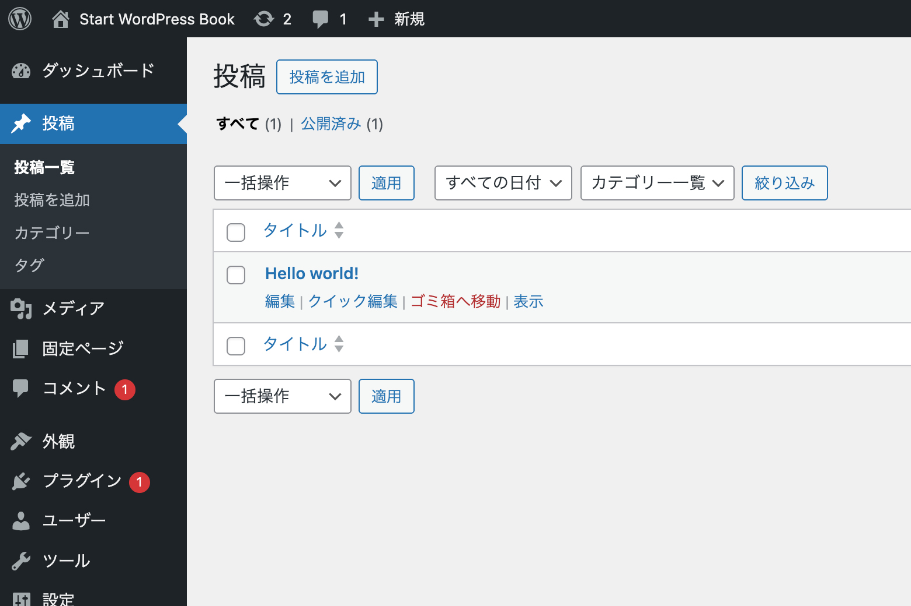
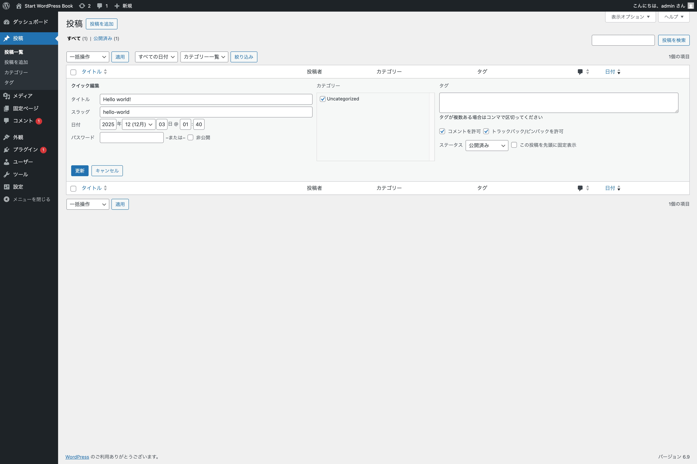
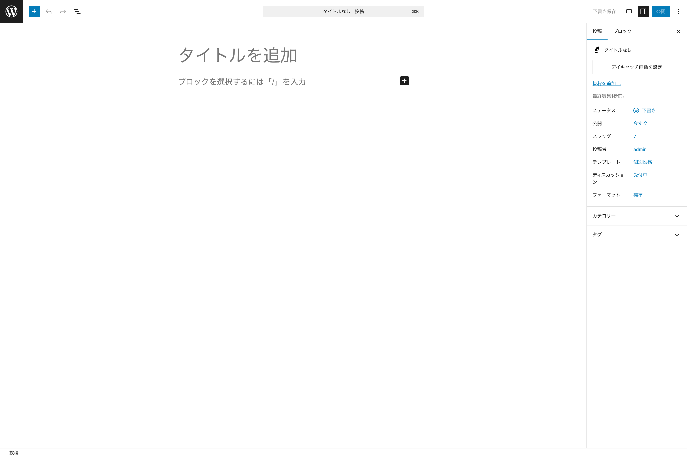
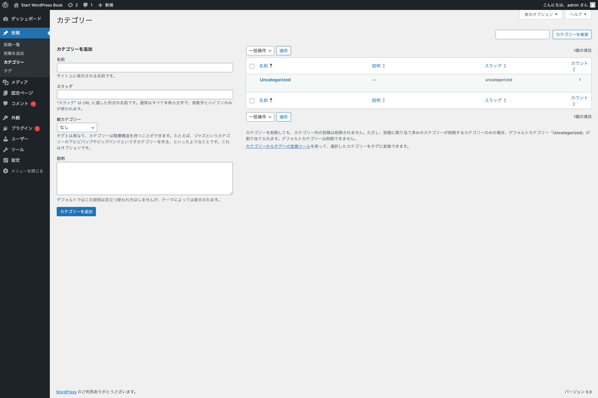
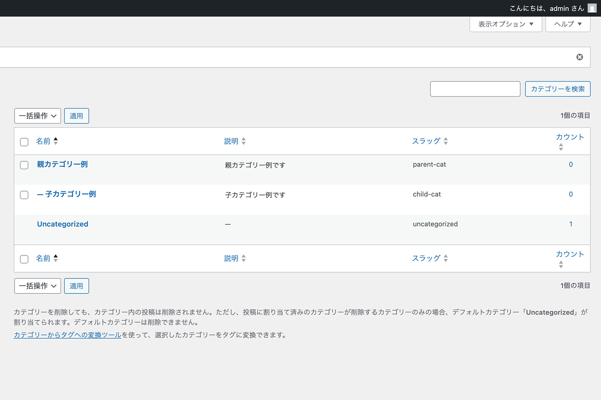
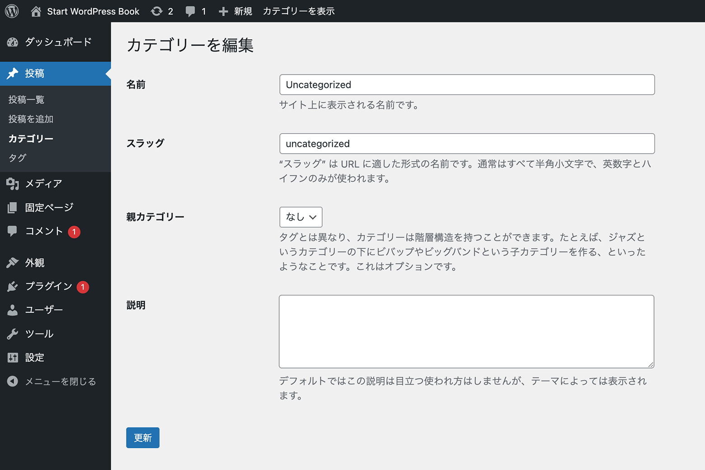
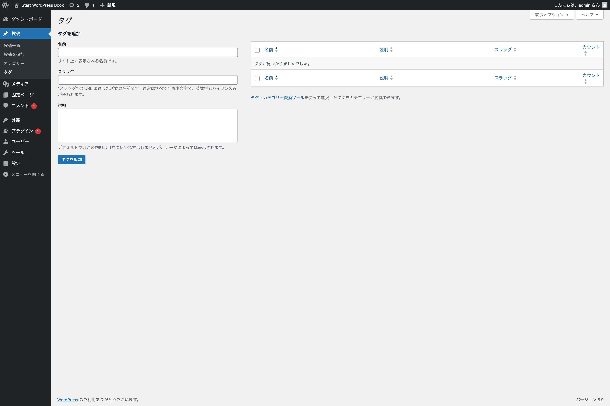

## 投稿

**投稿** を管理し、関係する設定ができます。

### 投稿一覧

{width=91.22mm}

投稿画面では、ウェブサイト内のすべての投稿を管理できます。この画面から、投稿の編集、削除、閲覧が可能です。また、フィルタリングや検索機能を使えば、特定の条件に一致する投稿を素早く簡単に見つけられます。

以下に、ページ上部に配置されているボタンやフォームについて紹介します。

- **投稿を追加** - 新しく投稿を追加できます。クリックすると投稿編集画面（デフォルトではブロックエディター）を開きます。
- **投稿を検索** - 投稿を検索できます。投稿数が多くなり、複数ページにまたがるようになった際にとても便利です。

次に、投稿一覧テーブルに含まれる項目や関連する機能について紹介します。

- **チェックボックス** - このチェックボックスをクリック（チェック）すると、特定の投稿が（テーブル上部左にある）一括操作で処理できるようになります。
- **タイトル** - 投稿のタイトルがリンクとして表示されます。タイトルをクリックすると、その投稿を編集できます。また、投稿が下書き、非公開、保留中、固定またはパスワード保護されている場合は、タイトル横に太字で表示されます。
- **投稿者** - 投稿を執筆した投稿者がリンク形式で表示されます。投稿者名をクリックすると、その投稿者が作成したすべての投稿が投稿一覧に表示されます。
- **カテゴリー** - この投稿が属するすべてのカテゴリーをリンク形式で表示されます。各カテゴリーリンクをクリックすると、そのカテゴリーに割り当てられた投稿が一覧表示されます。
- **タグ** - 投稿に関連付けられたすべてのタグがリスト形式で表示されます。各タグリンクをクリックすると、そのタグが割り当てられた投稿が一覧表示されます。
- **コメントアイコン** - 投稿に寄せられたコメントの中で承認されたコメントの数がバブルアイコンの中に表示されます。承認されていないコメントがある場合は、バブルアイコンの右上に赤丸数字で件数が表示されます。
- **日付** - 公開済みの投稿の場合は**公開日**が、その他の場合は**最終更新日**が表示されます。また、予約投稿の場合には**公開予定日**が表示されます。

テーブル上部には、**一括操作** 以外に、年月で絞り込みができる**全ての日付**や、カテゴリー別に絞り込みができる**カテゴリー一覧**というセレクトボックスが用意されています。

画面右上にある**表示オプション**では、以下のようなメニューが用意されています。

{width=91.22mm}

- **カラム** - デフォルトでは全てにチェックが入っていますが、表示する必要がないカラムはチェックを外すことで非表示に切り替えられます。
- **ページネーション** - １ページに表示する投稿の項目数を変更できます。
- **表示モード** - デフォルトでは**コンパクト表示**になっていますが、抜粋文やテーブル行にマウスカーソルを乗せないと表示されないメニューなどを常時表示させる**拡張表示**を選ぶこともできます。

先ほどの**表示モード**を**拡張表示**にすることで常時表示されるメニューについて紹介します。こちらはデフォルトでは、投稿一覧テーブルの各行にマウスカーソルを乗せることで表示させられます。以後、このメニューを**即時アクション**と呼びます。

{width=91.22mm}

- **編集** - 投稿を編集できます。投稿のタイトルリンクをクリックした際の移動先と同じく、エディターが開きます。
- **クイック編集** - こちらをクリックすると、タイトルやスラッグ、日付、カテゴリーやタグといった項目を素早く編集できます。投稿編集画面を開くまでもない編集に最適です。
- **ゴミ箱へ移動** - 投稿をゴミ箱へ移動します。こちらをクリックすると投稿が削除されたように感じますが、実際にはゴミ箱に移動されただけで**完全な削除にはなりません**。完全な削除を行う場合には、ゴミ箱からも削除する必要があります。なお、公開状態の投稿をゴミ箱へ移動し復元した場合、直ちに公開状態にはならず下書き状態になります。
- **表示** - 実際の表示を確認できます。リンクをクリックすると該当する投稿の実際の表示を確認できます。

{width=91.22mm}

### 投稿を追加

{width=91.22mm}

**投稿を追加**をクリックすると、新規投稿を作成するためにブロックエディターが表示されます。ブロックエディターについては別章で取り上げます。

### カテゴリー

WordPress の各投稿は、1 つ以上のカテゴリーに分類されます。これにより、投稿を土曜のコンテンツの他の投稿とグループ化できます。

各カテゴリーは親カテゴリーに割り当てることが可能で、これによりカテゴリー構造ないに階層構造を設定できます。

{width=91.22mm}

こちらの画面は、

- **新しいカテゴリーを追加する**セクション
- **既存のカテゴリーを編集または削除する**セクション

#### カテゴリーを追加

新しいカテゴリーを追加するセクションでは、以下のような設定項目が用意されています。

- **名前** - カテゴリー名を設定します。カテゴリー名は一意である必要があります。
- **スラッグ** - カテゴリースラッグも一意である必要があります。こちらは URL で使用されます。
- **親カテゴリー** - 登録しているカテゴリーを子カテゴリーにしたい場合には、こちらで**親カテゴリー**を指定します。
- **説明** - こちらはオプションです。テーマやテンプレートの設定によっては表示されないものもあります。

例えば、カテゴリー名に**カメラ**、スラッグに**camera**と指定した場合、`sample.com/blog/food/` のような URL を持つ**カメラ**の投稿すべて表示されます。このようにスラッグはアーカイブ一覧の URL にも関係することに留意しておきましょう。

#### カテゴリー一覧

こちらのカテゴリー一覧では、階層ごとかつアルファベット順に表示されます。子カテゴリーは親カテゴリーの下に表示され、先頭にハイフン（横線）が付きます。

{width=91.22mm}

カテゴリー一覧には以下のような項目があります。

- **チェックボックス** - チェックを入れると上の**一括操作**で**削除**を選択して、カテゴリーを一括削除できます。
- **名前** - カテゴリーの名前が表示されます。
- **説明** - カテゴリーの説明が表示されます。
- **スラッグ** - カテゴリーのスラッグが表示されます。
- **カウント** - カテゴリーに属する投稿の数が表示されます。テキストリンクになっている数字をクリックすると、**投稿一覧のカテゴリーが絞り込まれた状態の画面**に移動します。

画面右上にある**表示オプション**では、**カラム**や**ページネーション**（前述のため説明省略）が設定・変更できます。

カテゴリー一覧でカテゴリーにマウスカーソルを乗せると、**即時アクション**が表示されます。

- **編集** - 該当するカテゴリーの編集画面を表示します。
- **クイック編集** - こちらをクリックすると、**名前**や**スラッグ**を素早く編集できます。
- **表示** - 該当するカテゴリーアーカイブページを表示します。

#### カテゴリーを編集

{width=91.22mm}

カテゴリー一覧から任意のカテゴリー名をクリック、または即時アクションから**編集**をクリックすると、カテゴリーを編集できるページへ移動します。こちらでは、カテゴリーを新規追加した際に入力した内容を編集できます。また、クイック編集では編集できない**親カテゴリー**や**説明**が編集可能です。

### タグ `https://wordpress.org/documentation/article/posts-tags-screen/`

{width=91.22mm}

WordPress のすべての投稿はタグに分類できます。**カテゴリーとは違い、タグには階層構造がないため親子関係を持ちません。**しかし、タグ名とスラッグはカテゴリーと同様に一意である必要があります。

**タグを追加**、**タグ一覧**、**タグの編集**でできることは、カテゴリーで説明した内容と重複するため割愛します。