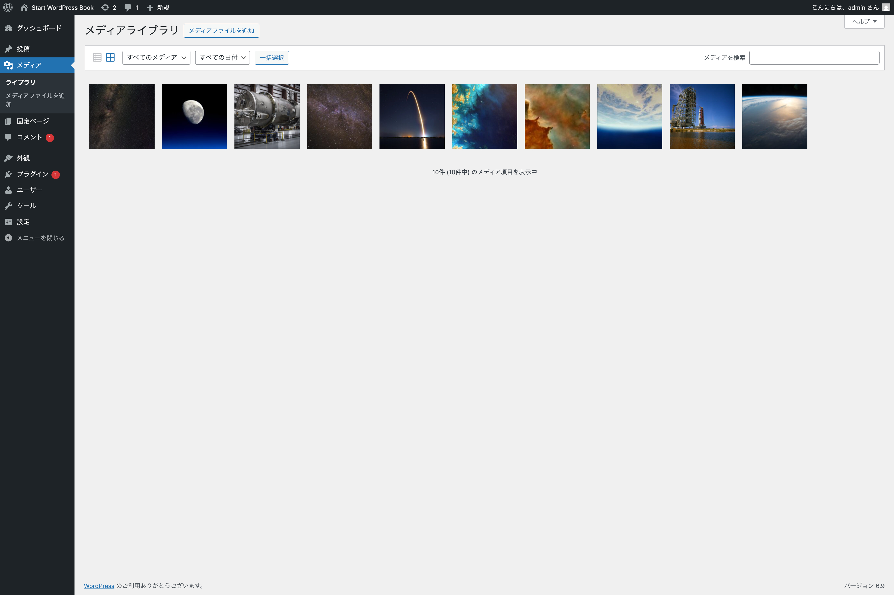
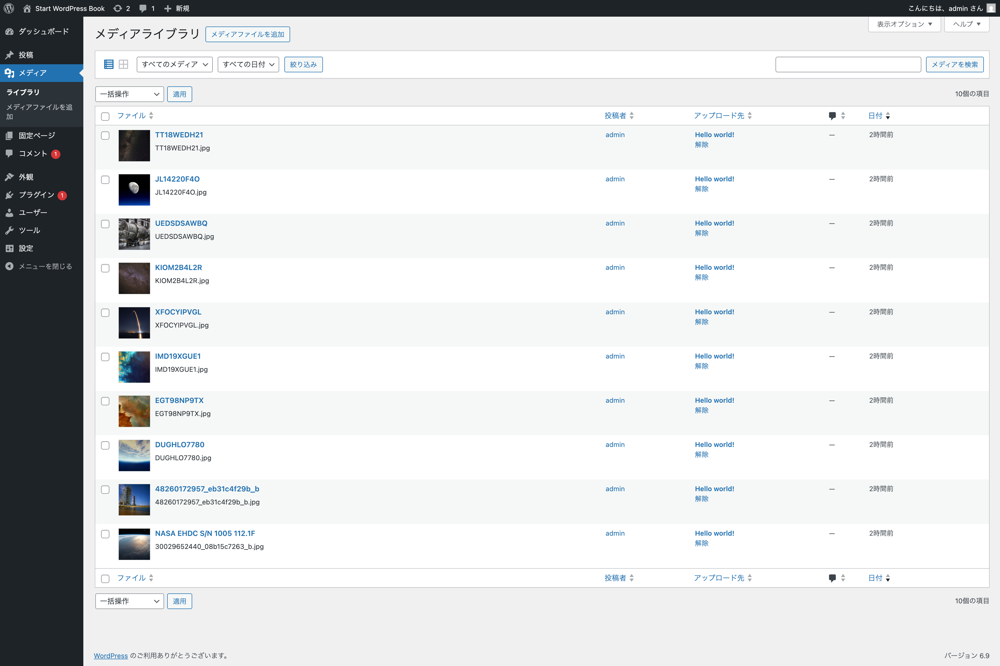
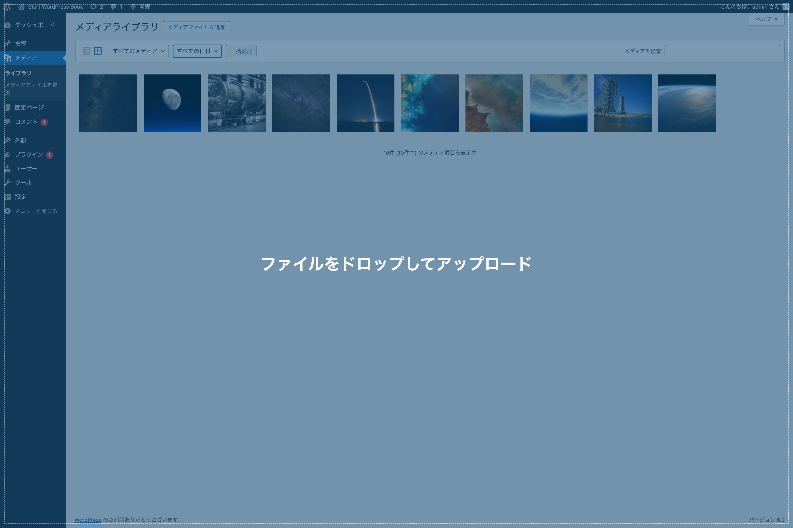
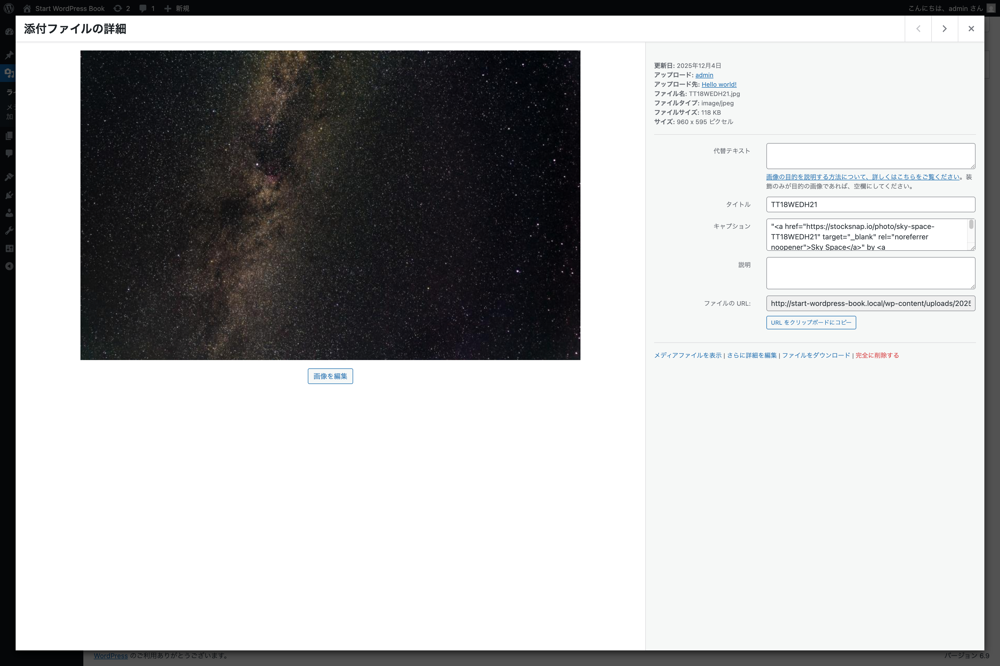
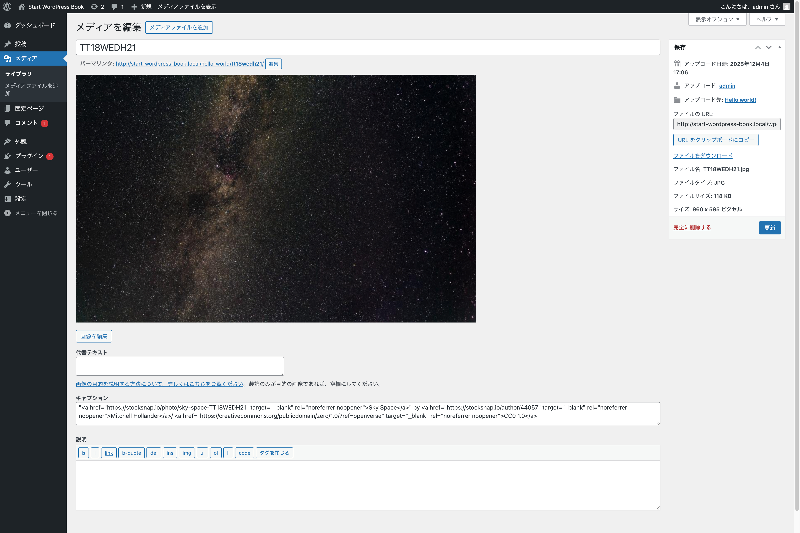
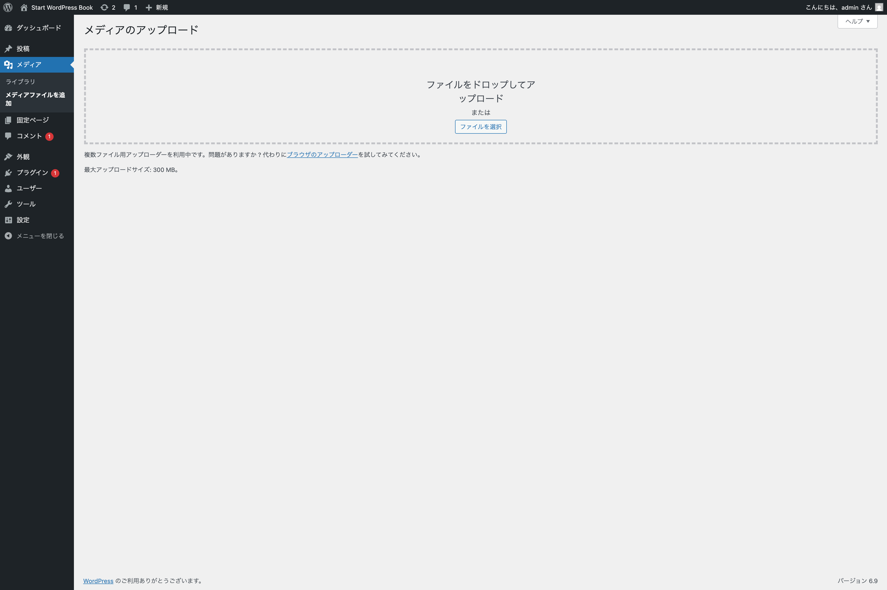
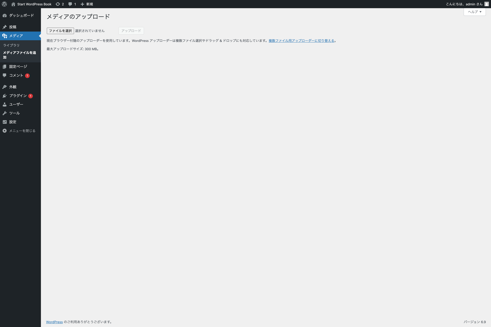

## メディア

メディアとは、WordPress にアップロードして使用する画像や動画、音声ファイルなどを指します。通常、投稿や固定ページの作成時にアップロードされ、コンテンツに挿入されます。

### ライブラリ

{width=91.22mm}

ナビゲーションメニューの**メディア**をクリックすると**ライブラリ**に移動します。ここでは、アップロードしたメディアを表示・編集・削除できます。

メディア一覧の上部左に、**リストアイコン**と**グリッドアイコン**（デフォルトではアクティブ）があります。これらを切り替えてメディア一覧のレイアウトを変更できます。

{width=91.22mm}

また、メディアの種類（画像・音声ファイル・動画など）や年月別で絞り込みができます。さらに、メディアに登録されているタイトルなどのテキストをもとに検索もできます。

最上部にある**メディアファイルを追加**ボタンをクリックすることで、新しくメディアを追加できます。また、その動作をしなくても新規追加したいファイルをメディア一覧にドラッグ＆ドロップするだけでもアップロードできます。（複数のファイルを一度にアップロードも可能です）

{width=91.22mm}

#### 添付ファイルの詳細

メディア一覧から任意のメディアをクリックすると、メディア情報の設定・編集ができます。

{width=91.22mm}

こちらで閲覧できる情報は以下の通りです。

- **更新日** - メディアがアップロードされた日付
- **アップロード** - メディアをアップロードしたアカウント
- **アップロード先** - このメディアを含む投稿または固定ページ名
- **ファイル名** - メディアファイルの名前
- **ファイルタイプ** - メディアファイルの MIME タイプ
- **ファイルサイズ** - メディアファイルのファイルサイズ
- **サイズ**（画像ファイルのみ）- 画像メディアのサイズ

そして、設定・編集できる情報は以下の通りです。

- **代替テキスト**（画像ファイルのみ）- 画像の代替テキスト
- **タイトル** - メディアの名前
- **キャプション** - メディアに掲載するキャプション
- **説明** - メディアの説明
- **ファイルURL**（編集不可）ーメディアファイルへの直接リンク
- **アーティスト名**（音声ファイルのみ）- このメディアの歌手・作曲家・またはプロデューサー
- **アルバム**（音声ファイルのみ）- このメディアが含まれるアルバムのタイトル

さらに、その下にリンクメニューが用意されています。

- **メディアファイルを表示** - メディアファイルに直接アクセスします
- **さらに詳細を編集** - より詳細にメディアの情報を編集できます
- **ファイルをダウンロード** - メディアファイルをダウンロードします
- **完全に削除する** - メディアファイルを完全に削除します

{width=91.22mm}

### メディアファイルを追加

{width=91.22mm}

こちらはメディアをアップロードする専用のメニューになっており、単体のファイルをアップロードすることもできますし、複数のファイルを一括でアップロードもできます。

通常、ナビゲーションメニューから移動して開くのは**複数ファイル用アップローダー**ですが、ファイルのドロップエリアの下部にある**「ブラウザのアップローダー」**をクリックすることで、単一ファイル専用のアップローダーに切り替えることも可能です。

{width=91.22mm}