# メインナビゲーション（ナビゲーションメニュー）

{width=91.22mm}

管理画面にログインすると左サイドバーに見えるのが **メインナビゲーション**です。または、ナビゲーションメニューとも呼ばれたりします。

呼ばれ方はさまざまありますが、それほど名称にこだわる必要がありません。

## ダッシュボード

### ホーム

**ダッシュボード > ホーム** は、WordPress 管理画面にログインしたら通常最初に表示される画面です。

### 更新 `https://wordpress.org/documentation/article/dashboard-updates-screen/`

**ダッシュボード > 更新** には、WordPress 本体のアップデートを自動的に行ったり、手動アップデートを完了するために必要なファイルをダウンロードしたりするために必要なリンクが表示されています。

{width=91.22mm}

最新の WordPress を利用している場合、上のように **「最新バージョンの WordPress をお使いです。」** と表示されます。よって、WordPress 本体に対するアップデートは、実施できるものはないと判断できます。

また、WordPress 本体に関する **自動アップデートの設定** も確認しておくと良いでしょう。

#### マイナーアップデートのみ自動になっている場合

**マイナーアップデート** とは、バージョン番号が `6.9.0` から `6.9.1` などに変わるアップデートを指します。マイナーアップデートには、軽微なバグ修正やセキュリティに関する修正が含まれることが多いです。

この **マイナーアップデートのみ自動更新** になっている状態は以下のような状態です。ご自身の環境で確認してみてください。

- **「このサイトは WordPress のメンテナンスリリースとセキュリティリリースのみで自動的に最新の状態に保たれます。」** というメッセージが表示されている
- その下に **「WordPress のすべての新しいバージョンに対する自動更新を有効にします。」** というテキストリンクが表示されている

{width=91.22mm}

#### メジャーアップデートを含む全てのアップデートが自動になっている場合

全てのアップデートを自動に設定することもできます。これは **メジャーアップデート** も含む自動設定になります。

**メジャーアップデート** とは、バージョン番号が `6.8` から `6.9` などに変わるアップデートを指します。メジャーアップデートには、機能追加や大きな変更を伴う場合もあるので、あらかじめ安全な環境を別途用意してテストを行ってから、本番環境でアップデートを実施することをお勧めします。

この **全てのアップデートが自動更新** になっている状態は、以下のような状態です。ご自身の環境で確認してみてください。

- **「このサイトは WordPress の新しいバージョンごとに自動的に最新の状態に保たれます。」**というメッセージが表示されている
- その下に **「メンテナンスリリースとセキュリティリリースのみの自動更新に切り替えます。」** というテキストリンクが表示されている

{width=91.22mm}

#### プラグインやテーマのアップデート

利用可能なアップデートがある全てのプラグインとテーマをアップデートできます。また、言語を英語（米語）以外に設定している場合は、翻訳アップデートもインストールされます。

{width=91.22mm}

テーマやプラグインの自動更新設定は、別途それぞれのメニュー内で行えます。

## 投稿

### 投稿一覧

{width=91.22mm}

ナビゲーションメニューから**投稿**を選択すると、この**投稿一覧**に移動します。ここでは、WordPress 内のすべての投稿を管理できます。この画面から、投稿の編集、削除、閲覧が可能です。また、フィルタリングや検索機能を使えば、特定の条件に一致する投稿を素早く簡単に見つけられます。

以下に、ページ上部に配置されているボタンやフォームについて紹介します。

- **投稿を追加** - 新しく投稿を追加できます。クリックすると投稿編集画面（デフォルトではブロックエディター）を開きます。
- **投稿を検索** - 投稿を検索できます。投稿数が多くなり、複数ページにまたがるようになった際にとても便利です。

次に、投稿一覧テーブルに含まれる項目や関連する機能について紹介します。

- **チェックボックス** - このチェックボックスをクリック（チェック）すると、特定の投稿が（テーブル上部左にある）一括操作で処理できるようになります。
- **タイトル** - 投稿のタイトルがリンクとして表示されます。タイトルをクリックすると、その投稿を編集できます。また、投稿が下書き、非公開、保留中、固定またはパスワード保護されている場合は、タイトル横に太字で表示されます。
- **投稿者** - 投稿を執筆した投稿者がリンク形式で表示されます。投稿者名をクリックすると、その投稿者が作成したすべての投稿が投稿一覧に表示されます。
- **カテゴリー** - この投稿が属するすべてのカテゴリーをリンク形式で表示されます。各カテゴリーリンクをクリックすると、そのカテゴリーに割り当てられた投稿が一覧表示されます。
- **タグ** - 投稿に関連付けられたすべてのタグがリスト形式で表示されます。各タグリンクをクリックすると、そのタグが割り当てられた投稿が一覧表示されます。
- **コメントアイコン** - 投稿に寄せられたコメントの中で承認されたコメントの数がバブルアイコンの中に表示されます。承認されていないコメントがある場合は、バブルアイコンの右上に赤丸数字で件数が表示されます。
- **日付** - 公開済みの投稿の場合は**公開日**が、その他の場合は**最終更新日**が表示されます。また、予約投稿の場合には**公開予定日**が表示されます。

テーブル上部には、**一括操作** 以外に、年月で絞り込みができる**全ての日付**や、カテゴリー別に絞り込みができる**カテゴリー一覧**というセレクトボックスが用意されています。

画面右上にある**表示オプション**では、以下のようなメニューが用意されています。

{width=91.22mm}

- **カラム** - デフォルトでは全てにチェックが入っていますが、表示する必要がないカラムはチェックを外すことで非表示に切り替えられます。
- **ページネーション** - １ページに表示する投稿の項目数を変更できます。
- **表示モード** - デフォルトでは**コンパクト表示**になっていますが、抜粋文やテーブル行にマウスカーソルを乗せないと表示されないメニューなどを常時表示させる**拡張表示**を選ぶこともできます。

先ほどの**表示モード**を**拡張表示**にすることで常時表示されるメニューについて紹介します。こちらはデフォルトでは、投稿一覧テーブルの各行にマウスカーソルを乗せることで表示させられます。以後、このメニューを**即時アクション**と呼びます。

{width=91.22mm}

- **編集** - 投稿を編集できます。投稿のタイトルリンクをクリックした際の移動先と同じく、エディターが開きます。
- **クイック編集** - こちらをクリックすると、タイトルやスラッグ、日付、カテゴリーやタグといった項目を素早く編集できます。投稿編集画面を開くまでもない編集に最適です。
- **ゴミ箱へ移動** - 投稿をゴミ箱へ移動します。こちらをクリックすると投稿が削除されたように感じますが、実際にはゴミ箱に移動されただけで**完全な削除にはなりません**。完全な削除を行う場合には、ゴミ箱からも削除する必要があります。なお、公開状態の投稿をゴミ箱へ移動し復元した場合、直ちに公開状態にはならず下書き状態になります。
- **表示** - 実際の表示を確認できます。リンクをクリックすると該当する投稿の実際の表示を確認できます。

{width=91.22mm}

### 投稿を追加

{width=91.22mm}

**投稿を追加**をクリックすると、新規投稿を作成するためにブロックエディターが表示されます。ブロックエディターについては別章で取り上げます。

### カテゴリー

WordPress の各投稿は、1 つ以上のカテゴリーに分類されます。これにより、投稿を土曜のコンテンツの他の投稿とグループ化できます。

各カテゴリーは親カテゴリーに割り当てることが可能で、これによりカテゴリー構造ないに階層構造を設定できます。

{width=91.22mm}

こちらの画面は、

- **新しいカテゴリーを追加する**セクション
- **既存のカテゴリーを編集または削除する**セクション

#### カテゴリーを追加

新しいカテゴリーを追加するセクションでは、以下のような設定項目が用意されています。

- **名前** - カテゴリー名を設定します。カテゴリー名は一意である必要があります。
- **スラッグ** - カテゴリースラッグも一意である必要があります。こちらは URL で使用されます。
- **親カテゴリー** - 登録しているカテゴリーを子カテゴリーにしたい場合には、こちらで**親カテゴリー**を指定します。
- **説明** - こちらはオプションです。テーマやテンプレートの設定によっては表示されないものもあります。

例えば、カテゴリー名に**カメラ**、スラッグに**camera**と指定した場合、`sample.com/blog/food/` のような URL を持つ**カメラ**の投稿すべて表示されます。このようにスラッグはアーカイブ一覧の URL にも関係することに留意しておきましょう。

#### カテゴリー一覧

こちらのカテゴリー一覧では、階層ごとかつアルファベット順に表示されます。子カテゴリーは親カテゴリーの下に表示され、先頭にハイフン（横線）が付きます。

{width=91.22mm}

カテゴリー一覧には以下のような項目があります。

- **チェックボックス** - チェックを入れると上の**一括操作**で**削除**を選択して、カテゴリーを一括削除できます。
- **名前** - カテゴリーの名前が表示されます。
- **説明** - カテゴリーの説明が表示されます。
- **スラッグ** - カテゴリーのスラッグが表示されます。
- **カウント** - カテゴリーに属する投稿の数が表示されます。テキストリンクになっている数字をクリックすると、**投稿一覧のカテゴリーが絞り込まれた状態の画面**に移動します。

画面右上にある**表示オプション**では、**カラム**や**ページネーション**（前述のため説明省略）が設定・変更できます。

カテゴリー一覧でカテゴリーにマウスカーソルを乗せると、**即時アクション**が表示されます。

- **編集** - 該当するカテゴリーの編集画面を表示します。
- **クイック編集** - こちらをクリックすると、**名前**や**スラッグ**を素早く編集できます。
- **表示** - 該当するカテゴリーアーカイブページを表示します。

#### カテゴリーを編集

{width=91.22mm}

カテゴリー一覧から任意のカテゴリー名をクリック、または即時アクションから**編集**をクリックすると、カテゴリーを編集できるページへ移動します。こちらでは、カテゴリーを新規追加した際に入力した内容を編集できます。また、クイック編集では編集できない**親カテゴリー**や**説明**が編集可能です。

### タグ

{width=91.22mm}

WordPress のすべての投稿はタグに分類できます。**カテゴリーとは違い、タグには階層構造がないため親子関係を持ちません。**しかし、タグ名とスラッグはカテゴリーと同様に一意である必要があります。

**タグを追加**、**タグ一覧**、**タグの編集**でできることは、カテゴリーで説明した内容と重複するため割愛します。

## メディア

メディアとは、WordPress にアップロードして使用する画像や動画、音声ファイルなどを指します。通常、投稿や固定ページの作成時にアップロードされ、コンテンツに挿入されます。

### ライブラリ

{width=91.22mm}

ナビゲーションメニューの**メディア**をクリックすると**ライブラリ**に移動します。ここでは、アップロードしたメディアを表示・編集・削除できます。

メディア一覧の上部左に、**リストアイコン**と**グリッドアイコン**（デフォルトではアクティブ）があります。これらを切り替えてメディア一覧のレイアウトを変更できます。

{width=91.22mm}

また、メディアの種類（画像・音声ファイル・動画など）や年月別で絞り込みができます。さらに、メディアに登録されているタイトルなどのテキストをもとに検索もできます。

最上部にある**メディアファイルを追加**ボタンをクリックすることで、新しくメディアを追加できます。また、その動作をしなくても新規追加したいファイルをメディア一覧にドラッグ＆ドロップするだけでもアップロードできます。（複数のファイルを一度にアップロードも可能です）

{width=91.22mm}

#### 添付ファイルの詳細

メディア一覧から任意のメディアをクリックすると、メディア情報の設定・編集ができます。

{width=91.22mm}

こちらで閲覧できる情報は以下の通りです。

- **更新日** - メディアがアップロードされた日付
- **アップロード** - メディアをアップロードしたアカウント
- **アップロード先** - このメディアを含む投稿または固定ページ名
- **ファイル名** - メディアファイルの名前
- **ファイルタイプ** - メディアファイルの MIME タイプ
- **ファイルサイズ** - メディアファイルのファイルサイズ
- **サイズ**（画像ファイルのみ）- 画像メディアのサイズ

そして、設定・編集できる情報は以下の通りです。

- **代替テキスト**（画像ファイルのみ）- 画像の代替テキスト
- **タイトル** - メディアの名前
- **キャプション** - メディアに掲載するキャプション
- **説明** - メディアの説明
- **ファイルURL**（編集不可）ーメディアファイルへの直接リンク
- **アーティスト名**（音声ファイルのみ）- このメディアの歌手・作曲家・またはプロデューサー
- **アルバム**（音声ファイルのみ）- このメディアが含まれるアルバムのタイトル

さらに、その下にリンクメニューが用意されています。

- **メディアファイルを表示** - メディアファイルに直接アクセスします
- **さらに詳細を編集** - より詳細にメディアの情報を編集できます
- **ファイルをダウンロード** - メディアファイルをダウンロードします
- **完全に削除する** - メディアファイルを完全に削除します

{width=91.22mm}

### メディアファイルを追加

{width=91.22mm}

こちらはメディアをアップロードする専用のメニューになっており、単体のファイルをアップロードすることもできますし、複数のファイルを一括でアップロードもできます。

通常、ナビゲーションメニューから移動して開くのは**複数ファイル用アップローダー**ですが、ファイルのドロップエリアの下部にある**「ブラウザのアップローダー」**をクリックすることで、単一ファイル専用のアップローダーに切り替えることも可能です。

{width=91.22mm}

## 固定ページ

### 固定ページ一覧

{width=91.22mm}

ナビゲーションメニューから**固定ページ**を選択すると、この**固定ページ一覧**に移動します。ここでは、WordPress 内のすべての固定ページを管理できます。出来ることは**投稿一覧**とほとんど同じです。

以下に、ページ上部に配置されているボタンやフォームについて紹介します。

- **固定ページを追加** - 新しく固定ページを追加できます。クリックすると固定ページ編集画面（デフォルトではブロックエディター）を開きます。
- **固定ページを検索** - 固定ページを検索できます。固定ページの数は多くなった際には重宝します。

次に紹介したいのは、固定ページ一覧テーブルに含まれる項目や関連する機能ですが、**投稿一覧**で紹介している内容と重複する項目が多いため割愛します。

固定ページ一覧では、投稿一覧とは違い、**カテゴリーやタグ**はデフォルトでは用意されていません。（コードを介したカスタマイズを行うことによって対応は可能です）

また、**表示オプションメニュー**と**即時アクションメニュー**も投稿一覧と同じものになります。

### 固定ページを追加

**固定ページを追加**をクリックすると、新規固定ページを作成するためにブロックエディターが表示されます。

しかし、**テーマ Twenty Twenty-Five を有効化している状態**では、デフォルトで**新しいページのスターターパターンを常に表示する**が有効になっているため、次の画像のようにパターンを選択できるモーダルが表示されます。

{width=91.22mm}

パターンの挿入をしない場合は、モーダルの右上のバツ印アイコンをクリックして閉じてください。次からモーダルを表示させたくない場合は、左下のチェックを外しておくと良いでしょう。

ブロックエディターについては別章で取り上げます。

## コメント

**コメント**では、投稿へのコメントの内容を編集・削除できます。また、コメントをスパムとしてマークしたり、ゴミ箱に送信したり、コメントに返信したりできます。

コメントを投稿できるユーザーやコメントを管理する方法についてのルールは、**管理画面 > 設定 > ディスカッション**で設定できます。

{width=91.22mm}

コメント一覧テーブルの一括操作や絞り込み方法については、投稿や固定ページと同じです。コメント一覧では、**コメントタイプ**で絞り込みができます。

コメント一覧テーブルに含まれる項目について紹介します。

- **チェックボックス** - 一括操作の対象にする際にチェックを入れます。
- **Gravatar** - コメント作成者の Gravatar アイコンが表示されます。
- **投稿者** - コメントの投稿者名が表示されます。その下には、その他のコメント投稿者に関する情報は表示されます。
- **コメント** - コメント内容が表示されます。
- **返信先** - どの投稿に付けられたコメントなのか確認できます。
- **投稿日** - コメントが投稿された年月日時が表示されます。

コメント行にマウスをホバーすると、コメント内容下に即時アクションが表示されます。

{width=91.22mm}

- **承認/非承認** - コメントが承認状態の場合は**非承認**と表示され、非承認状態の場合は**承認**と表示されます。
- **返信** - クリックをするとコメントの下に**コメントに返信**編集エリアが表示され、返信内容を入力して**承認と返信**をクリックすることで、即時にコメント返信ができます。
- **クイック編集** - 投稿されたコメントに関する情報を簡単に編集ができます。
- **編集** - 上のクイック編集とは違い、別途**コメントを編集**画面に切り替わり編集ができます。
- **スパム** - 該当コメントをスパムとしてマークします。
- **ゴミ箱へ移動** - 該当コメントをゴミ箱へ移動させます。ゴミ箱から復元も可能ですし、完全に削除されるわけではありません。

**表示オプション**の内容は、**カテゴリーやタグと同様**となっていますので、紹介は割愛します。

## 外観

**外観**では、ウェブサイトの**見た目**に関する設定やカスタマイズを行えるメニューが用意されています。 また、**有効化しているテーマがブロックテーマかクラシックテーマかによって表示されるメニュー内容が異なる**ので注意してください。

ブロックテーマとクラシックテーマの違いについては、第 1 章を参照してください。

### ブロックテーマを有効化している場合

#### テーマ

ナビゲーションメニューにて**外観**をクリックすると、こちらの画面に切り替わります。こちらで、この WordPress にインストールされているテーマや有効化されているテーマを確認できます。

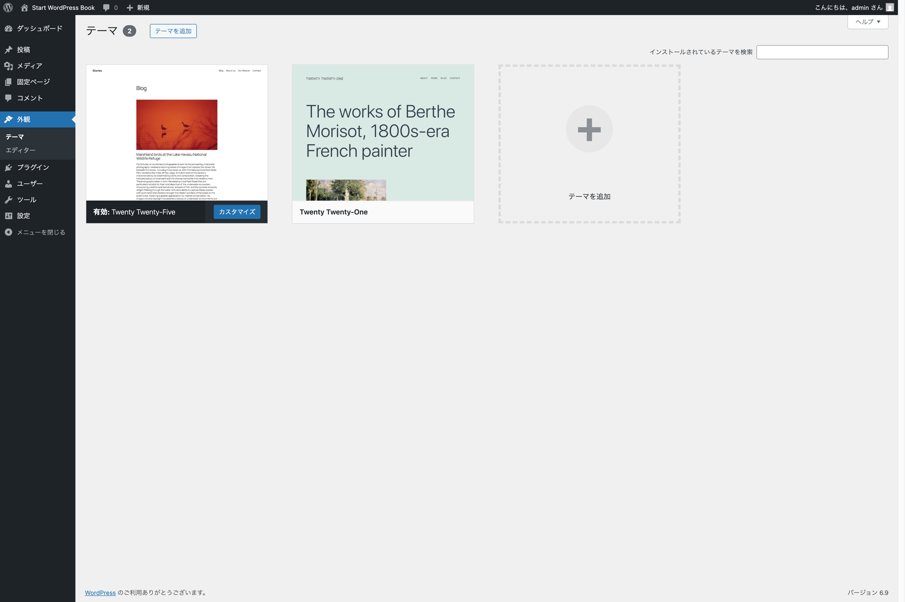{width=91.22mm}

また、各テーマにマウスホバーをすると**テーマの詳細**というボタンが表示されます。こちらをクリックすると、テーマに関する詳しい情報を確認できます。

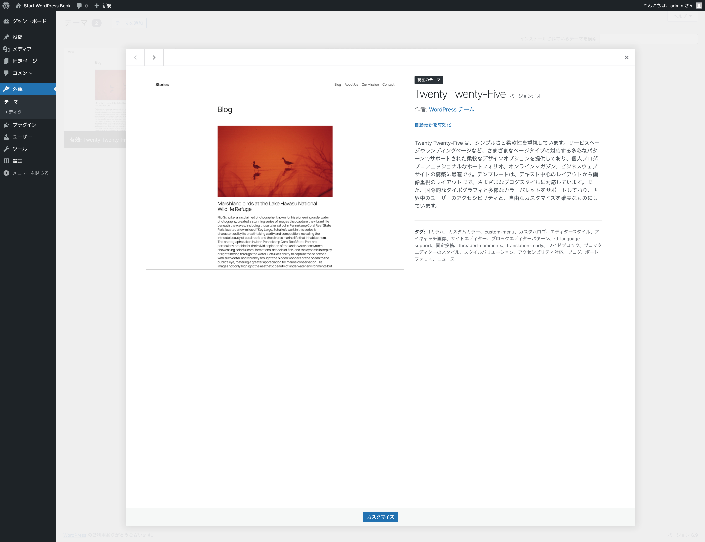{width=91.22mm}

更新可能なテーマがある場合はこのように表示され、直接アップデートを実行できます。

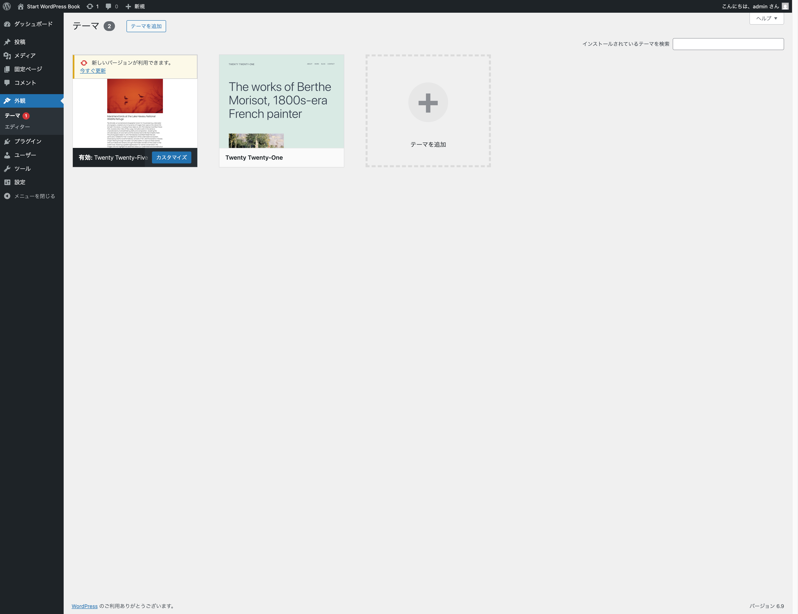{width=91.22mm}

有効化されているテーマには、下部のテーマ名の先頭に**有効:**と付けられ黒背景のバナー表示になっていることが確認できます。

画面最上部に**テーマを追加**というメニューがあります。そちらをクリックすると、WordPress.org 公式リポジトリに登録されている 100% GPL の無料テーマを検索してインストールできます。

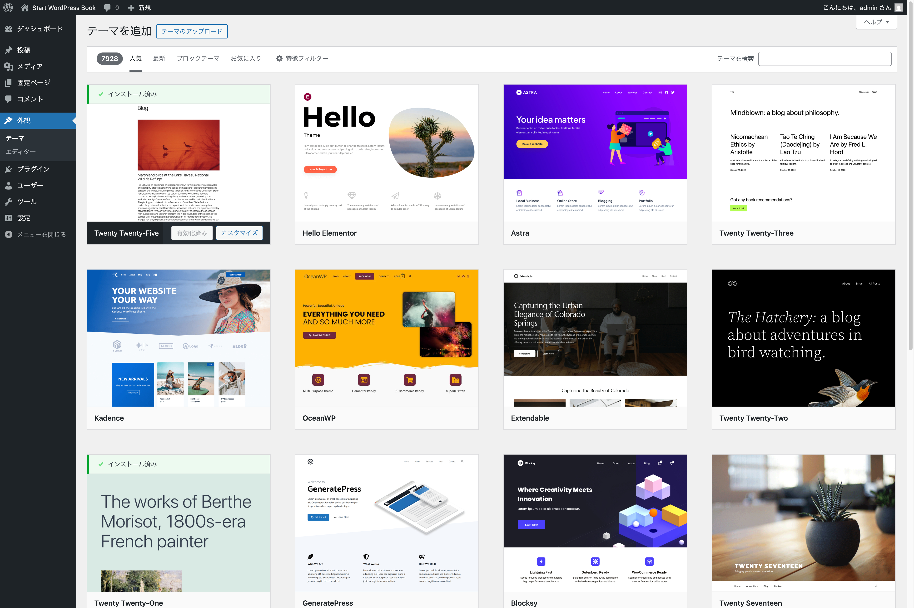{width=91.22mm}

画面上のナビゲーションでは、デフォルトで**人気**が選択されており、人気のあるテーマが一覧表示されます。それ以外に、**最新、ブロックテーマ、お気に入り**といったメニューに切り替えられます。

**お気に入り** を選択すると WordPress.org ユーザー名が入力できる画面に変わります。ここでは、特定の WordPress.org ユーザーのアカウント名を入れることで、そのユーザーがお気に入りに登録しているテーマを表示してくれます。

WordPress.org ユーザーアカウントは、個々の WordPress へログインするアカウントではなく、WordPress に貢献活動を行ったり、サポートフォーラムにてトピックスを作成したり返答したりする際に必要になるアカウントです。

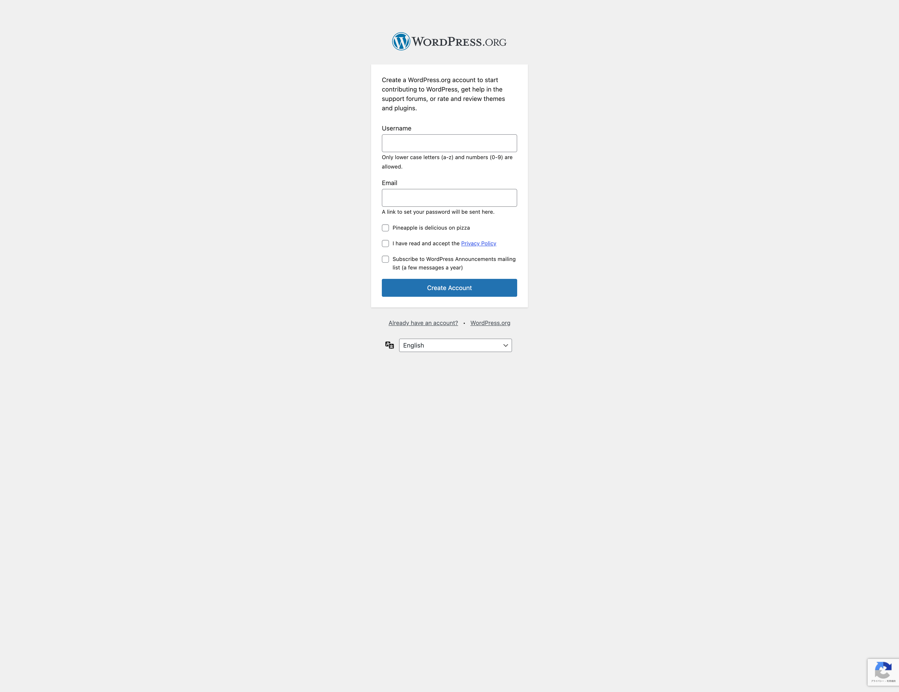{width=91.22mm}

WordPress.org アカウントでログインしている状態で、`https://wordpress.org/themes/twentytwentyfive/` といった WordPress 公式レポジトリに掲載されているテーマのページにアクセスすると、テーマ名の下に**ハートマーク**が表示され、ここをクリックすることで WordPress.org アカウントにお気に入りテーマとして記録されます。

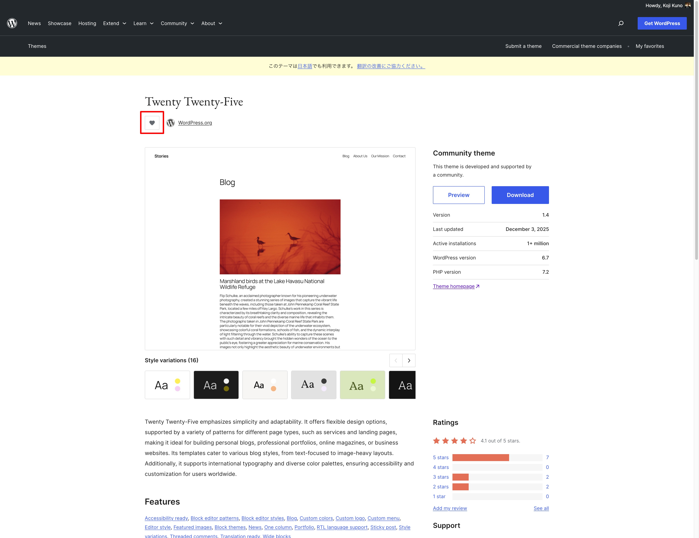{width=91.22mm}

実際に私のお気に入りに登録されているテーマを確認してみましょう。テーマを追加する画面で**お気に入り**タブに切り替えて、私の WordPress.org ユーザー名である `olein` と入力してみましょう。

{width=91.22mm}

すると先ほどお気に入り登録したテーマを含む、私のアカウントでお気に入り登録しているテーマの一覧を確認できるでしょう。このように、ご自身またはご存じの方のアカウント名をいれることで、よく利用する又は気に入っているテーマに素早くアクセスできます。

**特徴フィルター**では、テーマそれぞれに登録されている特徴から絞り込んで検索できます。ぜひ試してみてください。

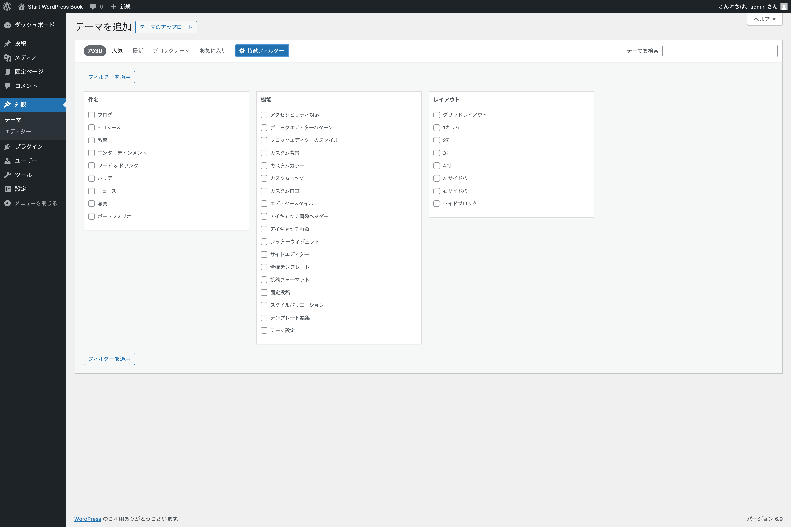{width=91.22mm}

#### エディター

ブロックテーマを有効化している場合に表示されるメニューです。こちらをクリックすると**サイトエディター**に移動します。サイトエディターに関しては別章にて詳しく紹介します。

{width=91.22mm}

### クラシックテーマを有効化している場合

本書では、標準テーマである **Twenty Twenty-One** を有効化している場合を例に紹介します。有効化しているクラシックテーマによって表示されるメニューに違いがあります。

#### テーマ

**ブロックテーマを有効化している場合**で紹介した**テーマ**メニューと同じものになるため紹介を割愛します。

#### デザイン

{width=91.22mm}

ここでは**スタイル**の確認と**パターン**の管理ができます。

**スタイル**では、テーマから各ブロックに設定されているスタイルを確認できます。カラーパレットからタイポグラフィ、そして画像やボタンといったブロックに設定されているスタイリングを確認できます。

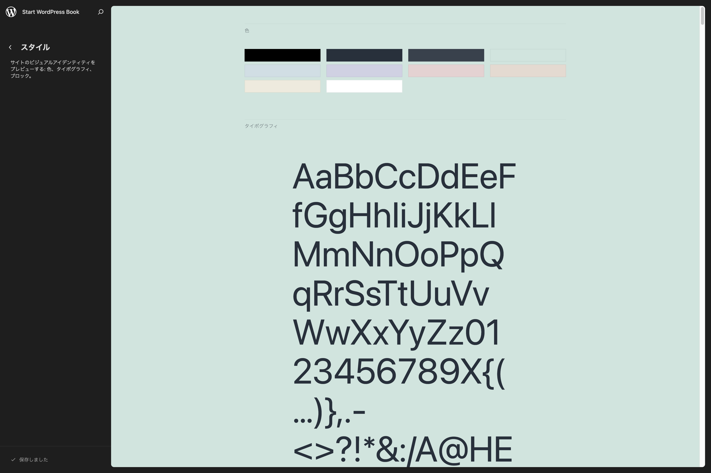{width=91.22mm}

**パターン**では、テーマで用意されているパターンを確認できます。パターンについて詳しくは別途詳しく紹介します。

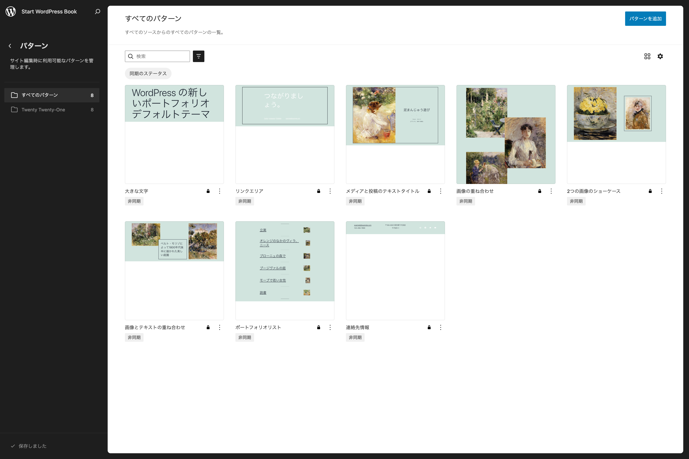{width=91.22mm}

#### カスタマイズ

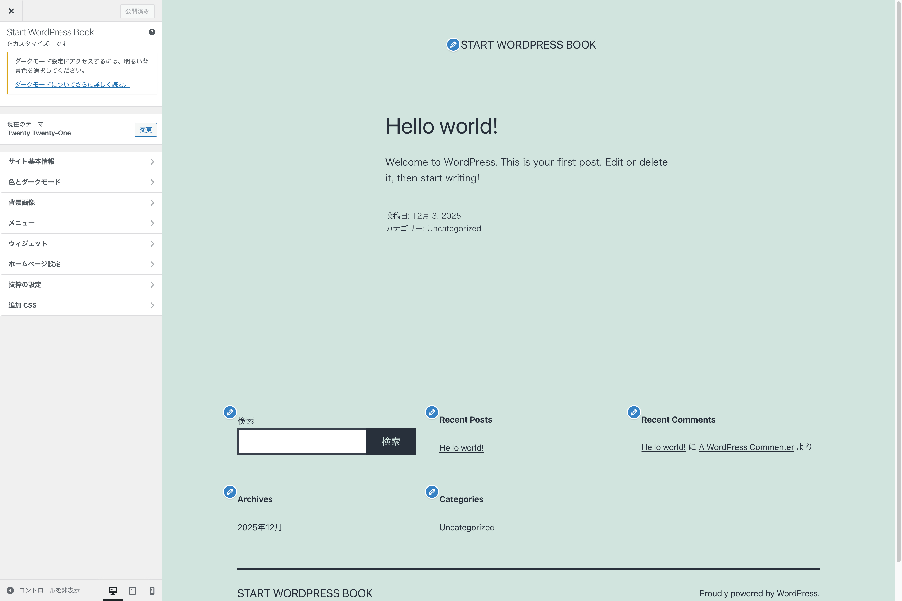{width=91.22mm}

こちらは**カスタマイザー**または**テーマカスタマイザー**と呼ばれる機能です。利用しているテーマや切り替えを検討しているテーマの外観や設定を、変更内容を公開することなく、自由に変更できます。保存ボタンを押すことで公開され、変更が適応されます。

カスタマイザーは、有効化しているテーマがカスタマイザーでカスタマイズできるようにサポートしている場合にのみ利用できます。ですので、有効化しているテーマが変われば、カスタマイザーで対応可能なカスタマイズも変わってきます。

ブロックテーマを有効化している際には、カスタマイザーは非表示になります。しかし、カスタマイザーを必要とするプラグインを使用している場合はその限りではありません。

#### ウィジェット

ウィジェットは、ウィジェットエリアにコンテンツと機能を追加します。ウィジェットエリアはテーマによって定義されたエリアで、通常はサイドバーやフッターに配置されますが、テーマによって様々です。WordPress では標準でカテゴリーやタグクラウドといったウィジェットがありますが、プラグインなどを経て独自のウィジェットを追加することもできます。

このウィジェットを編集する画面は、デフォルトではブロックエディターベースのものになっています。

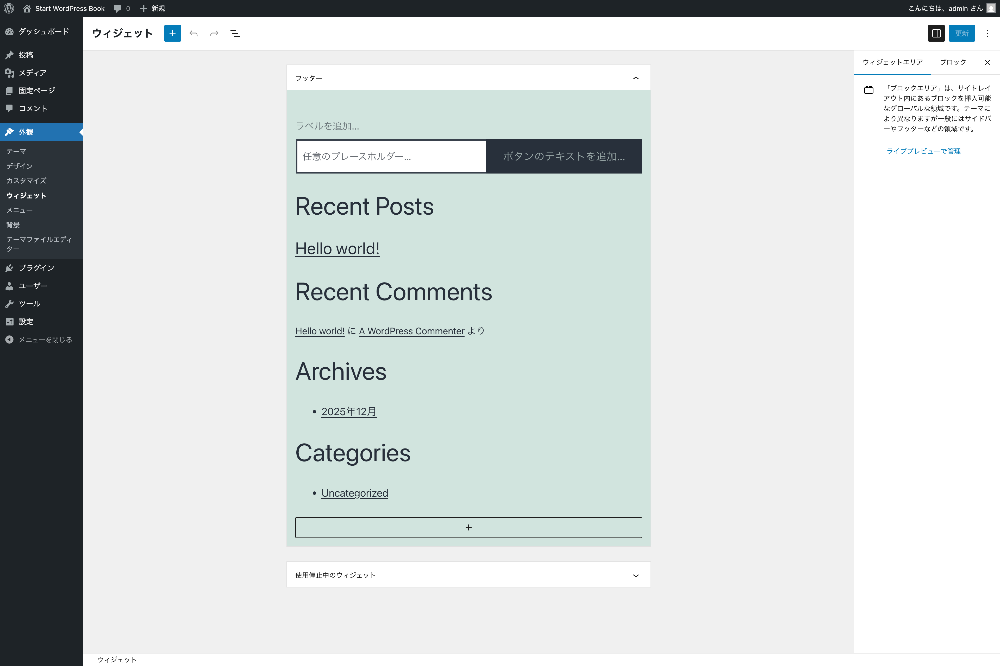{width=91.22mm}

こちらでは、ブロックエディターでコンテンツを編集する感覚で、同様にウィジェットを編集できます。

旧来のウィジェット編集画面を好む場合には、**Classic Widgets**プラグインを使うことで、旧来の画面に戻すことができます。

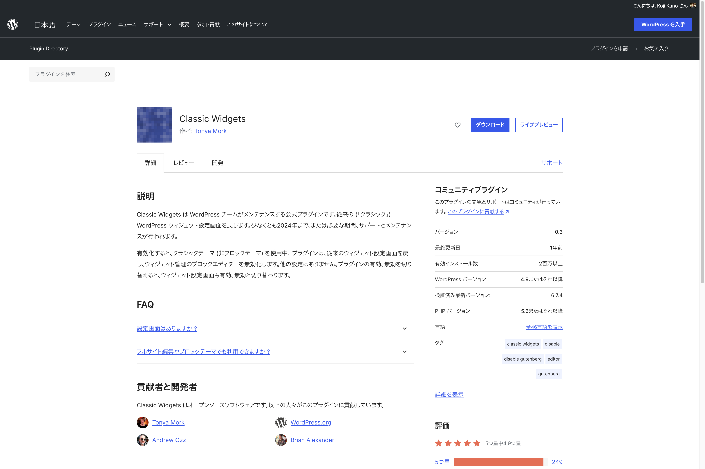{width=91.22mm}

このプラグインを有効化すると、ウィジェット編集画面が以下のように変更されます。

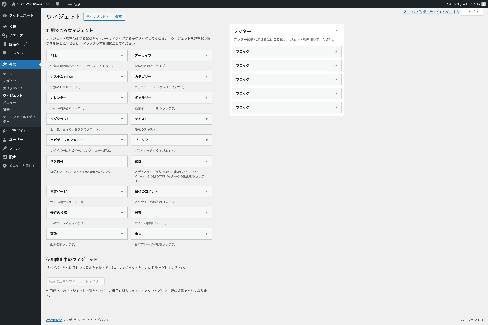{width=91.22mm}

お好みのウィジェット編集画面で作業を進めると良いかと思います。しかし、Classic Widgets プラグインはいつまでメンテナンスが継続されるか随時確認することをお勧めします。

#### メニュー

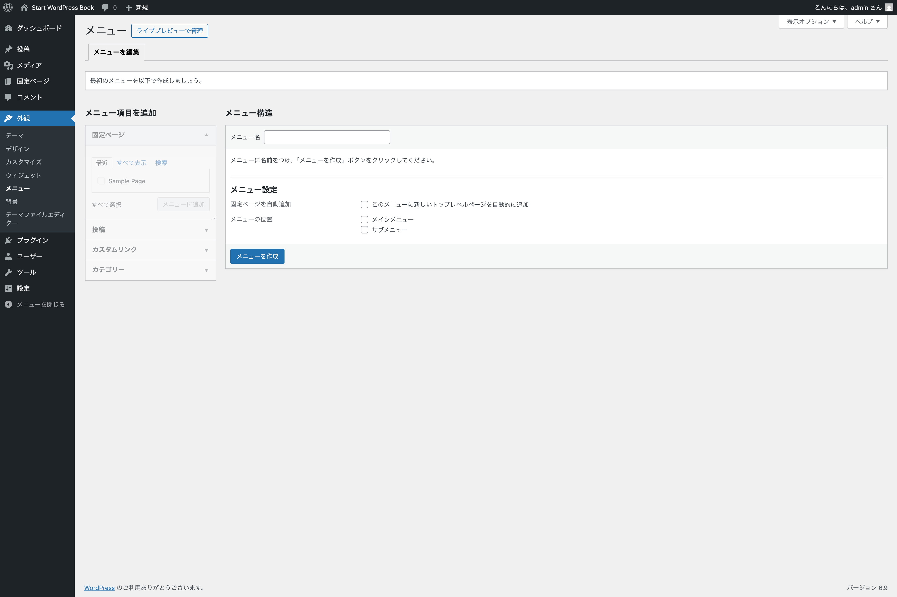{width=91.22mm}

メニューでは、カスタムメニューを作成できます。有効化しているテーマによって違いますが、通常ウェブサイトには 1 つ以上のメニューの位置が用意されていることがほとんどです。

メニューでは、固定ページ、投稿、カテゴリーへのリンクや、他のウェブサイトへの任意の URL など、様々な項目を追加できます。また、メニュー項目の順序の調整や階層構造を管理することもできます。

ここではメニューの作成方法の紹介は割愛しますが、**表示オプション**には表示されていない便利な項目もあるので簡単に紹介しておきます。

- **リンクターゲット** - メニューをクリックした際に別タブで開くといった設定ができます。
- **タイトル属性** - メニュー項目にタイトル属性を設定できます。
- **CSSクラス** - メニュー項目に CSS クラスを設定できるようにします。
- **説明** - メニュー項目に対して説明文を設定できます。テーマによって出力が対応しているものがあります。

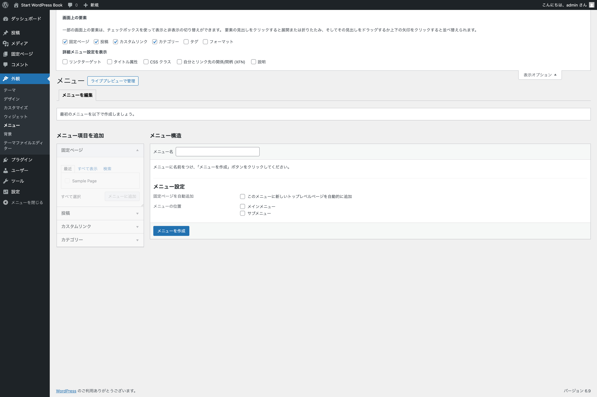{width=91.22mm}

#### 背景

ウェブサイトの背景画像を設定できます。このメニューは、テーマが背景画像のカスタマイズをサポートしている場合にのみ表示されます。

#### テーマファイルエディター

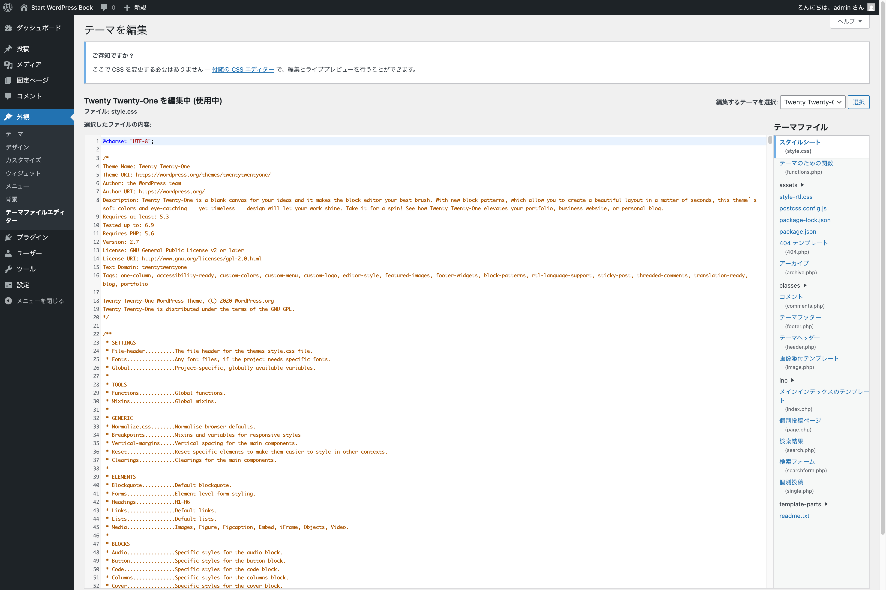{width=91.22mm}

テーマファールエディターを使用すると、テーマテンプレートまたはスタイルシートに保存されているコードを表示または変更できます。

これはとても強力な機能ですので、注意して使用してください。テーマファイルエディターでコードを変更する際にエラーが発生すると、ウェブサイト全体が利用できなくなる可能性があります。

## プラグイン

**プラグイン**ではプラグインを管理できます。

### インストール済みプラグイン

メインナビゲーションの**プラグイン**をクリックすると、この画面が表示されます。この画面は**インストール済みプラグイン**メニューの画面と同じです。

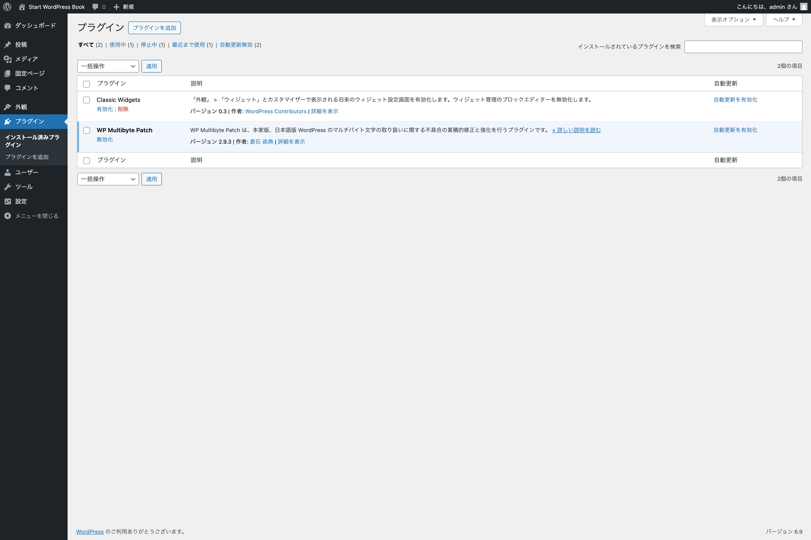{width=91.22mm}

こちらでは、インストールされているすべてのプラグインがアルファベット順に一覧表示されます。

画面上部には**プラグインを追加**メニューがあります。こちらの詳細は後ほど紹介します。デフォルトでは**すべて**が選択されているメニューですが、使用中や停止中、最近まで使用や自動更新無効など、プラグインの状態で絞り込みができます。また、右側の検索フォームでプラグイン一覧から検索して探し出せます。

プラグイン一覧のテーブルには以下の項目があります。

- **チェックボックス** - チェックボックスをチェックすると、そのプラグインを一括操作で処理できます。
- **プラグイン** - プラグインの名前が表示されます。
- **説明** - プラグインに関する情報が表示されます。バージョン番号やプラグイン作者、詳細情報やサポートのためのリンクもここに表示されます。
- **自動更新** - プラグインの自動更新（アップデート）が無効になっている場合は**自動更新を有効化**、有効になっている場合は**自動更新を無効化**と表示されます。

プラグインの有効化・無効化は**プラグイン名の下**にあるテキストリンクで設定できます。また、削除も同様にプラグイン名の下のテキストリンクから行えます。

### プラグインを追加

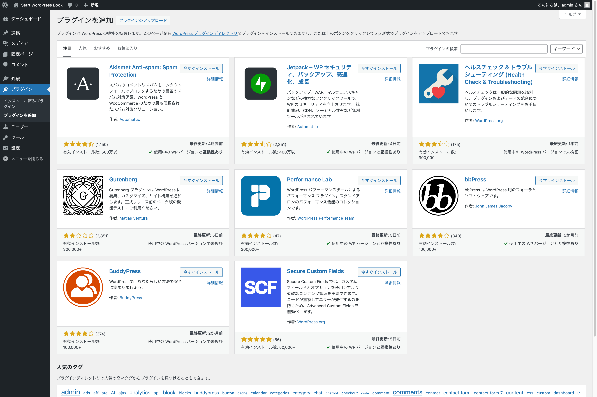{width=91.22mm}

**プラグインを追加**では、新しいプラグインをインストールできます。先ほど紹介した**インストール済みプラグイン**の画面上部にある**プラグインを追加**ボタンをクリックすることで、この画面に移動します。

画面上部には**プラグインのアップロード**メニューがあります。こちらからは、ZIP 形式で圧縮されたプラグインファイルを直接指定をして WordPress にアップロードしインストールできます。

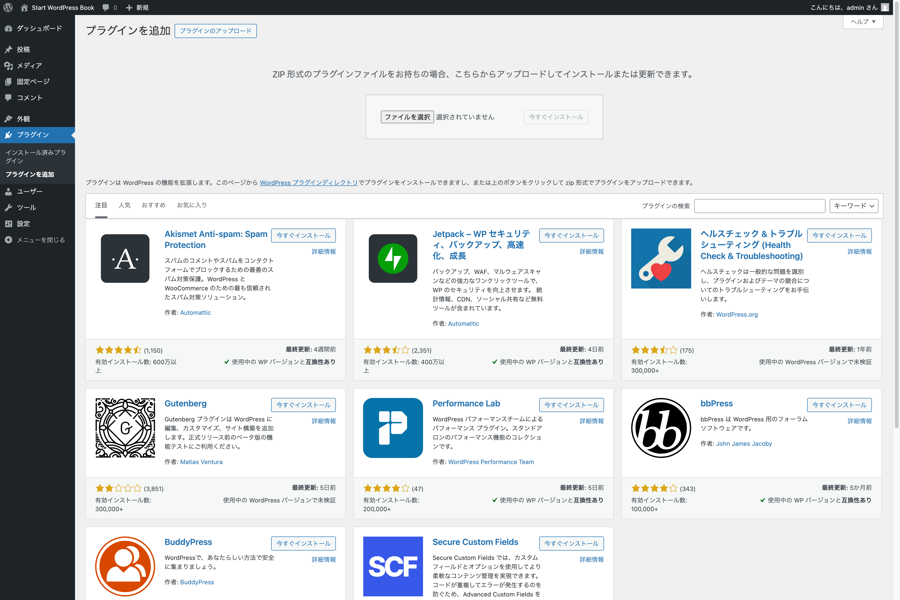{width=91.22mm}

画面中央のプラグイン一覧の上部には４つのタブメニューが用意されており、デフォルトでは**注目**がアクティブになっています。その他には、人気、おすすめ、お気に入りがあります。

**お気に入り**は、テーマの追加でも紹介したように、 WordPress.org ユーザーアカウントにお気に入り登録されているプラグインを表示できます。ご自身の WordPress.org アカウントをお持ちの方は（ない場合は新規作成できます）よく利用するプラグインをお気に入りに登録しておくことで、素早くアクセスできインストールも簡単に行えます。

各プラグインにある**今すぐインストール**をクリックするとプラグインをインストールできます。そして、プラグインはインストールするだけでは利用できません。利用する場合には必ず**有効化**を行いましょう。

また、一覧のプラグイン名をクリックすると、プラグインの詳細情報にアクセスできます。

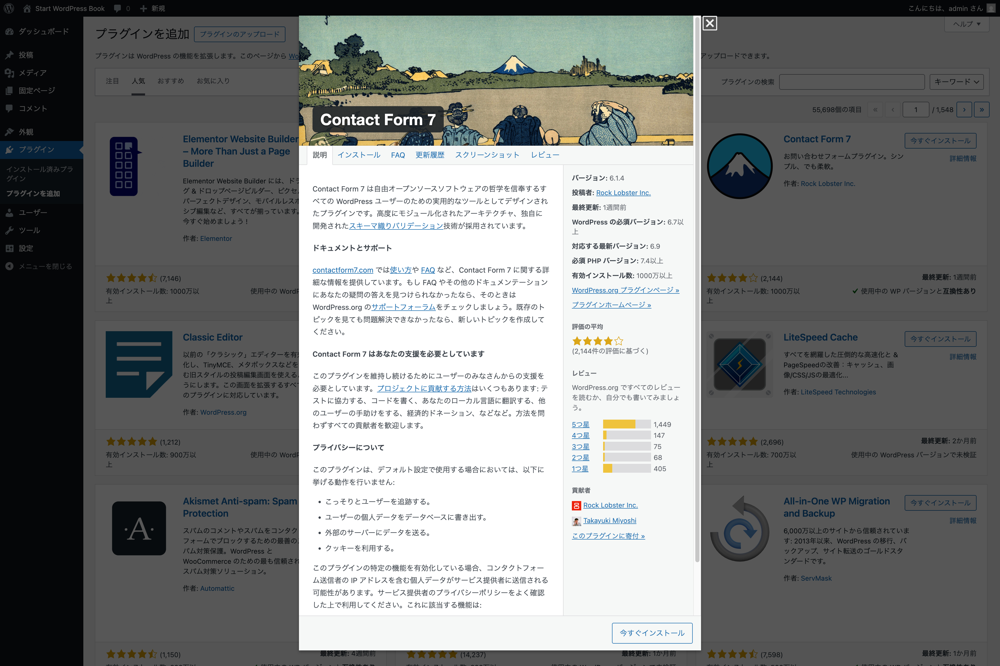{width=91.22mm}

私の場合ですが、インストールするプラグインが複数個確定している場合、検索などを活用して対象のプラグインを全てインストールしてしまってから、**インストール済みプラグイン**画面に移動して、**一括で有効化**を行うことが多いです。ぜひ試してみてください。

## ユーザー

**ユーザー**では、ウェブサイトのユーザーを追加、変更、削除できます。さらに、ユーザーを検索したり、選択したユーザーグループに対して一括操作や削除を行うこともできます。

### ユーザー一覧

メインナビゲーションメニューの**ユーザー**をクリックすると、この**ユーザー一覧**に移動します。

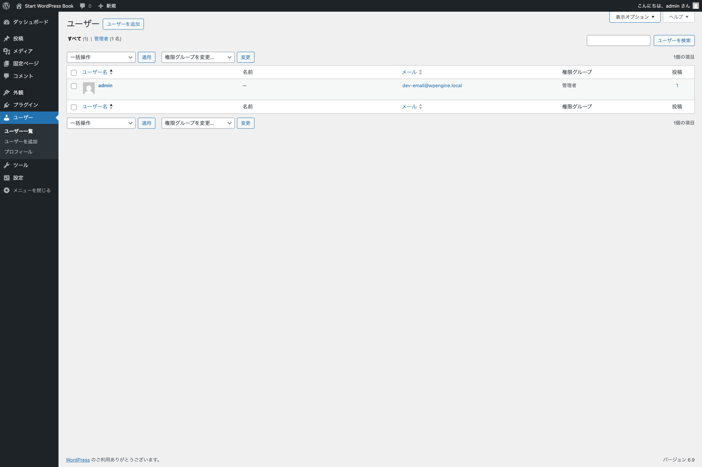{width=91.22mm}

画面上部にある**ユーザーを追加**ボタンをクリックすると、新しいユーザーを追加できます。デフォルトでは**すべて**が選択されているメニューですが、**管理者**など特定の権限グループで絞り込みができます。 また、右側の検索フォームでユーザー一覧から検索して探し出せます。

ユーザー一覧のテーブルには以下の項目があります。

- **チェックボックス** - チェックボックスをチェックすると、そのユーザーを一括操作で処理できます。
- **ユーザー名** - ユーザー名を表示します。中にはユーザーのプロフィール画像と名前も表示されます。
- **名前** - ユーザープロフィールで設定されている姓名が表示されます。
- **メール** - ユーザーのメールアドレスが表示されます。
- **権限グループ** - ユーザーに割り当てられている権限グループが表示されます。
- **投稿** - ユーザーが投稿した投稿の数が表示されます。

ユーザー名をクリックすると、そのユーザーのプロフィール編集画面に移動します。また、メールアドレスをクリックするとメールを送信できます。

### ユーザーを追加

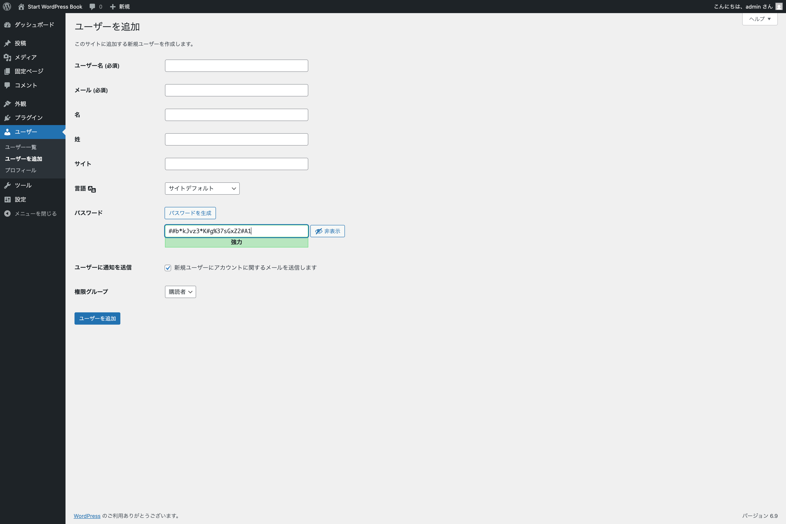{width=91.22mm}

**ユーザーを追加**では、手動でユーザーを新しく追加できます。後ほど紹介する**設定 > 一般**の**メンバーシップ**で**だれでもユーザー登録ができるようにする**にチェックが入っていると、ウェブサイト閲覧者は `https://[your-domain].com/wp-register.php` からも新規登録できるようになります。

以下に登録する際に入力可能な項目を紹介します。

- **ユーザー名（必須）** - 新しいユーザー名を入力します。これはログイン時にユーザー名としても利用します。
- **メール（必須）** - 有効なメールアドレスを入力します。このメールアドレスはユーザーごとに一意である必要があります。
- **名** - ユーザーの名を入力します。
- **姓** - ユーザーの姓を入力します。
- **サイト** - ユーザーのウェブサイト URL を入力します。
- **言語** - ユーザーの管理画面表示言語を選択します。
- **パスワード** - ユーザーのパスワードを設定します。**パスワードの強度**メーターが表示され、強力なパスワードを設定することが推奨されます。また、**パスワードを生成**ボタンを押すと自動で強力なパスワードを生成できます。ぜひ活用してください。
- **ユーザーに通知を送信** - チェックを入れると、新しいユーザーに登録情報をメールで送信します。
- **権限グループ** - 新しいユーザーに割り当てる権限グループを選択します。

ここでも設定できる**WordPress のユーザー権限**について簡単に紹介します。 WordPress には予め以下の 5 つのユーザー権限グループが用意されています。

- **管理者** - サイト内のすべての機能にアクセスできるユーザー権限
- **編集者** - 他のユーザーの投稿を含む投稿を公開および管理できるユーザー権限
- **投稿者** - 自分の投稿を公開および管理できるユーザー権限
- **寄稿者** - 自分の投稿を管理できるが、公開はできないユーザー権限
- **購読者** - 自分のプロフィールのみを管理できるユーザー権限

なお、この他に**スーパー管理者**という権限グループもありますが、こちらはマルチサイト機能を有効化している場合にのみ利用できる権限グループですので、こちらでは紹介をしていません。

このように権限によってできることが大きく異なります。権限を付与する際には、そのユーザーに対してその権限が適切かどうかしっかりと検討されることをお勧めします。

### プロフィール

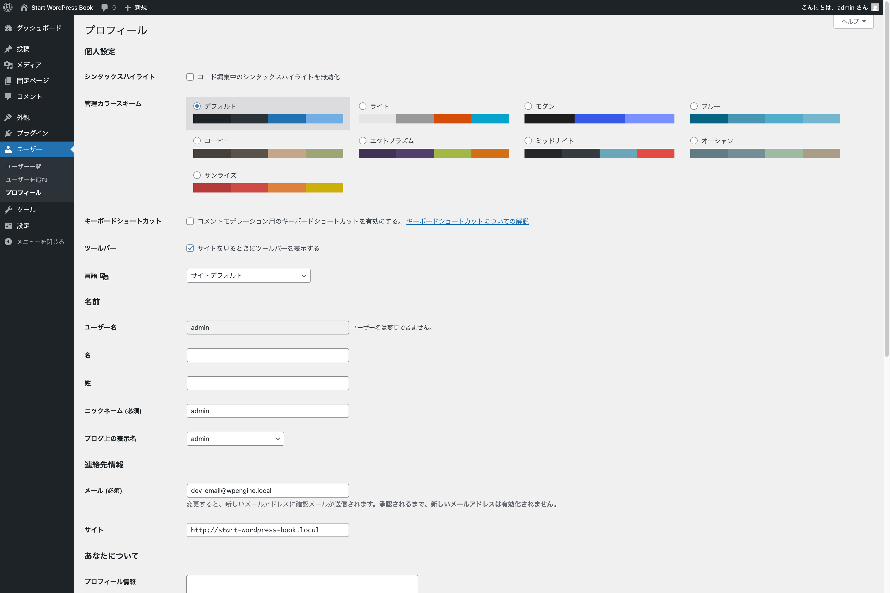{width=91.22mm}

ここでは、あなたのユーザーアカウントに関する情報を編集できます。設定可能項目が多くあるため、セクションごとに紹介します。

#### 個人設定

- **シンタックスハイライト** - コード編集 j いに構文の強調表示を行うかどうかの設定。
- **管理カラースキーム** - 管理画面で使用するカラースキームの設定。
- **キーボードショートカット** - コメント管理用のキーボードショートカットを有効にするかどうかの設定。
- **ツールバー** - ログイン状態でサイトを閲覧する際にツールバーを表示するかどうかの設定。
- **言語** - 管理画面使用中に使用する言語の設定。

#### 名前

- **ユーザー名** - ログイン時にユーザー名として使用されるため編集できません。管理者であっても変更できない項目です。
- **名** - 名を設定します。
- **姓** - 姓を設定します。
- **ニックネーム（必須）** - ニックネームを設定します。
- **ブログ上の表示名** - 投稿者名などウェブサイト上で表示される名前を設定します。

#### 連絡先情報

- **メール（必須）** - ユーザー登録した際に登録しているメールアドレスが表示されます。変更もこちらから可能です。
- **サイト** - ユーザーのウェブサイト URL を設定します。

#### あなたについて

- **プロフィール情報** - 簡単な自己紹介プロフィールを入力します。
- **プロフィール写真** - Gravatar サービスを利用してプロフィール写真を設定します。`https://ja.gravatar.com/` から登録・管理ができます。

#### アカウント管理

- **新しいパスワード** - **新しいパスワードを設定**ボタンをクリックすると、新しいパスワードを設定できます。
- **セッション** - 他のすべての場所からログアウトする場合は**他のすべての場所からログアウト**ボタンをクリックします。

#### アプリケーションパスワード

- **新しいアプロケーションパスワード名** - 外部のアプリケーションから WordPress の REST API にアクセスするために使用するパスワードの名前を設定します。
- **アプリケーションパスワードを追加** - 上のパスワード名を入力した後にこのボタンをクリックすることで、アプリケーションパスワードが生成されます。

何か情報を更新したら、忘れずに**プロフィールを更新**ボタンをクリックして保存しましょう。

## ツール

### 利用可能なツール

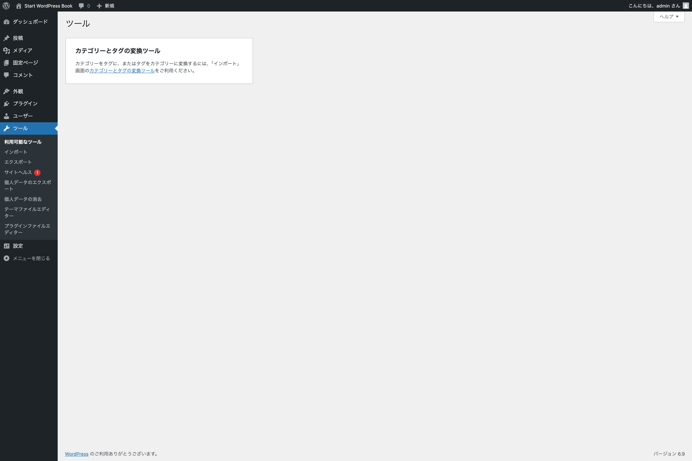{width=91.22mm}

メインナビゲーションの**ツール**をクリックすると、この**利用可能なツール**に移動します。

### インポート

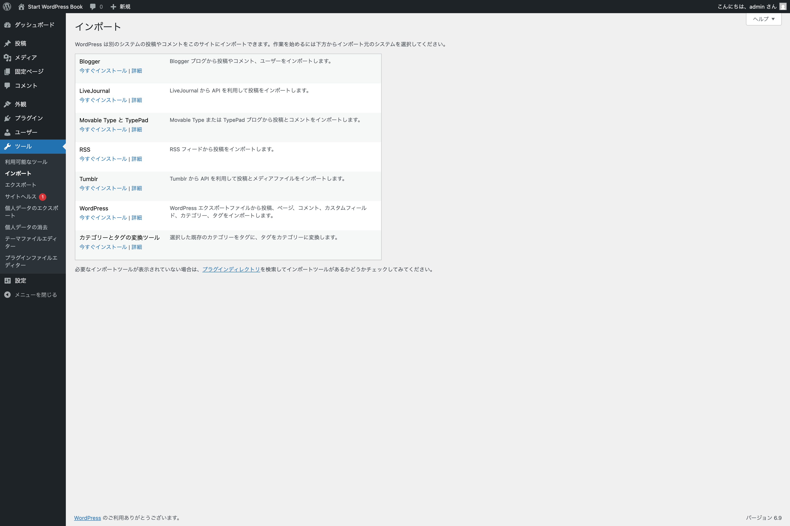{width=91.22mm}

さまざまな方法で WordPress へデータをインポートできます。デフォルトで対応しているインポート元は以下の通りです。

- Blogger
- Livejournal
- Movable Type と TypePad
- RSS
- Tumblr
- WordPress

これらに加えて**カテゴリーとタグの変換ツール**も用意されています。

これら以外のインポーターを探したい場合は、プラグインから `importer` と検索してみましょう。

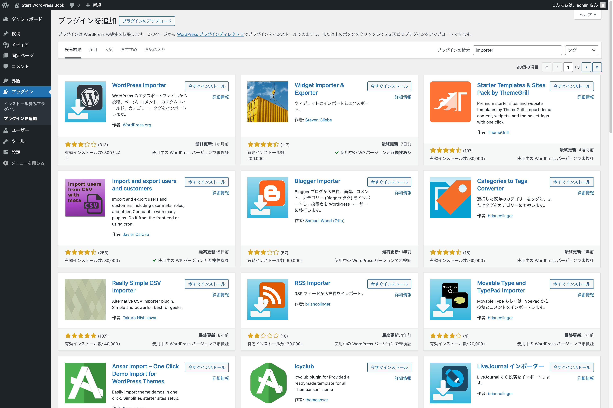{width=91.22mm}

### エクスポート

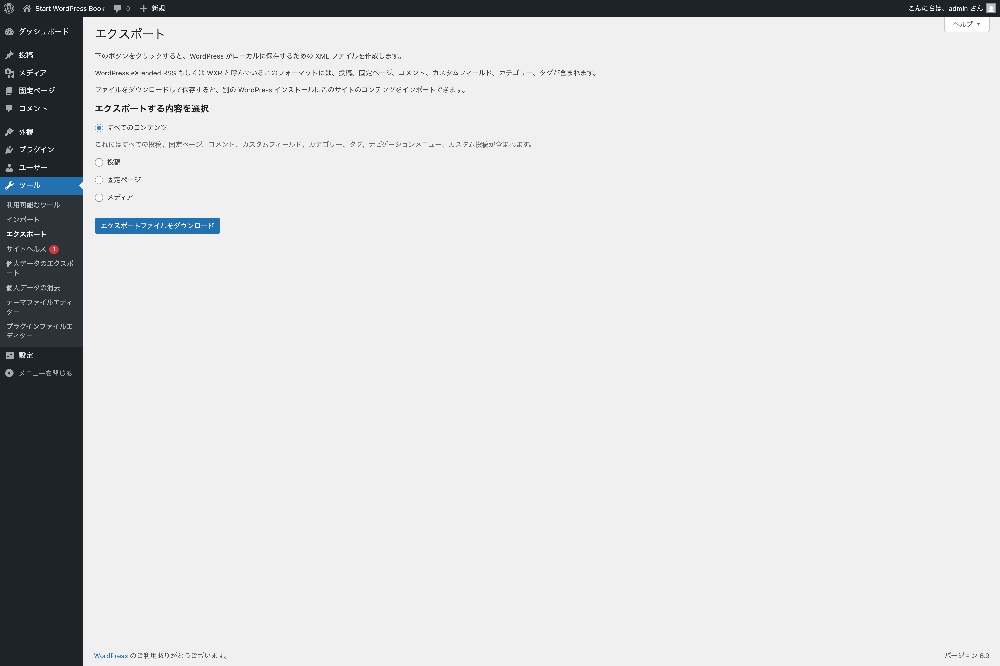{width=91.22mm}

投稿、固定ページ、カスタム投稿タイプ、コメント、カスタムフィールド、カテゴリー、タグ、カスタムタクソノミー、ユーザーといった WordPress データのエクスポートができます。

出力されるファイルは XML ファイルで、WordPress eXtended RSS もしくは WXR と呼ばれます。

エクスポートできる内容は以下の種類があります。必要に応じて適切なものを選びましょう。

#### すべてのコンテンツ

すべての投稿、固定ページ、コメント、カスタムフィールド、ターム類、メニューカスタム投稿をエクスポートします。

#### 投稿

特定の投稿をエクスポートします。以下の項目で絞り込みが可能です。

- カテゴリー
- 投稿者
- 開始日時と終了日時
- ステータス（公開済みや下書きなど）

#### 固定ページ

特定の固定ページをエクスポートします。以下の項目で絞り込みが可能です。

- 投稿者
- 開始日時と終了日時
- ステータス（公開済みや下書きなど）

#### メディア

特定のメディアファイルをエクスポートします。以下の項目で絞り込みが可能です。

- 開始日時と終了日時

### サイトヘルス

WordPress は、ウェブサイトの健全性を診断する機能を提供しています。このページには**ステータス**と**情報**の２つのタブが用意されています。

#### ステータス

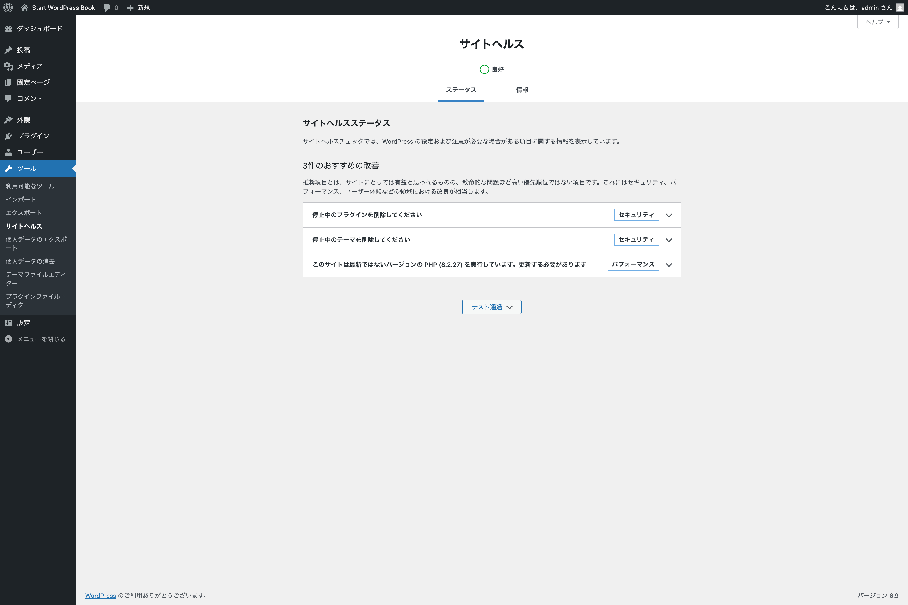{width=91.22mm}

WordPress の設定に関する重要な情報と注意が必要な項目が表示されます。可能な限り問題を解決しておくと良いでしょう。

#### 情報

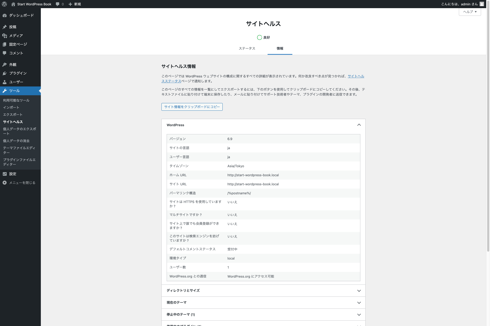{width=91.22mm}

こちらでは、WordPress サイトの設定に関する詳細情報が表示されます。

例えば、使用している WordPress のバージョンや有効化・無効化されているプラグインとテーマに関する情報などを確認できます。それ以外にも、サーバーやデータベースに関する設定など、以下のような技術的な情報も掲載されています。

- WordPress
- ディレクトリとサイズ
- 現在のテーマ
- 停止中のテーマ
- 使用中のプラグイン
- 停止中のプラグイン
- メディア処理
- サーバー
- データベース
- WordPress 定数
- ファイルシステムパーミッション

また、これらの情報をクリップボードにワンクリックでコピーもできるので、何か問題が起きた際に対処を依頼する技術者に情報を提供する際にも便利です。

### 個人データのエクスポート

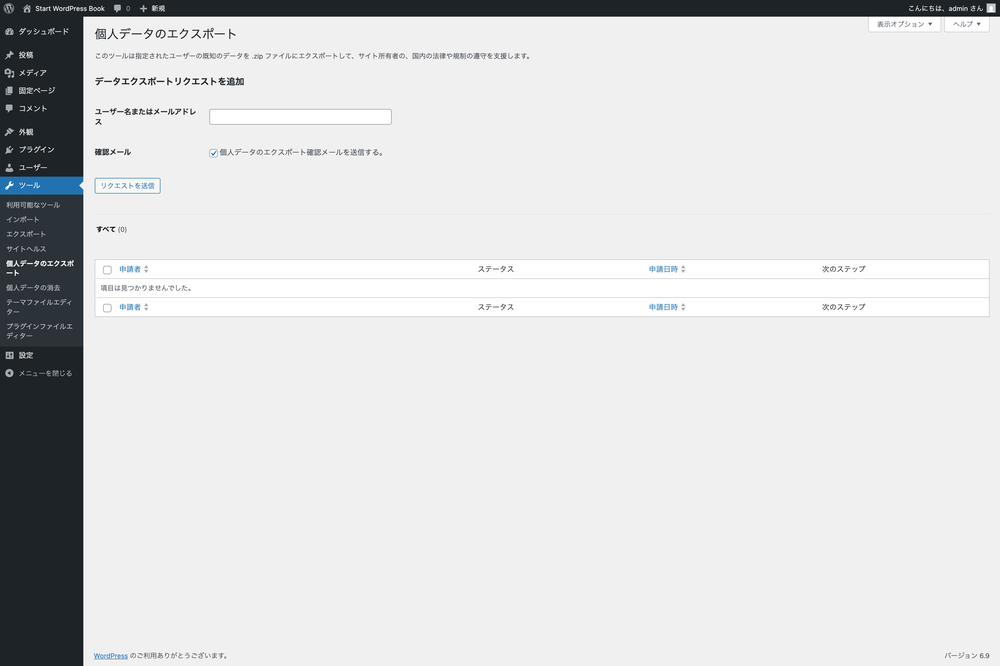{width=91.22mm}

WordPress 4.9.6 から、ユーザーデータをアーカイブしてエクスポートする機能が追加されました。この機能で WordPress サイト内のユーザーに関する個人データを含むデータを Zip 形式でエクスポートできます。

#### 基本的な使い方

以下のような流れで利用できます。

1. 個人データのエクスポート画面を開く
2. ユーザー名またはメールアドレスを指定し**リクエストを送信**ボタンをクリック
3. 確認リクエストが正常に送信されると、リクエストは下部のリストに追加される
4. リクエストしたアカウントの登録メールアドレスに**リクエストの確認メール**が届くので、メール本文内の確認用 URL をクリックする
5. 管理者に通知が届き、管理者はリクエストされたアカウントに対してデータをメール送信可能になる
6. リクエストしたアカウントの登録メールアドレスに個人データをダウンロードできる URL が記載されたメールが届く

### 個人データの消去

{width=91.22mm}

WordPress 4.9.6 から、ユーザーデータを消去する機能が追加されました。この機能で WordPress サイト内のユーザーに関する個人データを消去できます。

このツールでは、バックアップやアーカイブファイルからデータを削除するものではありません。自動バックアップやアーカイブと併用する場合、バックアップからユーザーデータを復元する際には注意が必要です。

#### 基本的な使い方

以下のような流れで利用できます。

1. 個人データの消去画面を開く
2. ユーザー名またはメールアドレスを指定し**リクエストを送信**ボタンをクリック
3. 確認リクエストが正常に送信されると、リクエストは下部のリストに追加される
4. リクエストしたアカウントの登録メールアドレスに**リクエストの確認メール**が届くので、メール本文内の確認用 URL をクリックする
5. 管理者に通知が届き、管理者はリクエストされたアカウントに対してデータの消去を実行可能になる
6. リクエストしたアカウントの登録メールアドレスに個人データが消去されたことを通知するメールが届く

### テーマファイルエディター

**外観**メニューにて紹介しているため割愛します。

### プラグインファイルエディター

前述している**テーマファイルエディター**と同じように、プラグインに含まれるファイルを直接編集ができます。

## 設定

### 一般

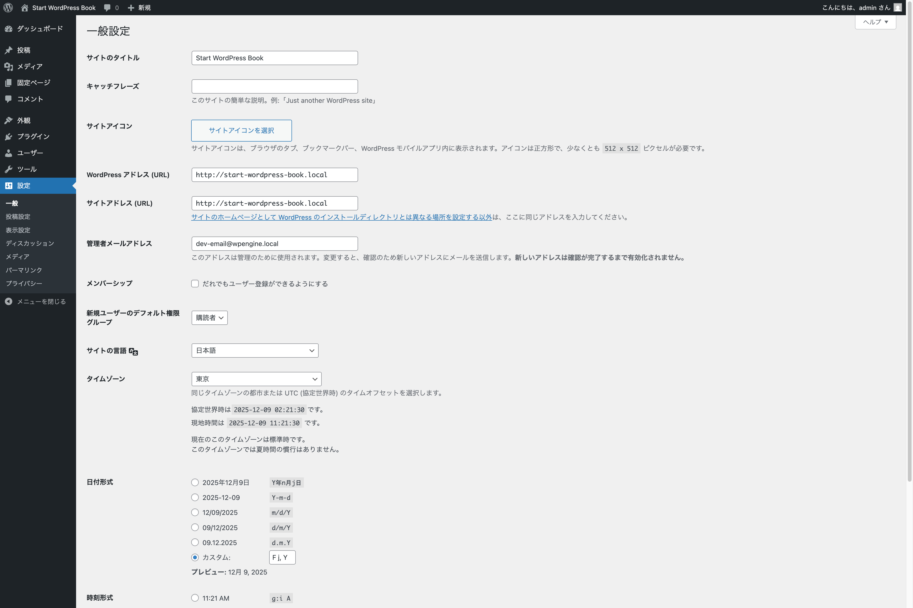{width=91.22mm}

メインナビゲーションの**設定**をクリックするとこちらの画面に移動します。ここでは、サイトの最も基本的な設定を行います。以下のような設定が可能です。

- **サイトのタイトル** - ウェブサイトの名前またはブログ名を入力します。
- **キャッチフレーズ** - ウェブサイトの内容を簡単に説明する文章を入力します。
- **サイトアイコン** - ウェブサイトのファビコンなどに利用する画像を設定します。
- **WordPress アドレス (URL)** - WordPress コアファイルがインストールされている URL を設定します。
- **サイトアドレス (URL)** - WordPress サイトにアクセスするためにブラウザに入力してほしいアドレスを設定します。通常、上の**WordPress アドレス (URL)** と同じになります。別にする際には別途技術的な対応が必要です。
- **管理者メールアドレス** - ウェブサイトの管理者メールアドレスを設定します。重要な通知がこのメールアドレスに送信されます。
- **メンバーシップ** - **だれでもユーザー登録ができるようにする**にチェックを入れると、ウェブサイト閲覧者が新規登録できるようになります。
- **新規ユーザーのデフォルト権限グループ** - 新規登録したユーザーに割り当てるデフォルトの権限グループを設定します。
- **サイトの言語** - WordPress 管理画面で使用する言語を設定します。
- **タイムゾーン** - ウェブサイトのタイムゾーンを設定します。
- **日付形式** - ウェブサイトで使用する日付の表示形式を設定します。
- **時刻形式** - ウェブサイトで使用する時刻の表示形式を設定します。
- **週の始まり** - 週の始まりの曜日を設定します。

### 投稿設定

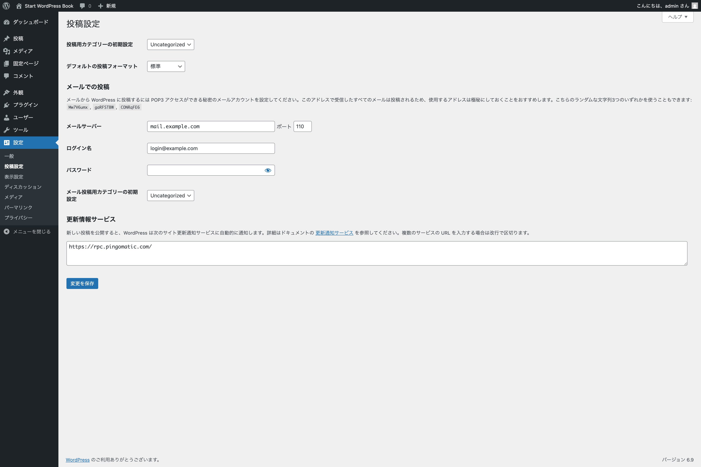{width=91.22mm}

こちらでは、新しい投稿を作成する際のデフォルト設定を行います。以下のような設定が可能です。

- **投稿用カテゴリーの初期設定** - 投稿を作成した際にデフォルトで割り当てられるカテゴリーを設定します。
- **デフォルトの投稿フォーマット** - 投稿のデフォルトのフォーマットを設定します。
- **メールサーバー** - 投稿をメールで受信するためのメールサーバーの設定を行います。
- **ログイン名** - 送信元メールアドレスの `@` 以降の部分を除いたログイン名を設定します。
- **メール投稿用カテゴリーの初期設定** - メールで投稿を受信した際に割り当てられるカテゴリーを設定します。
- **更新情報サービス** - 新しい投稿を公開した際に通知する更新情報サービスの URL を設定します。

### 表示設定

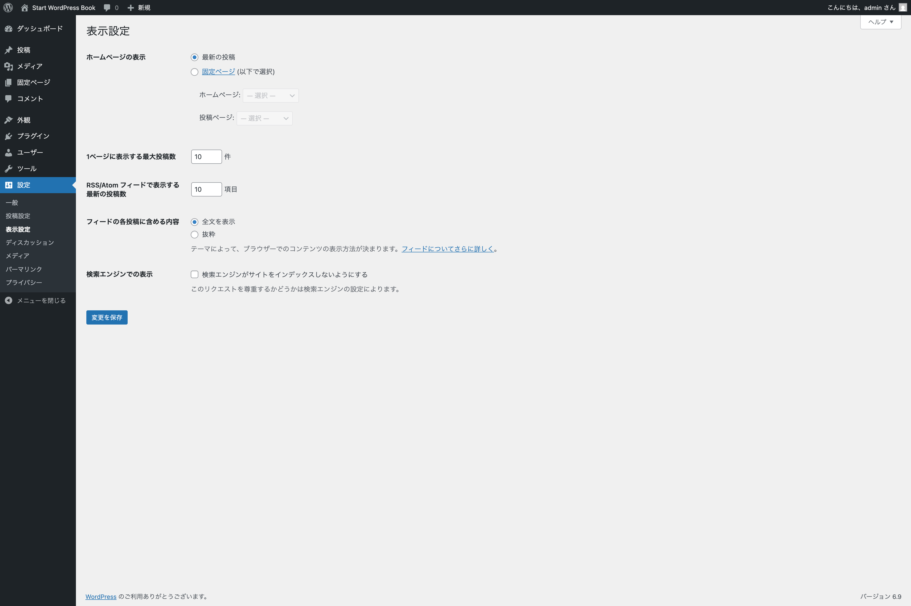{width=91.22mm}

こちらでは、ウェブサイトのフロント（ホーム）ページに最新の投稿を表示するか、静的なページを表示するかなどを設定できます。他にも、ホームページに表示する投稿数の調整などもできます。

- **ホームページの表示** - ホームページに最新の投稿を表示するか、静的なページを表示するかを設定します。（詳細後述）
- **1ページに表示する最大投稿数** - ホームページやアーカイブページに表示する投稿数を設定します。
- **RSS/Atomフィードで表示する最新の投稿数** - RSS フィードに表示する最新の投稿数を設定します。
- **フィードの各投稿に含める内容** - フィードに表示する内容を設定します。
- **検索エンジンでの表示** - 検索エンジンがウェブサイトをインデックスしないようにするかどうかを設定します。

#### ホームページの表示

**最新の投稿**と**固定ページ**のいずれかを選択できます。

**最新の投稿**を選択すると、ホームページに最新の投稿が一覧表示されます。ブログなど、頻繁に更新されるコンテンツを提供するウェブサイトに適しています。

**固定ページ**を選択すると、ホームページに特定の固定ページを表示できます。例えば、すでに固定ページを「トップ」と「ブログ」を用意していたとします。その場合、**ホームページ**には固定ページ「トップ」を指定し、**投稿ページ**には固定ページ「ブログ」を指定することで、ホームページには「トップ」ページが表示され、ブログ記事一覧は「ブログ」ページに表示されるようになります。コーポレートサイトなどウェブサイトとして情報を提供するページ構成の場合はこちらを採用することも多いです。

### ディスカッション

こちらでは、コメントに関する設定を行います。

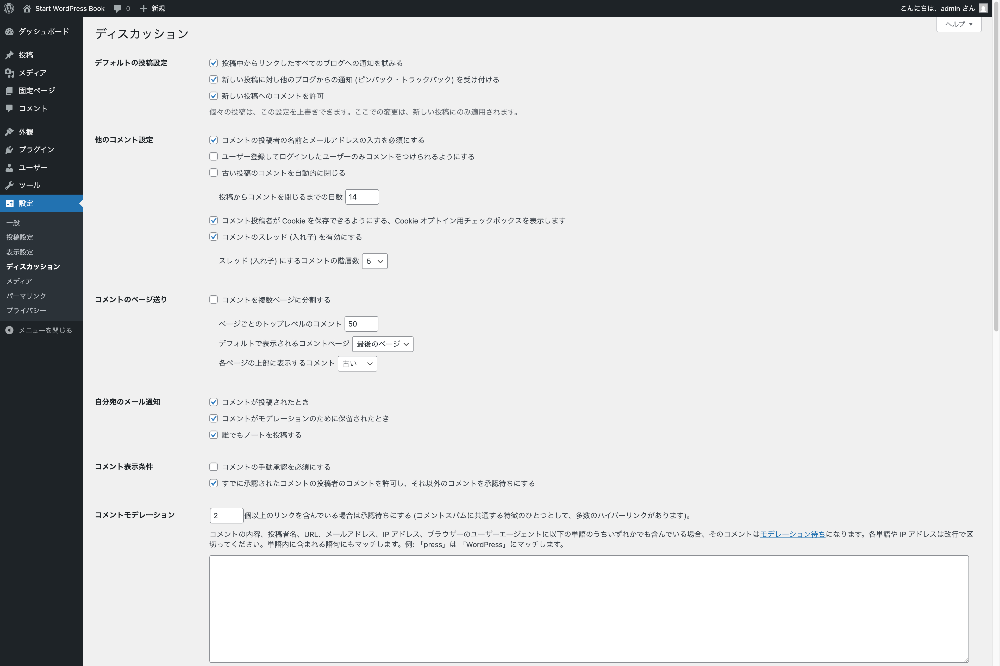{width=91.22mm}

#### デフォルトの投稿設定

- **投稿中からリンクしたすべてのブログへの通知を試みる** -これをチェックすると、WordPress は投稿内でリンクされているウェブサイトや記事に ping を送信します。
- **新しい投稿に対し他のブログからの通知 (ピンバック・トラックバック) を受け付ける** - これをチェックすると、WordPress はあなたのウェブサイトや記事を参照している可能性のある他のウェブサイトからのピンバックを受け入れます。
- **新しい投稿へのコメントを許可** - これをチェックすると、新しい投稿に対してコメントが許可されます。

#### 他のコメント設定

- **コメントの投稿者の名前とメールアドレスの入力を必須にする** - これをチェックすると、コメントを投稿するためには名前とメールアドレスの入力が必須になります。
- **ユーザー登録してログインしたユーザーのみコメントをつけられるようにする** - これをチェックすると、コメントを投稿するためにはユーザー登録とログインが必須になります。 
- **古い投稿のコメントを自動的に閉じる** - これをチェックすると、指定した日数が経過した投稿に対してコメントが自動的に閉じられます。
  - **投稿からコメントを閉じるまでの日数** - 日数を指定します。
- **コメント投稿者が Cookie を保存できるようにする、Cookie オプトイン用チェックボックスを表示します** - これをチェックすると、コメント投稿フォームに Cookie オプトイン用のチェックボックスが表示されます。
- **コメントのスレッド (入れ子) を有効にする** - これをチェックすると、コメントのスレッド (入れ子) が有効になります。
  - **スレッド (入れ子) にするコメントの階層数** - コメントの入れ子の最大階層数を指定します。

#### コメントのページ送り

- **コメントを複数ページに分割する** - これをチェックすると、コメントが複数ページに分割されます。
  - **ページごとのトップレベルのコメント** - 1 ページあたりに表示するトップレベルのコメント数を指定します。
  - **デフォルトで表示されるコメントページ** - **最後のページ**または**最初のページ**のいずれかを選択します。
  - **各ページの上部に表示するコメント** - **古い**または**新しい**のいずれかを選択します。

#### 自分宛のメール通知

- **コメントが投稿されたとき** - これをチェックすると、コメントが投稿された際に管理者にメール通知を送信します。
- **コメントがモデレーションのために保留されたとき** - これをチェックすると、コメントがモデレーションのために保留された際に管理者にメール通知を送信します。
- **誰でもノートを投稿する** - これをチェックすると、誰でもノートを投稿できます。

#### コメント表示条件

- **コメントの手動承認を必須にする** - これをチェックすると、コメントは手動で承認されるまで表示されません。
- **すでに承認されたコメントの投稿者のコメントを許可し、それ以外のコメントを承認待ちにする** - これをチェックすると、すでに承認されたコメントの投稿者のコメントは自動的に承認されます。

#### コメントモデレーション

任意の数以上のリンクを含んでいるコメントの場合は承認待ちにする設定ができます。また、コメントの内容、投稿者名、URL、メールアドレス、IP アドレス、ブラウザの UA に指定した単語が含まれている場合、モデレーション待ちにできます。

#### コメント内で許可されないキーワード

コメントの内容、投稿者名、URL、メールアドレス、IP アドレス、ブラウザの UA に指定した単語が含まれている場合、ゴミ箱に入れられます。

#### アバター

- **アバターの表示** - これにチェックを入れると、コメントにアバターが表示されます。
- **評価による制限** - アバターの表示に制限を設ける場合に設定します。
- **デフォルトのアバター** - アバターが設定されていない場合に表示するアバターを選択します。

### メディア

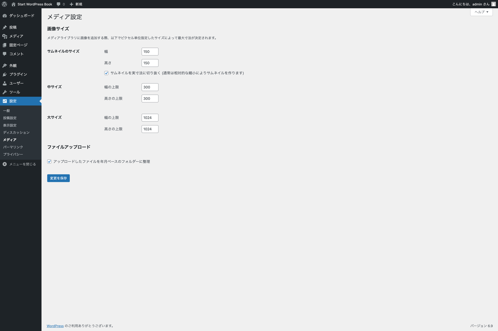{width=91.22mm}

こちらでは、投稿や固定ページの作成に使用される画像やその他のメディアに関連する設定ができます。

#### 画像サイズ

用意されている画像サイズを数値指定できます。サムネイル画像だけは、画像を実寸法に切り抜くかどうかを選択できます。

#### ファイルアップロード

**アップロードしたファイルを年月ベースのフォルダーに整理**にチェックを入れると、`wp-content/uploads/2025/12` というように年月別のフォルダーが自動的に用意され保存されます。

### パーマリンク 

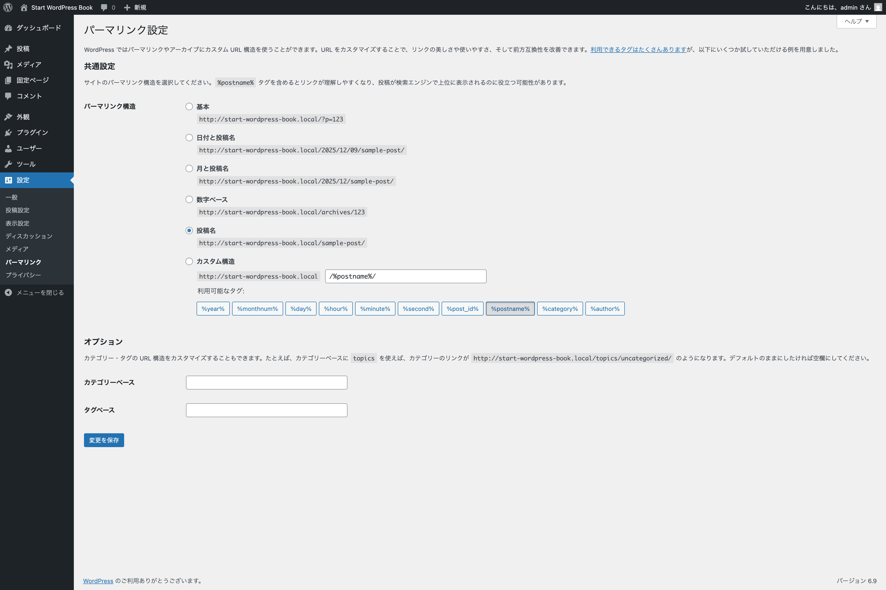{width=91.22mm}

こちらでは、ウェブサイトのパーマリンク構造を設定できます。パーマリンクとは、投稿、固定ページ、カテゴリー、タグなどの個別のコンテンツにアクセスするための URL のことです。

パーマリンク設定は、ブログやウェブサイトの運用が始まった後に変更することは、投稿や固定ページの URL が変わってしまうのでお勧めしません。できるだけ運用を始めるタイミングでしっかりと検討することをお勧めします。

後ほど変更できないという意味ではありません。変更した場合はリダイレクト処理など適切な対応を行うことで対応は可能です。しかし、投稿や固定ページが増えるほど対応件数が増えるため、個人的には可能な限り初期段階でパーマリンクに対する検討をお勧めしています。

#### 共通設定

以下のパーマリンク構造を選択できます。

- **基本** - デフォルトの構造です。`https://[your-domain].com/?p=123` のような形式になります。
- **日付と投稿名** - 日付と投稿名に基づいた構造です。`https://[your-domain].com/2025/12/31/sample-post/` のような形式になります。
- **月と投稿名** - 月と投稿名に基づいた構造です。`https://[your-domain].com/2025/12/sample-post/` のような形式になります。
- **数字ベース** - 数字に基づいた構造です。`https://[your-domain].com/archives/123` のような形式になります。
- **投稿名** - 投稿名に基づいた構造です。`https://[your-domain].com/sample-post/` のような形式になります。
- **カスタム構造** - 独自の構造を設定できます。利用できるタグは画面内に記載されています。

**投稿名**を含んだパーマリンクを選択する場合、投稿や固定ページに入力した日本語のタイトルをそのまま採用される場合があります。適宜アルファベットや英単語に変換するなど対応が必要になる場合があります。

#### オプション

- **カテゴリーのベース** - カテゴリーアーカイブの URL に使用する接頭辞を設定します。例えば、`topics` と設定すると、カテゴリーアーカイブの URL は `https://[your-domain].com/topics/category-name/` のようになります。
- **タグのベース** - タグアーカイブの URL に使用する接頭辞を設定します。例えば、`tags` と設定すると、タグアーカイブの URL は `https://[your-domain].com/tags/tag-name/` のようになります。

### プライバシー

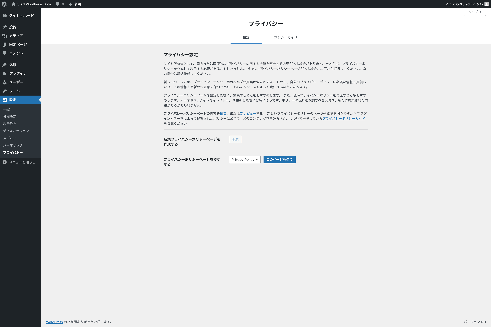{width=91.22mm}

こちらでは、ウェブサイトのプライバシーポリシーページを設定できます。デフォルトでは自動的に下書き状態の固定ページで用意されており設定されているので、対象となる固定ページを公開状態にすることで公開されます。 別途、新しく生成することもできます。