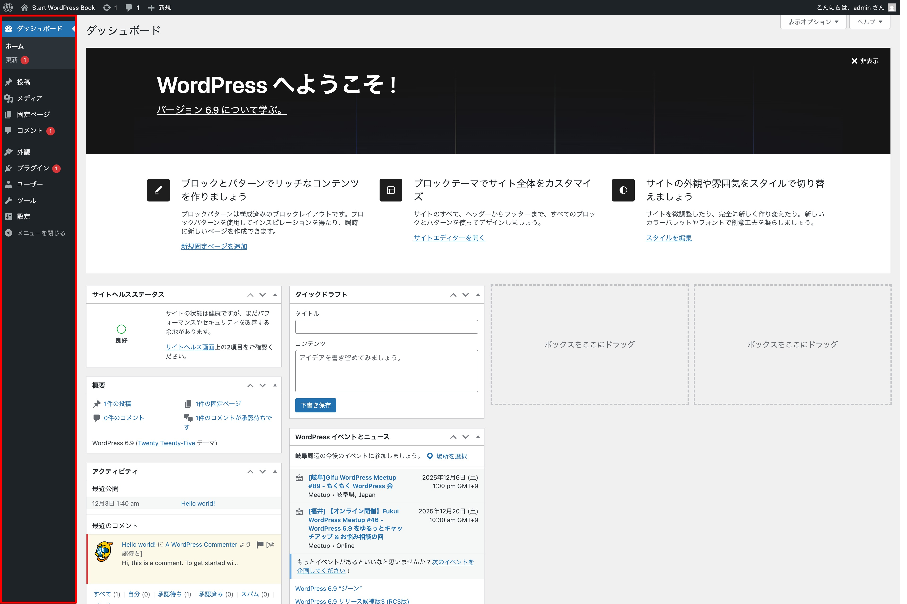
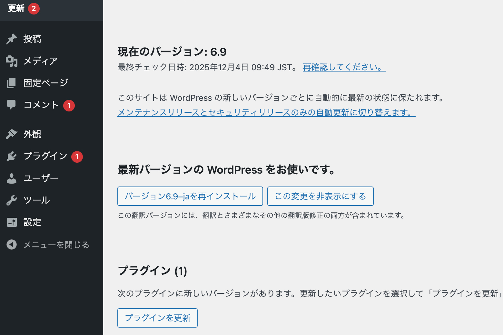
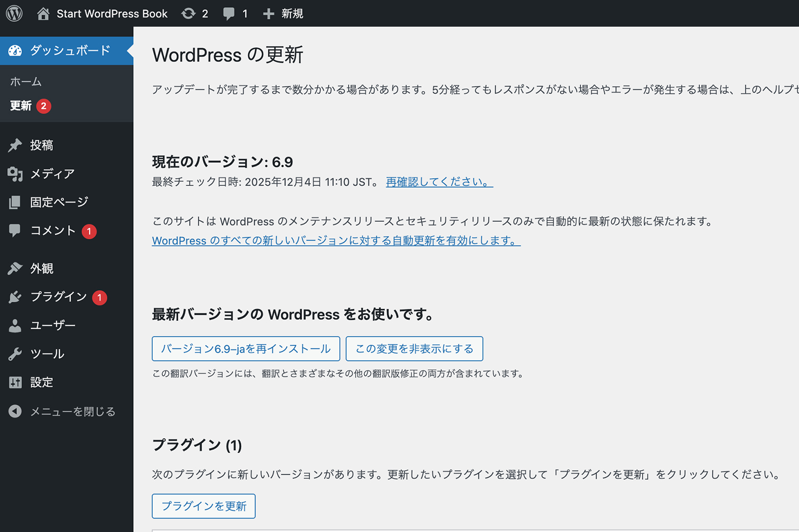
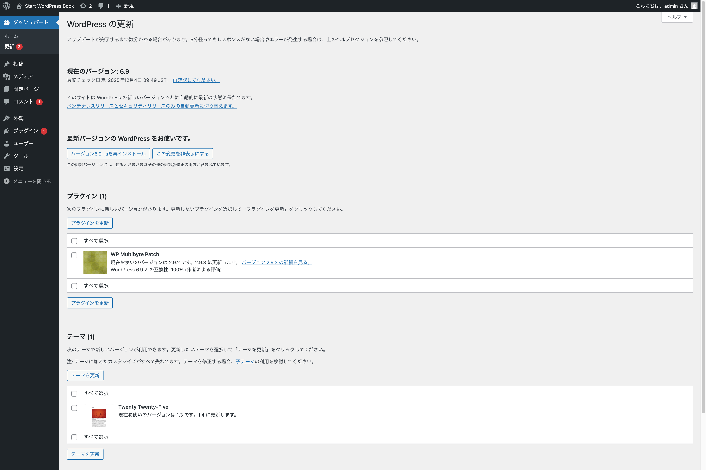
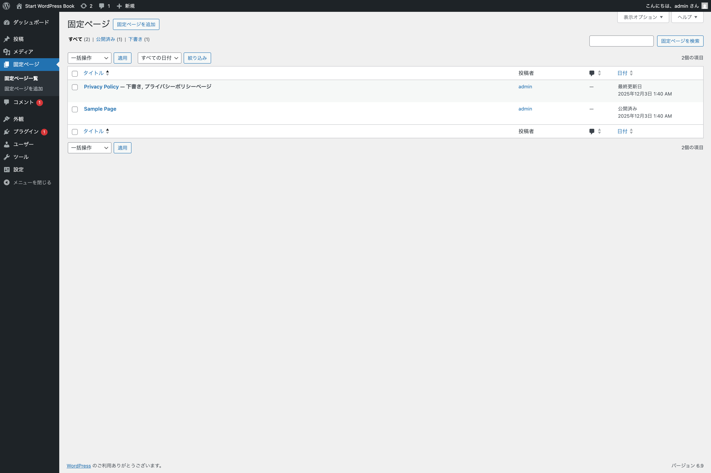
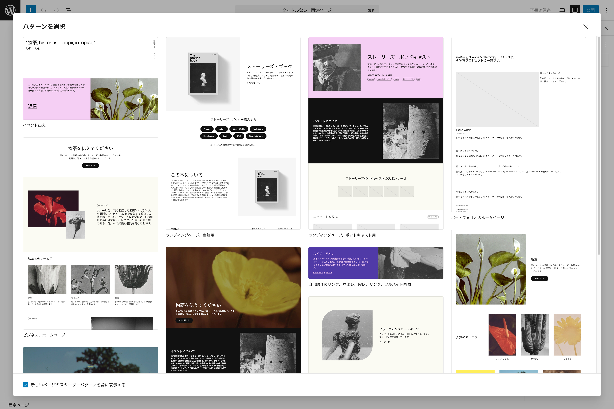
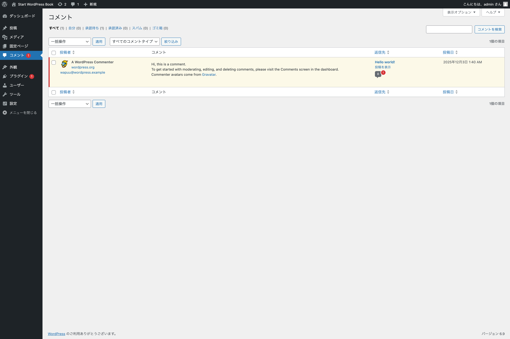
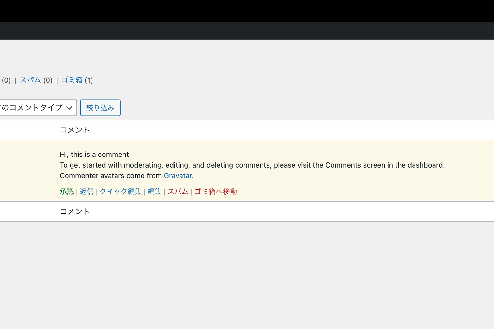

# メインナビゲーション（ナビゲーションメニュー）

{width=91.22mm}

管理画面にログインすると左サイドバーに見えるのが **メインナビゲーション**です。または、ナビゲーションメニューとも呼ばれたりします。

呼ばれ方はさまざまありますが、それほど名称にこだわる必要がありません。

## ダッシュボード

### ホーム

**ダッシュボード > ホーム** は、WordPress 管理画面にログインしたら通常最初に表示される画面です。

### 更新 `https://wordpress.org/documentation/article/dashboard-updates-screen/`

**ダッシュボード > 更新** には、WordPress 本体のアップデートを自動的に行ったり、手動アップデートを完了するために必要なファイルをダウンロードしたりするために必要なリンクが表示されています。

{width=91.22mm}

最新の WordPress を利用している場合、上のように **「最新バージョンの WordPress をお使いです。」** と表示されます。よって、WordPress 本体に対するアップデートは、実施できるものはないと判断できます。

また、WordPress 本体に関する **自動アップデートの設定** も確認しておくと良いでしょう。

#### マイナーアップデートのみ自動になっている場合

**マイナーアップデート** とは、バージョン番号が `6.9.0` から `6.9.1` などに変わるアップデートを指します。マイナーアップデートには、軽微なバグ修正やセキュリティに関する修正が含まれることが多いです。

この **マイナーアップデートのみ自動更新** になっている状態は以下のような状態です。ご自身の環境で確認してみてください。

- **「このサイトは WordPress のメンテナンスリリースとセキュリティリリースのみで自動的に最新の状態に保たれます。」** というメッセージが表示されている
- その下に **「WordPress のすべての新しいバージョンに対する自動更新を有効にします。」** というテキストリンクが表示されている

{width=91.22mm}

#### メジャーアップデートを含む全てのアップデートが自動になっている場合

全てのアップデートを自動に設定することもできます。これは **メジャーアップデート** も含む自動設定になります。

**メジャーアップデート** とは、バージョン番号が `6.8` から `6.9` などに変わるアップデートを指します。メジャーアップデートには、機能追加や大きな変更を伴う場合もあるので、あらかじめ安全な環境を別途用意してテストを行ってから、本番環境でアップデートを実施することをお勧めします。

この **全てのアップデートが自動更新** になっている状態は、以下のような状態です。ご自身の環境で確認してみてください。

- **「このサイトは WordPress の新しいバージョンごとに自動的に最新の状態に保たれます。」**というメッセージが表示されている
- その下に **「メンテナンスリリースとセキュリティリリースのみの自動更新に切り替えます。」** というテキストリンクが表示されている

{width=91.22mm}

#### プラグインやテーマのアップデート

利用可能なアップデートがある全てのプラグインとテーマをアップデートできます。また、言語を英語（米語）以外に設定している場合は、翻訳アップデートもインストールされます。

{width=91.22mm}

テーマやプラグインの自動更新設定は、別途それぞれのメニュー内で行えます。

## 投稿

### 投稿一覧

{width=91.22mm}

ナビゲーションメニューから**投稿**を選択すると、この**投稿一覧**に移動します。ここでは、WordPress 内のすべての投稿を管理できます。この画面から、投稿の編集、削除、閲覧が可能です。また、フィルタリングや検索機能を使えば、特定の条件に一致する投稿を素早く簡単に見つけられます。

以下に、ページ上部に配置されているボタンやフォームについて紹介します。

- **投稿を追加** - 新しく投稿を追加できます。クリックすると投稿編集画面（デフォルトではブロックエディター）を開きます。
- **投稿を検索** - 投稿を検索できます。投稿数が多くなり、複数ページにまたがるようになった際にとても便利です。

次に、投稿一覧テーブルに含まれる項目や関連する機能について紹介します。

- **チェックボックス** - このチェックボックスをクリック（チェック）すると、特定の投稿が（テーブル上部左にある）一括操作で処理できるようになります。
- **タイトル** - 投稿のタイトルがリンクとして表示されます。タイトルをクリックすると、その投稿を編集できます。また、投稿が下書き、非公開、保留中、固定またはパスワード保護されている場合は、タイトル横に太字で表示されます。
- **投稿者** - 投稿を執筆した投稿者がリンク形式で表示されます。投稿者名をクリックすると、その投稿者が作成したすべての投稿が投稿一覧に表示されます。
- **カテゴリー** - この投稿が属するすべてのカテゴリーをリンク形式で表示されます。各カテゴリーリンクをクリックすると、そのカテゴリーに割り当てられた投稿が一覧表示されます。
- **タグ** - 投稿に関連付けられたすべてのタグがリスト形式で表示されます。各タグリンクをクリックすると、そのタグが割り当てられた投稿が一覧表示されます。
- **コメントアイコン** - 投稿に寄せられたコメントの中で承認されたコメントの数がバブルアイコンの中に表示されます。承認されていないコメントがある場合は、バブルアイコンの右上に赤丸数字で件数が表示されます。
- **日付** - 公開済みの投稿の場合は**公開日**が、その他の場合は**最終更新日**が表示されます。また、予約投稿の場合には**公開予定日**が表示されます。

テーブル上部には、**一括操作** 以外に、年月で絞り込みができる**全ての日付**や、カテゴリー別に絞り込みができる**カテゴリー一覧**というセレクトボックスが用意されています。

画面右上にある**表示オプション**では、以下のようなメニューが用意されています。

{width=91.22mm}

- **カラム** - デフォルトでは全てにチェックが入っていますが、表示する必要がないカラムはチェックを外すことで非表示に切り替えられます。
- **ページネーション** - １ページに表示する投稿の項目数を変更できます。
- **表示モード** - デフォルトでは**コンパクト表示**になっていますが、抜粋文やテーブル行にマウスカーソルを乗せないと表示されないメニューなどを常時表示させる**拡張表示**を選ぶこともできます。

先ほどの**表示モード**を**拡張表示**にすることで常時表示されるメニューについて紹介します。こちらはデフォルトでは、投稿一覧テーブルの各行にマウスカーソルを乗せることで表示させられます。以後、このメニューを**即時アクション**と呼びます。

{width=91.22mm}

- **編集** - 投稿を編集できます。投稿のタイトルリンクをクリックした際の移動先と同じく、エディターが開きます。
- **クイック編集** - こちらをクリックすると、タイトルやスラッグ、日付、カテゴリーやタグといった項目を素早く編集できます。投稿編集画面を開くまでもない編集に最適です。
- **ゴミ箱へ移動** - 投稿をゴミ箱へ移動します。こちらをクリックすると投稿が削除されたように感じますが、実際にはゴミ箱に移動されただけで**完全な削除にはなりません**。完全な削除を行う場合には、ゴミ箱からも削除する必要があります。なお、公開状態の投稿をゴミ箱へ移動し復元した場合、直ちに公開状態にはならず下書き状態になります。
- **表示** - 実際の表示を確認できます。リンクをクリックすると該当する投稿の実際の表示を確認できます。

{width=91.22mm}

### 投稿を追加

{width=91.22mm}

**投稿を追加**をクリックすると、新規投稿を作成するためにブロックエディターが表示されます。ブロックエディターについては別章で取り上げます。

### カテゴリー

WordPress の各投稿は、1 つ以上のカテゴリーに分類されます。これにより、投稿を土曜のコンテンツの他の投稿とグループ化できます。

各カテゴリーは親カテゴリーに割り当てることが可能で、これによりカテゴリー構造ないに階層構造を設定できます。

{width=91.22mm}

こちらの画面は、

- **新しいカテゴリーを追加する**セクション
- **既存のカテゴリーを編集または削除する**セクション

#### カテゴリーを追加

新しいカテゴリーを追加するセクションでは、以下のような設定項目が用意されています。

- **名前** - カテゴリー名を設定します。カテゴリー名は一意である必要があります。
- **スラッグ** - カテゴリースラッグも一意である必要があります。こちらは URL で使用されます。
- **親カテゴリー** - 登録しているカテゴリーを子カテゴリーにしたい場合には、こちらで**親カテゴリー**を指定します。
- **説明** - こちらはオプションです。テーマやテンプレートの設定によっては表示されないものもあります。

例えば、カテゴリー名に**カメラ**、スラッグに**camera**と指定した場合、`sample.com/blog/food/` のような URL を持つ**カメラ**の投稿すべて表示されます。このようにスラッグはアーカイブ一覧の URL にも関係することに留意しておきましょう。

#### カテゴリー一覧

こちらのカテゴリー一覧では、階層ごとかつアルファベット順に表示されます。子カテゴリーは親カテゴリーの下に表示され、先頭にハイフン（横線）が付きます。

{width=91.22mm}

カテゴリー一覧には以下のような項目があります。

- **チェックボックス** - チェックを入れると上の**一括操作**で**削除**を選択して、カテゴリーを一括削除できます。
- **名前** - カテゴリーの名前が表示されます。
- **説明** - カテゴリーの説明が表示されます。
- **スラッグ** - カテゴリーのスラッグが表示されます。
- **カウント** - カテゴリーに属する投稿の数が表示されます。テキストリンクになっている数字をクリックすると、**投稿一覧のカテゴリーが絞り込まれた状態の画面**に移動します。

画面右上にある**表示オプション**では、**カラム**や**ページネーション**（前述のため説明省略）が設定・変更できます。

カテゴリー一覧でカテゴリーにマウスカーソルを乗せると、**即時アクション**が表示されます。

- **編集** - 該当するカテゴリーの編集画面を表示します。
- **クイック編集** - こちらをクリックすると、**名前**や**スラッグ**を素早く編集できます。
- **表示** - 該当するカテゴリーアーカイブページを表示します。

#### カテゴリーを編集

{width=91.22mm}

カテゴリー一覧から任意のカテゴリー名をクリック、または即時アクションから**編集**をクリックすると、カテゴリーを編集できるページへ移動します。こちらでは、カテゴリーを新規追加した際に入力した内容を編集できます。また、クイック編集では編集できない**親カテゴリー**や**説明**が編集可能です。

### タグ

{width=91.22mm}

WordPress のすべての投稿はタグに分類できます。**カテゴリーとは違い、タグには階層構造がないため親子関係を持ちません。**しかし、タグ名とスラッグはカテゴリーと同様に一意である必要があります。

**タグを追加**、**タグ一覧**、**タグの編集**でできることは、カテゴリーで説明した内容と重複するため割愛します。

## メディア

メディアとは、WordPress にアップロードして使用する画像や動画、音声ファイルなどを指します。通常、投稿や固定ページの作成時にアップロードされ、コンテンツに挿入されます。

### ライブラリ

{width=91.22mm}

ナビゲーションメニューの**メディア**をクリックすると**ライブラリ**に移動します。ここでは、アップロードしたメディアを表示・編集・削除できます。

メディア一覧の上部左に、**リストアイコン**と**グリッドアイコン**（デフォルトではアクティブ）があります。これらを切り替えてメディア一覧のレイアウトを変更できます。

{width=91.22mm}

また、メディアの種類（画像・音声ファイル・動画など）や年月別で絞り込みができます。さらに、メディアに登録されているタイトルなどのテキストをもとに検索もできます。

最上部にある**メディアファイルを追加**ボタンをクリックすることで、新しくメディアを追加できます。また、その動作をしなくても新規追加したいファイルをメディア一覧にドラッグ＆ドロップするだけでもアップロードできます。（複数のファイルを一度にアップロードも可能です）

{width=91.22mm}

#### 添付ファイルの詳細

メディア一覧から任意のメディアをクリックすると、メディア情報の設定・編集ができます。

{width=91.22mm}

こちらで閲覧できる情報は以下の通りです。

- **更新日** - メディアがアップロードされた日付
- **アップロード** - メディアをアップロードしたアカウント
- **アップロード先** - このメディアを含む投稿または固定ページ名
- **ファイル名** - メディアファイルの名前
- **ファイルタイプ** - メディアファイルの MIME タイプ
- **ファイルサイズ** - メディアファイルのファイルサイズ
- **サイズ**（画像ファイルのみ）- 画像メディアのサイズ

そして、設定・編集できる情報は以下の通りです。

- **代替テキスト**（画像ファイルのみ）- 画像の代替テキスト
- **タイトル** - メディアの名前
- **キャプション** - メディアに掲載するキャプション
- **説明** - メディアの説明
- **ファイルURL**（編集不可）ーメディアファイルへの直接リンク
- **アーティスト名**（音声ファイルのみ）- このメディアの歌手・作曲家・またはプロデューサー
- **アルバム**（音声ファイルのみ）- このメディアが含まれるアルバムのタイトル

さらに、その下にリンクメニューが用意されています。

- **メディアファイルを表示** - メディアファイルに直接アクセスします
- **さらに詳細を編集** - より詳細にメディアの情報を編集できます
- **ファイルをダウンロード** - メディアファイルをダウンロードします
- **完全に削除する** - メディアファイルを完全に削除します

{width=91.22mm}

### メディアファイルを追加

{width=91.22mm}

こちらはメディアをアップロードする専用のメニューになっており、単体のファイルをアップロードすることもできますし、複数のファイルを一括でアップロードもできます。

通常、ナビゲーションメニューから移動して開くのは**複数ファイル用アップローダー**ですが、ファイルのドロップエリアの下部にある**「ブラウザのアップローダー」**をクリックすることで、単一ファイル専用のアップローダーに切り替えることも可能です。

{width=91.22mm}

## 固定ページ

### 固定ページ一覧

{width=91.22mm}

ナビゲーションメニューから**固定ページ**を選択すると、この**固定ページ一覧**に移動します。ここでは、WordPress 内のすべての固定ページを管理できます。出来ることは**投稿一覧**とほとんど同じです。

以下に、ページ上部に配置されているボタンやフォームについて紹介します。

- **固定ページを追加** - 新しく固定ページを追加できます。クリックすると固定ページ編集画面（デフォルトではブロックエディター）を開きます。
- **固定ページを検索** - 固定ページを検索できます。固定ページの数は多くなった際には重宝します。

次に紹介したいのは、固定ページ一覧テーブルに含まれる項目や関連する機能ですが、**投稿一覧**で紹介している内容と重複する項目が多いため割愛します。

固定ページ一覧では、投稿一覧とは違い、**カテゴリーやタグ**はデフォルトでは用意されていません。（コードを介したカスタマイズを行うことによって対応は可能です）

また、**表示オプションメニュー**と**即時アクションメニュー**も投稿一覧と同じものになります。

### 固定ページを追加

**固定ページを追加**をクリックすると、新規固定ページを作成するためにブロックエディターが表示されます。

しかし、**テーマ Twenty Twenty-Five を有効化している状態**では、デフォルトで**新しいページのスターターパターンを常に表示する**が有効になっているため、次の画像のようにパターンを選択できるモーダルが表示されます。

{width=91.22mm}

パターンの挿入をしない場合は、モーダルの右上のバツ印アイコンをクリックして閉じてください。次からモーダルを表示させたくない場合は、左下のチェックを外しておくと良いでしょう。

ブロックエディターについては別章で取り上げます。

## コメント

**コメント**では、投稿へのコメントの内容を編集・削除できます。また、コメントをスパムとしてマークしたり、ゴミ箱に送信したり、コメントに返信したりできます。

コメントを投稿できるユーザーやコメントを管理する方法についてのルールは、**管理画面 > 設定 > ディスカッション**で設定できます。

{width=91.22mm}

コメント一覧テーブルの一括操作や絞り込み方法については、投稿や固定ページと同じです。コメント一覧では、**コメントタイプ**で絞り込みができます。

コメント一覧テーブルに含まれる項目について紹介します。

- **チェックボックス** - 一括操作の対象にする際にチェックを入れます。
- **Gravatar** - コメント作成者の Gravatar アイコンが表示されます。
- **投稿者** - コメントの投稿者名が表示されます。その下には、その他のコメント投稿者に関する情報は表示されます。
- **コメント** - コメント内容が表示されます。
- **返信先** - どの投稿に付けられたコメントなのか確認できます。
- **投稿日** - コメントが投稿された年月日時が表示されます。

コメント行にマウスをホバーすると、コメント内容下に即時アクションが表示されます。

{width=91.22mm}

- **承認/非承認** - コメントが承認状態の場合は※※非承認**と表示され、非承認状態の場合は**承認**と表示されます。
- **返信** - クリックをするとコメントの下に**コメントに返信**編集エリアが表示され、返信内容を入力して**承認と返信**をクリックすることで、即時にコメント返信ができます。
- **クイック編集** - 投稿されたコメントに関する情報を簡単に編集ができます。
- **編集** - 上のクイック編集とは違い、別途**コメントを編集**画面に切り替わり編集ができます。
- **スパム** - 該当コメントをスパムとしてマークします。
- **ゴミ箱へ移動** - 該当コメントをゴミ箱へ移動させます。ゴミ箱から復元も可能ですし、完全に削除されるわけではありません。

**表示オプション**の内容は、**カテゴリーやタグと同様**となっていますので、紹介は割愛します。

### 外観
#### ブロックテーマを有効化している場合
- テーマ `https://wordpress.org/documentation/article/appearance-themes-screen/`
- エディター（サイトエディターが開く）

#### クラシックテーマを有効化している場合
- テーマ `https://wordpress.org/documentation/article/appearance-themes-screen/`
- デザイン（サイトエディターライクなスタイルとパターンの管理画面が開く）
- カスタマイズ `https://wordpress.org/documentation/article/customizer/`
- ウィジェット `https://wordpress.org/documentation/article/block-based-widgets-editor/` `https://wordpress.org/documentation/article/appearance-widgets-screen-classic-editor/`
- メニュー `https://wordpress.org/documentation/article/appearance-menus-screen/`
- 背景（背景画像とカスタム背景）
- テーマファイルエディター `https://wordpress.org/documentation/article/appearance-theme-file-editor-screen/`

### プラグイン
- インストール済みプラグイン `https://wordpress.org/documentation/article/plugins-screen/`
- プラグインを追加 `https://wordpress.org/documentation/article/plugins-add-new-screen/`

### ユーザー
- ユーザー一覧 `https://wordpress.org/documentation/article/users-screen/`
- ユーザーを追加 `https://wordpress.org/documentation/article/users-add-new-screen/`
- プロフィール `https://wordpress.org/documentation/article/users-your-profile-screen/`

### ツール
- 利用可能なツール `https://wordpress.org/documentation/article/tools-screen/`
- インポート `https://wordpress.org/documentation/article/tools-import-screen/`
- エクスポート `https://wordpress.org/documentation/article/tools-export-screen/`
- サイトヘルス `https://wordpress.org/documentation/article/site-health-screen/`
- 個人データのエクスポート `https://wordpress.org/documentation/article/tools-export-personal-data-screen/`
- 個人データの消去 `https://wordpress.org/documentation/article/tools-erase-personal-data-screen/`
- テーマファイルエディター `https://wordpress.org/documentation/article/appearance-theme-file-editor-screen/`
- プラグインファイルエディター ``

### 設定
- 一般 `https://wordpress.org/documentation/article/settings-general-screen/`
- 投稿設定 `https://wordpress.org/documentation/article/settings-writing-screen/`
- 表示設定 `https://wordpress.org/documentation/article/settings-reading-screen/`
- ディスカッション `https://wordpress.org/documentation/article/settings-discussion-screen/`
- メディア `https://wordpress.org/documentation/article/settings-media-screen/`
- パーマリンク `https://wordpress.org/documentation/article/settings-permalinks-screen/`
- プライバシー `https://wordpress.org/documentation/article/settings-privacy-screen/`