# サイトエディターとは

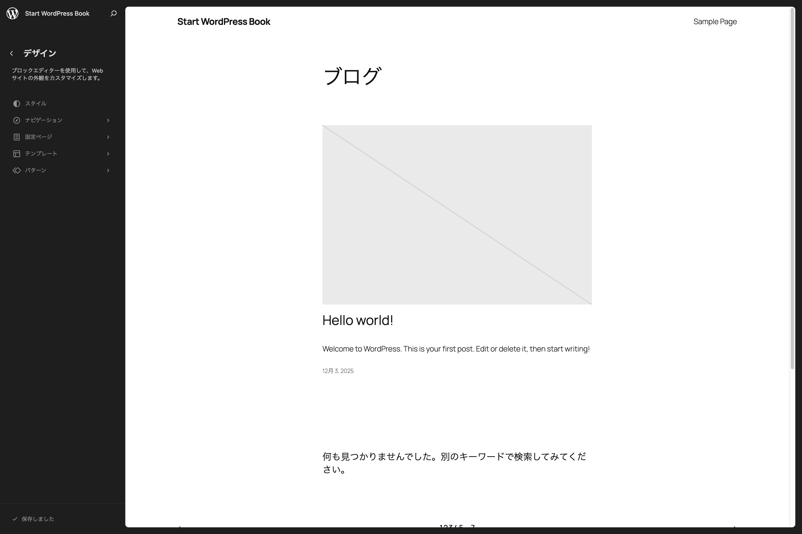{width=91.22mm}

サイトエディターとは、ヘッダーやフッター、そしてその間のすべてを含むサイト全体をブロックで構築するために使用する WordPress の強力なツールの 1 つです。

# サイトエディターにアクセスするためには

サイトエディターへアクセスするためのメニューは、管理画面サイドバー内**外観**から**エディター**よりアクセスできます。

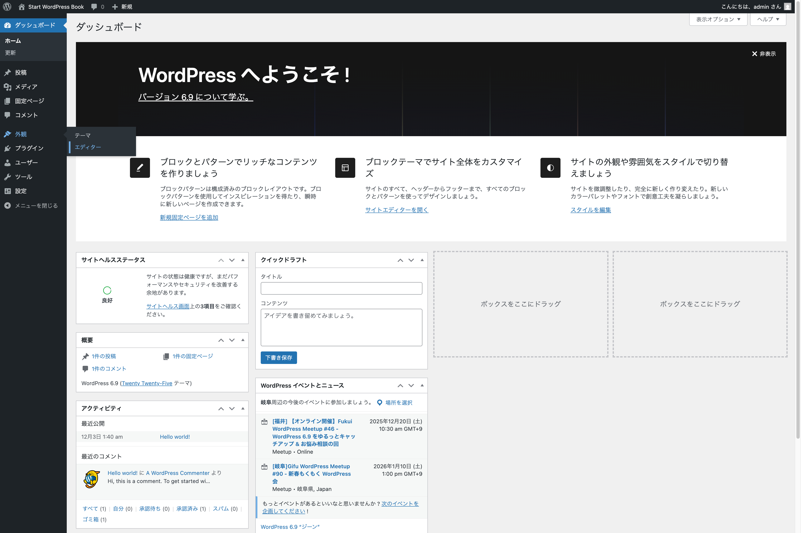{width=91.22mm}

上の画像は標準テーマである **Twenty Twenty-Five** を有効化している場合の例です。他にインストールしているプラグインによっては、別のメニューが追加される場合があります。ご自身の環境でも確認してみましょう。

# 左サイドバーのメニュー

{width=91.22mm}

## WordPress ロゴメニュー

ダッシュボードへ戻るリンクです。

## サイト名

サイト名にカーソルを合わせると、右上向きの矢印が表示されます。こちらをクリックすると、ウェブサイトを新しいタブで開きます。

## コマンドパレットを開く

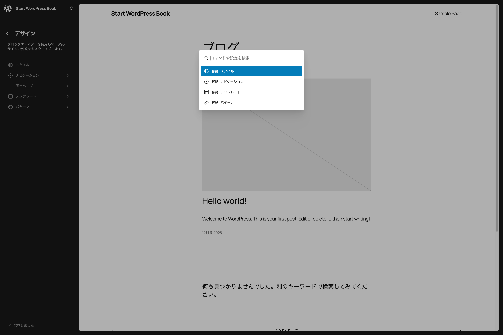{width=91.22mm}

クリックするとコマンドパレットが起動します。**command（Windowsの場合は ctrl）+K**でも起動できます。

## スタイル

サイトのスタイルに関する設定ができます。

### 目のアイコン

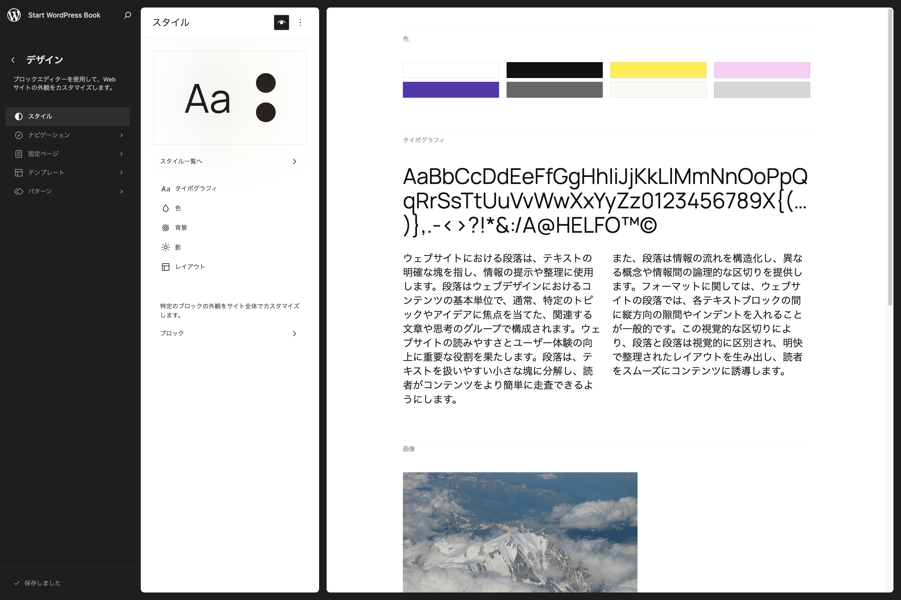{width=91.22mm}

クリックすると**スタイルブック**が開きます。スタイルブックとは、テーマで設定してあるスタイルを確認できます。

この**左サイドバーのスタイル**からアクセスできるスタイルブックは**簡易的なスタイルの参照のみ**可能となっています。

本来のスタイルブックは、各ブロックに設定してあるスタイルを一覧できるものです。そちらへのアクセスは**トップツールバーのスタイル**から目のアイコンをクリックしてアクセスする必要があります。

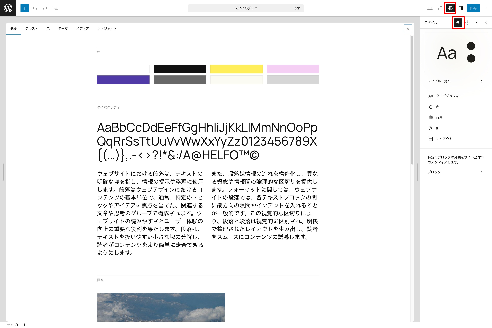{width=91.22mm}

### 追加CSS

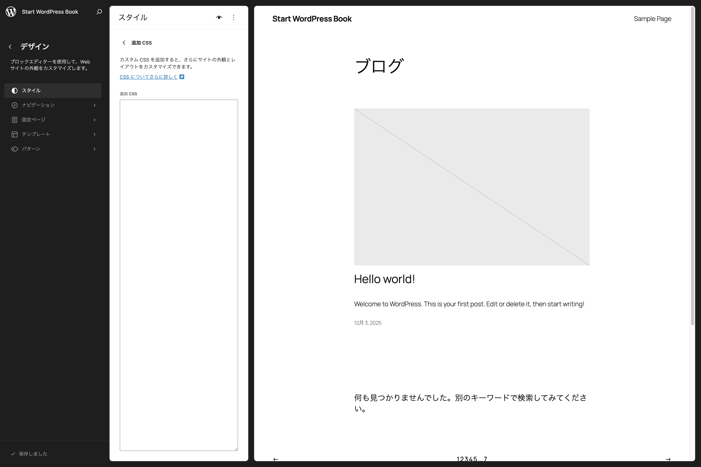{width=91.22mm}

クリックすると**追加CSS**の編集画面が表示されます。ウェブサイト全体に適用したいスタイルを記述します。

### スタイル一覧へ

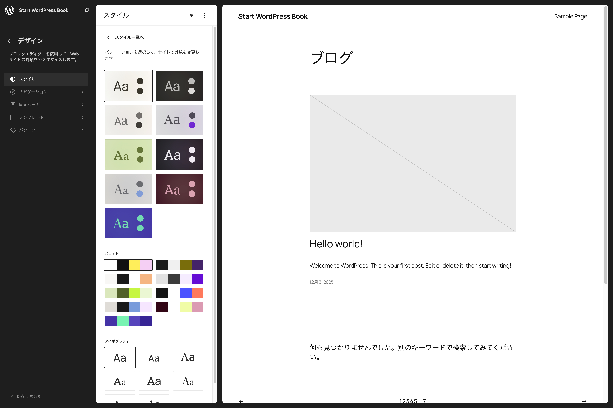{width=91.22mm}

テーマが用意しているスタイルバリエーションを選択できます。

全体を一括で変更できるスタイルバリエーションと、配色パレットとタイポグラフィを別々に変更できるスタイルバリエーションが用意されています。これらはテーマから提供されるもので、利用するテーマによって数や内容が異なります。

### タイポグラフィ

ウェブサイト内でのタイポグラフィに関する設定を行えます。

**タイプセット**では、あらかじめ用意されているフォントに関するプリセットを切り替えることで、さまざまなフォントの組み合わせを試せます。

**フォント**では、利用できるフォントを確認したり、各フォントをクリックすることでフォントライブラリ内の該当フォント設定画面へ移動できます。右側のアイコンをクリックすることで、フォントライブラリへもアクセス可能です。

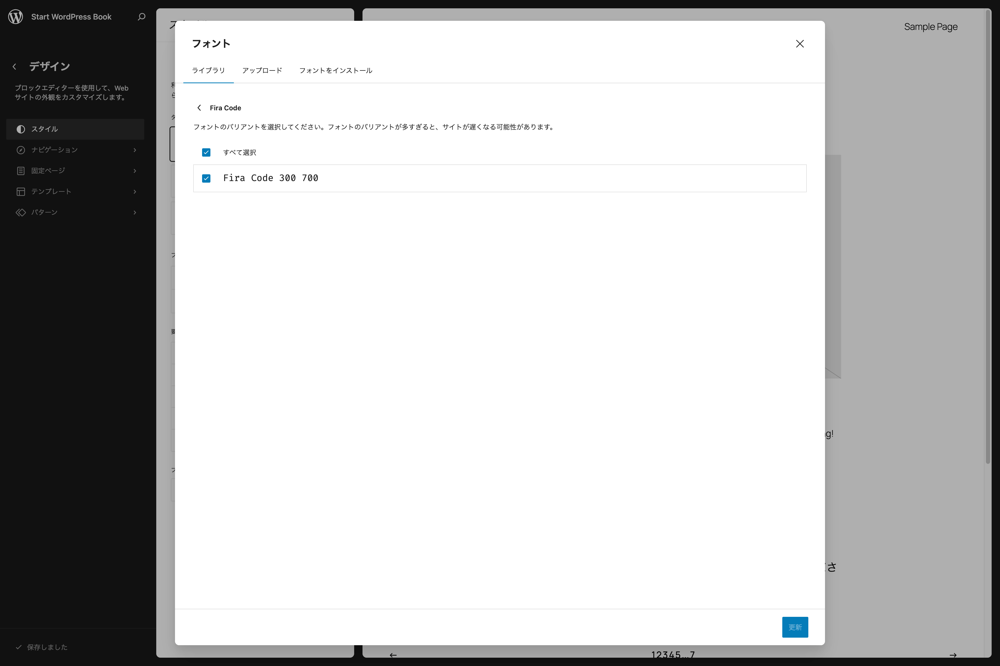{width=91.22mm}

**要素**では、ウェブサイトを通したテキストやリンク、見出しやキャプション、そしてボタンに関するフォントの設定が行えます。

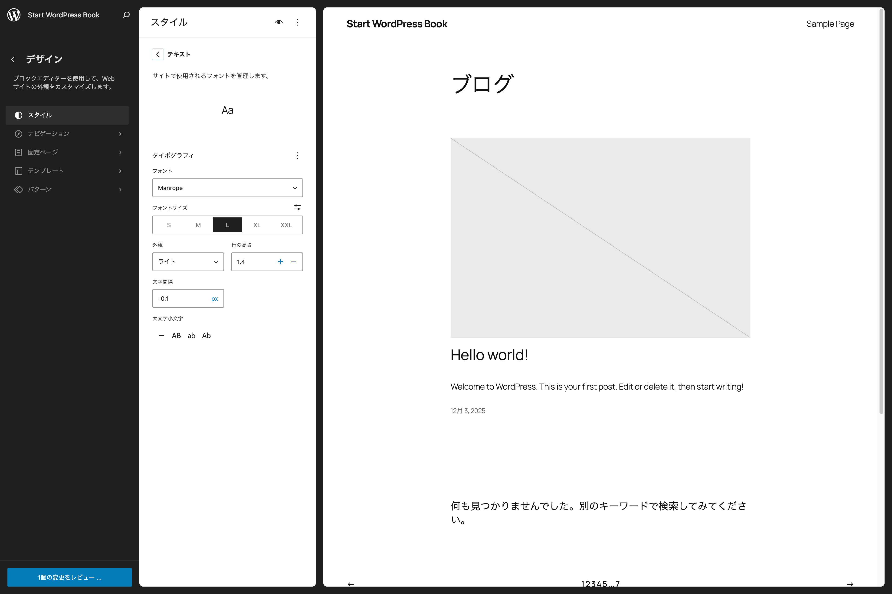{width=91.22mm}

**フォントサイズ**では、あらかじめテーマで定められているフォントサイズを変更したり、新しくフォントサイズプリセットを追加できます。さらに、流体タイポグラフィ（画面内ではフルードタイポグラフィと表記）の設定を、自動もしくは任意のフォントサイズを入力して行えます。

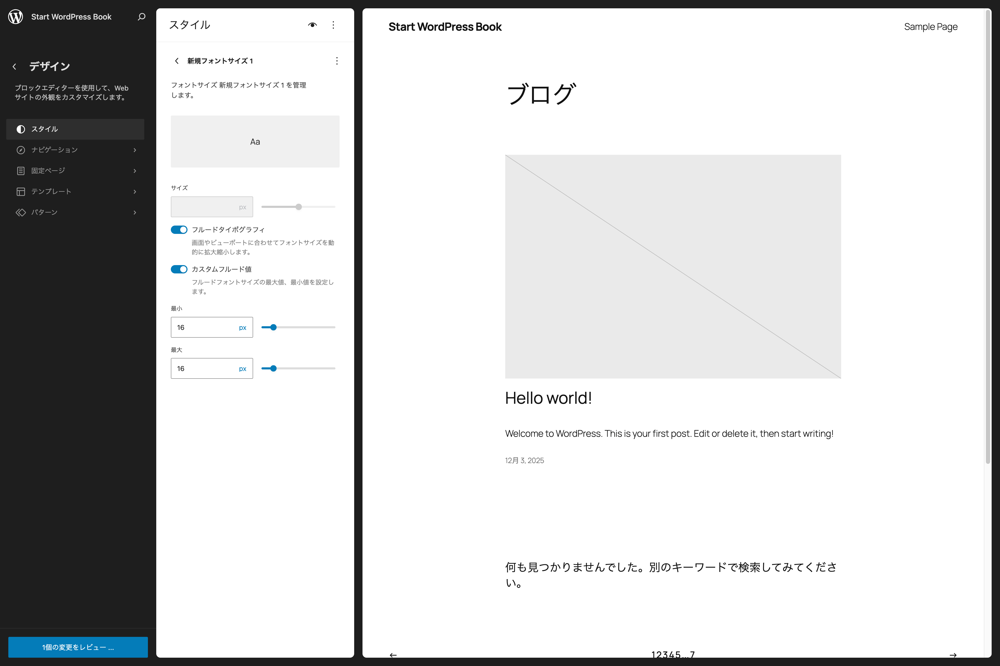{width=91.22mm}

### 色

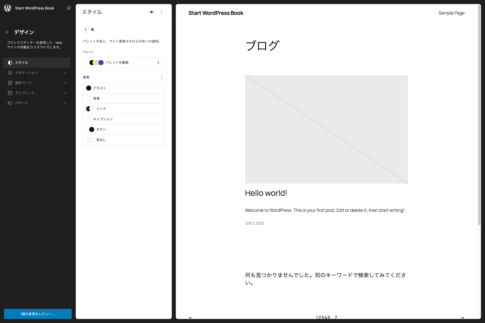{width=91.22mm}

ウェブサイト内でも色に関する設定を行えます。

#### パレット

**テーマ**では、テーマで設定されている色が表示されています。任意の色を選択して個別に変更することもできます。

**カスタム**から任意の色をパレットに追加できます。追加することでウェブサイト内で広く利用できるようになります。

**パレット**では、選択しているスタイルで定められているカラーパレットを確認でき、切り替えることで配色を切り替えられます。

#### 要素

テキスト、背景、リンク、キャプション、ボタン、見出しに関する色の設定が行えます。

### 背景

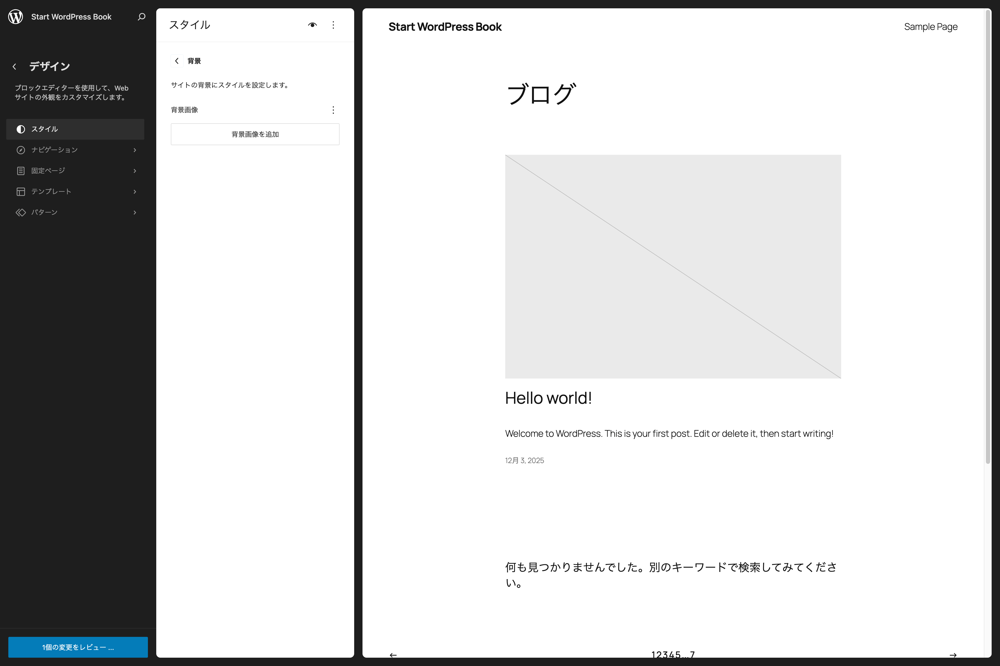{width=91.22mm}

ウェブサイト全体に適応する背景画像を設定できます。

### 影

{width=91.22mm}

さまざまなブロックで利用できる影を設定できます。すでに用意されているプリセットの他に、独自に追加することもできます。

{width=91.22mm}

### レイアウト

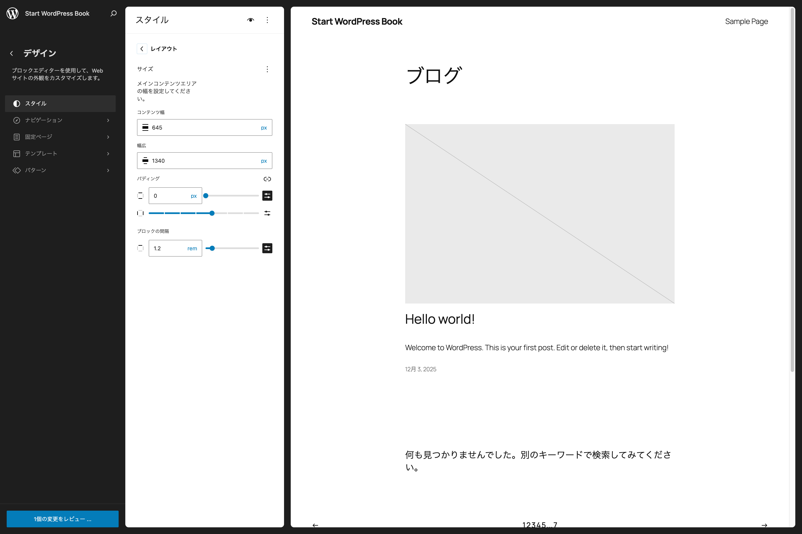{width=91.22mm}

ウェブサイト内でのレイアウトに関する設定が行えます。

**コンテンツ幅**や**幅広**のサイズを設定できます。また、グローバルパディングやブロックの間隔もこちらで設定可能です。

### ブロック

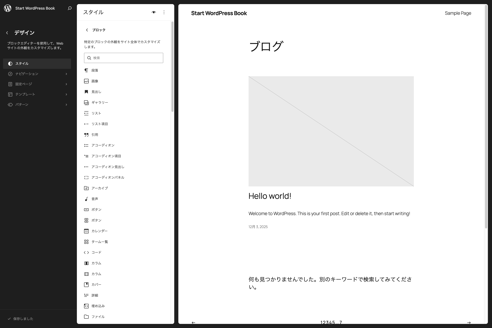{width=91.22mm}

任意のブロックのスタイルを設定できます。この設定はウェブサイトを通じて適用されます。また、ブロックによって設定可能な項目も違うため、それぞれで確認すると良いでしょう。

## ナビゲーション

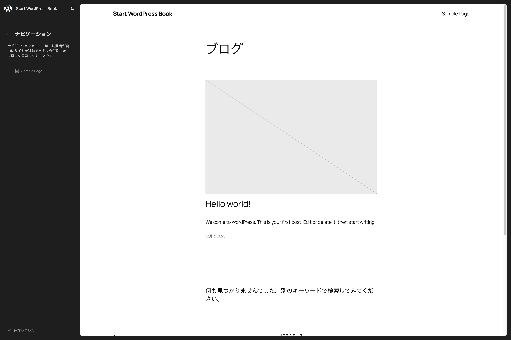{width=91.22mm}

配置してあるナビゲーションブロックに表示するメニューを管理できます。メニューの名前の変更や編集、複製や削除は３点メニューボタンから行えます。

## 固定ページ

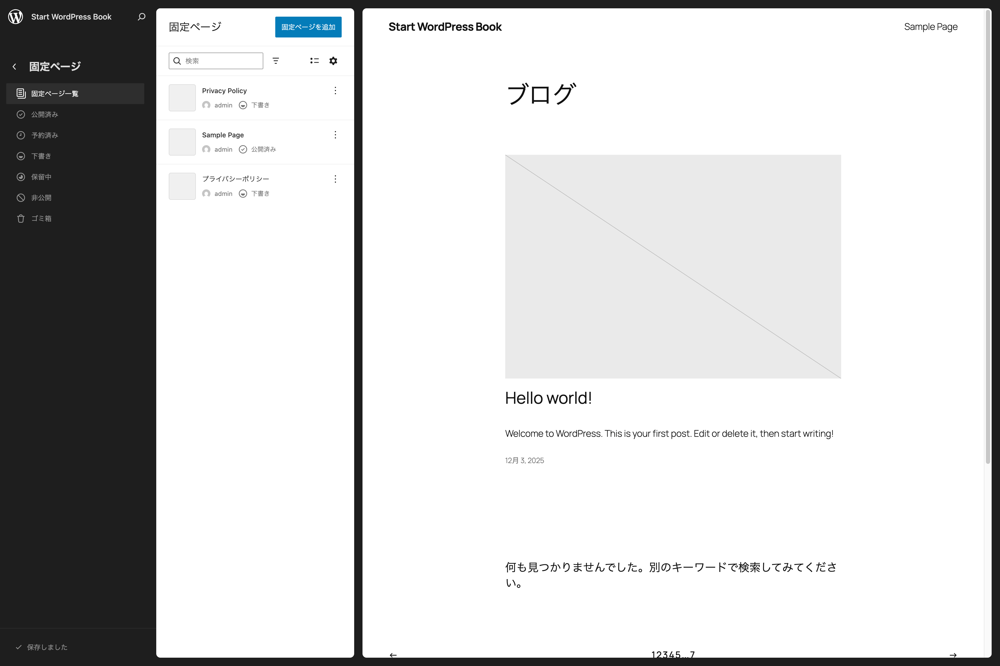{width=91.22mm}

固定ページの管理を行えます。ページの一覧から、公開済みや予約済み、また下書きや保留中などの固定ページを手軽に確認できます。

## テンプレート

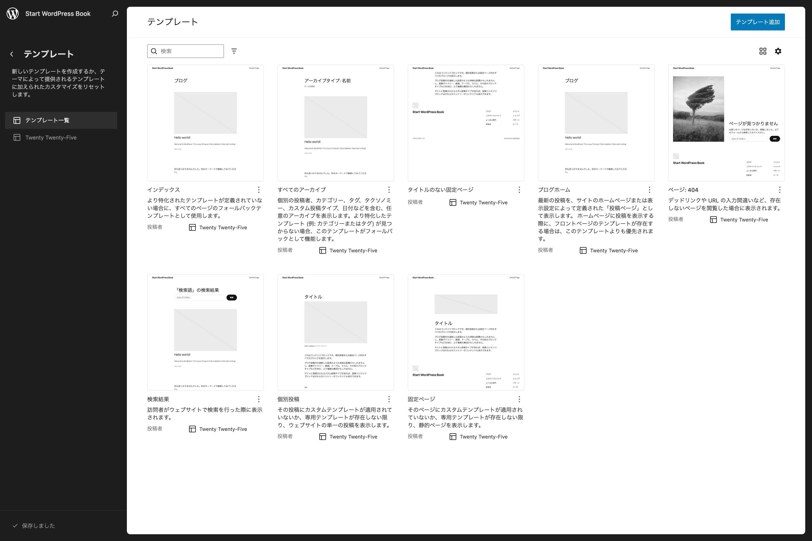{width=91.22mm}

利用できるテンプレートを管理できます。テーマから提供されているものあれば、独自に作成したもの表示されます。

## パターン

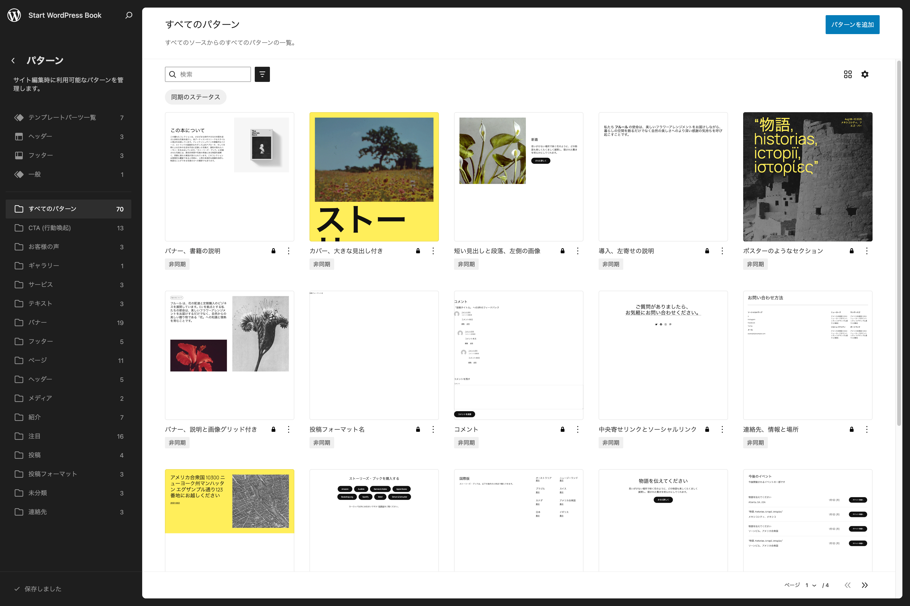{width=91.22mm}

利用できるパターンとテンプレートパーツを管理できます。

左サイドバー上部にはテンプレートパーツが箇所ごとに確認でき、その下ではパターンがパターンカテゴリーから選択できます。パターンカテゴリーは、独自にパターンを登録する際に新しく作成できるので、管理しやすいように工夫すると良いでしょう。

# トップツールバー

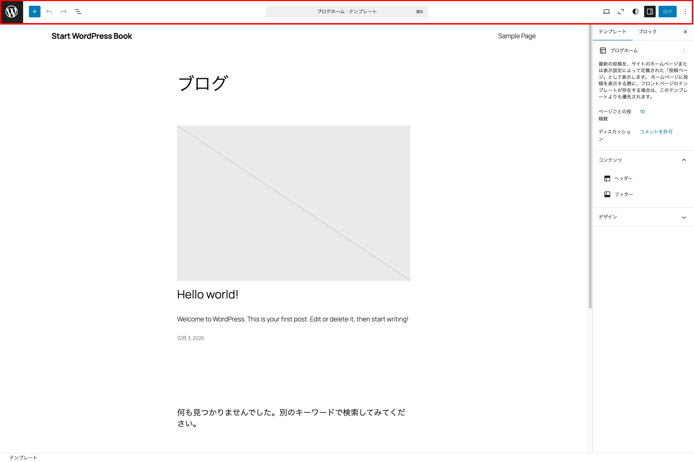{width=91.22mm}

サイトエディターのプレビューエリア（実際のウェブサイトの見た目を確認できるエリア）をクリックすると、サイトエディターが切り替わりブロックなどを選択して編集可能な状態に切り替わります。

その際に画面上部に表示されるトップツールバーについて紹介していきます。

## WordPress ロゴメニューボタン

クリックすることで 1 つ前に表示していたページに戻ります。

例えば、投稿一覧から投稿編集画面に入った場合は、投稿一覧へ戻ります。また、固定ページ一覧から固定ページ編集画面に入った場合には、固定ページ一覧へ戻ります。そして、サイトエディターのコマンドパレットから任意の固定ページや投稿へアクセスした場合には、サイトエディターを開いた最初の画面に戻ります。

ロゴマークにマウスカーソルを載せると、どこへページ遷移するかツールチップ表示で確認できます。

## ブロックインサーター

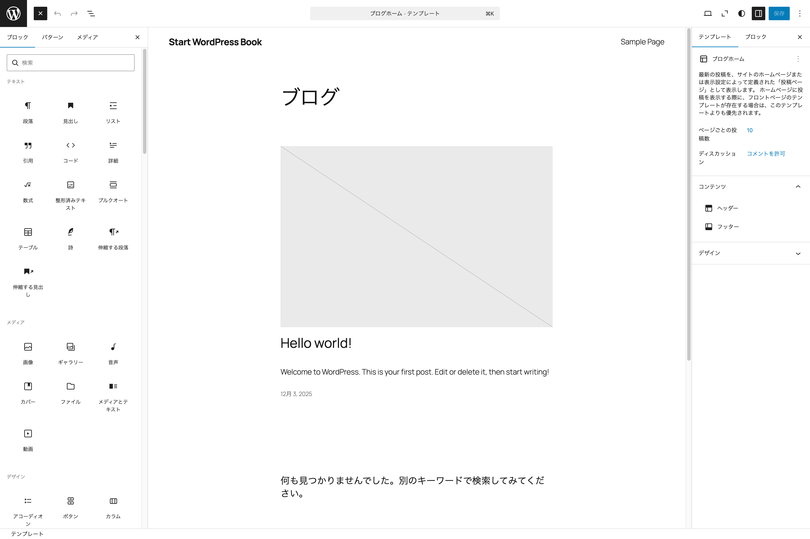{width=91.22mm}

青塗りのプラスアイコンのボタンをクリックすると、ブロックを選択して挿入できるドロワーが左から表示されます。これが「インサーター」または「ブロックインサーター」と呼びます。

タブを切り替えることで、ブロック以外にもパターンやメディアを挿入できます。その際には、プレビューエリアは自動的にズームアウト状態になります。

## 元に戻す/やり直す

直近の作業を元に戻したり、逆に戻った後に進めたりできます。

## ドキュメント概観

ドキュメント概観では２つのタブを選択できます。

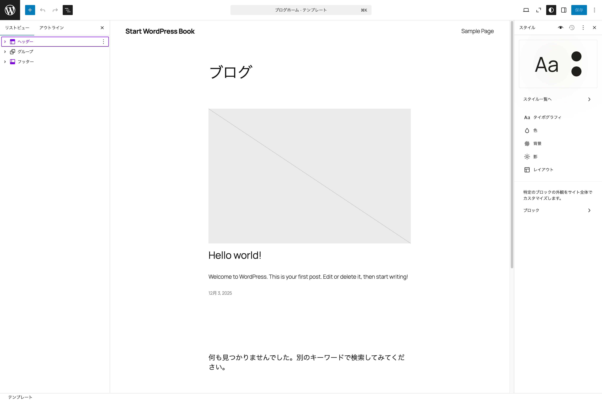{width=91.22mm}

デフォルトで選択されているのが**リストビュー**です。配置しているブロックをリスト形式で確認できます。ブロックをクリックすることで、プレビューエリア内で該当のブロックが選択されます。

もう 1 つが**アウトライン**です。こちらでは、編集しているドキュメントの文字数や単語数、読み終わるまでに必要な所要時間、そして見出しブロックのレベルを階層的に確認できるように表示されています。

## コマンドパレット

前述しているので解説は割愛します。

## 表示

プレビューエリアの幅をデスクトップやタブレット、モバイルに変更してプレビューできます。また、メニュー項目の最下部には、実際の表示を新しいタブで開くリンクも用意されています。

## ズームアウト

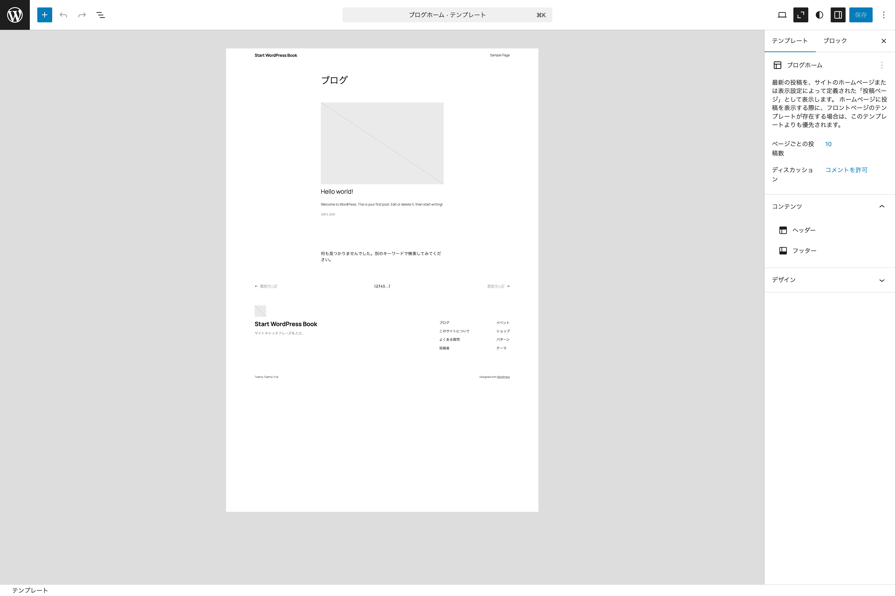{width=91.22mm}

プレビューエリアで表示しているコンテンツをズームアウトします。通常の編集画面よりも俯瞰して表示を確認できるため、全体のバランスなどを確認する際に重宝します。

## スタイル

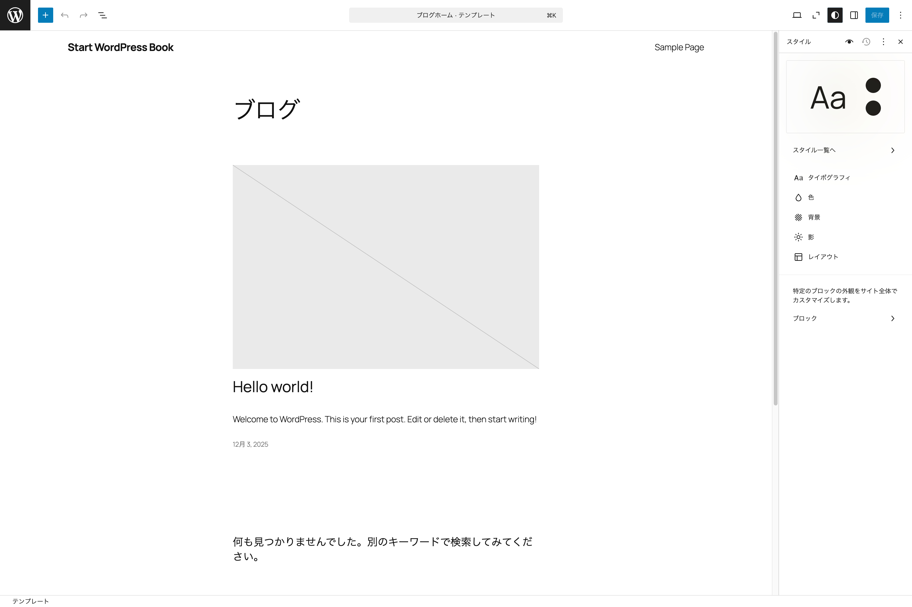{width=91.22mm}

### スタイルブック

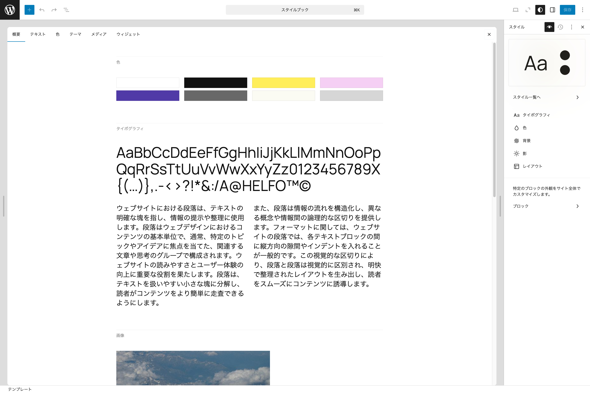{width=91.22mm}

**目のアイコン**をクリックすると、スタイルブックが開きます。こちらは前述していますが、こちらから開くスタイルブックは**上部にタブでブロックカテゴリーを切り替えられ、コアブロックへどのようなスタイルが設定されているかを確認できます**。

### リビジョン

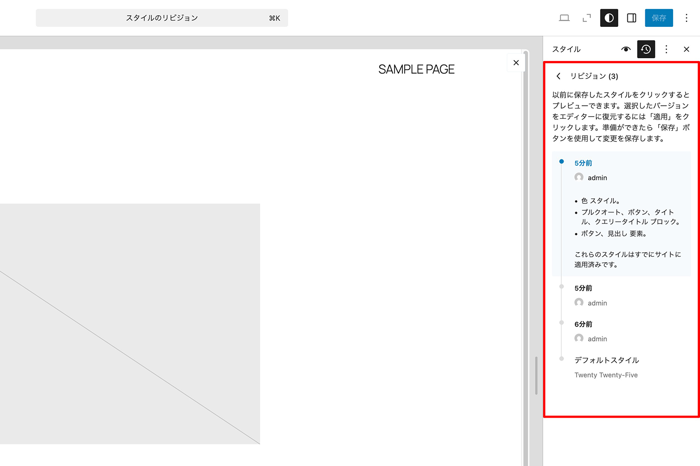{width=91.22mm}

これまでの作業の履歴を確認できます。また、リビジョンの記録が残っている時点まで戻すこともできます。

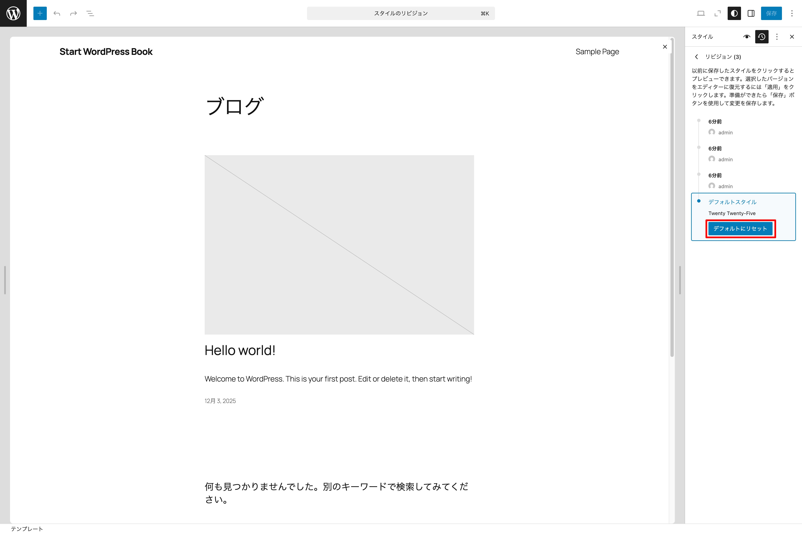{width=91.22mm}

### さらに表示（３点メニューボタン）

#### 追加CSS

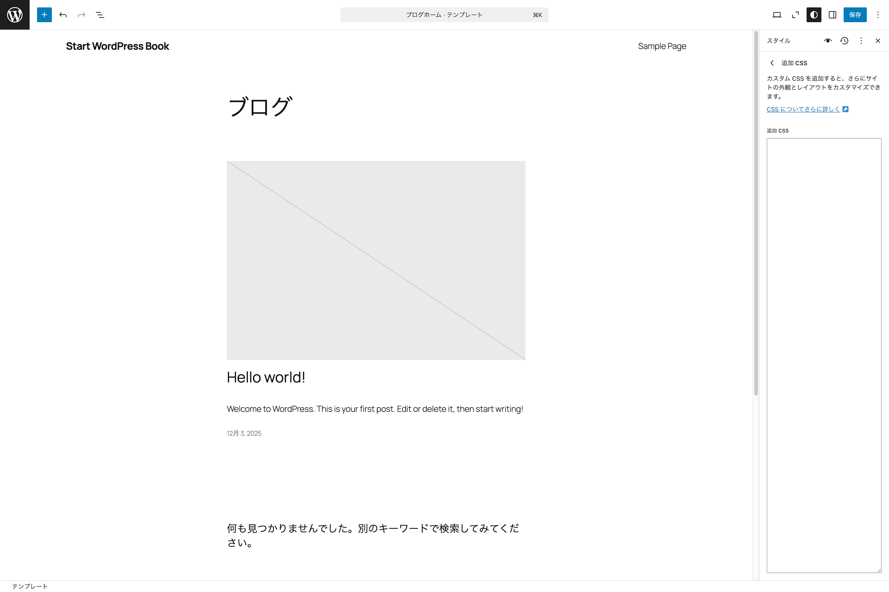{width=91.22mm}

すでに前述しているように、ウェブサイト全体に適応される CSS を記述できます。

#### ウェルカムガイド

サイトエディターを初めて開いた際に表示されたガイドを再度確認できます。

#### スタイルをリセット

これまで変更したスタイルに関する変更をデフォルトの状態にリセットできます。

> サイトエディター左サイドバーのセクションで、**スタイル一覧へ**、**タイポグラフィ**、**色**、**背景**、**影**、**レイアウト**、**ブロック**については前述しているため、ここでは割愛します。

## 設定

### テンプレートタブ

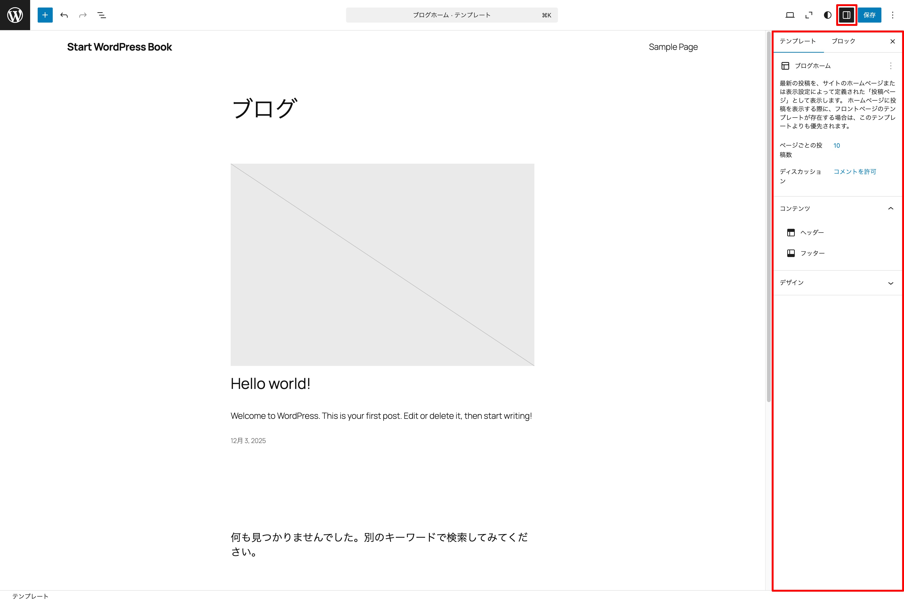{width=91.22mm}

#### テンプレートの情報

現在表示しているテンプレートに関する情報を確認できます。上の画像の場合、**ブログホーム**テンプレートを表示しており、テンプレートに関する簡単な説明と、**ページごとの投稿数**と**ディスカッション**に関する設定を確認・編集できます。選択しているテンプレートによっては、表示される情報が異なります。

#### コンテンツ

選択しているテンプレートに含まれるコンテンツを確認できます。ブログホームテンプレートの場合、ヘッダーとフッターというテンプレートパーツが呼び出されていることが確認できます。また、クリックすると該当するパーツを選択できます。

#### デザイン

選択しているテンプレートで利用できるように設定されたパターンが表示されます。任意のデザインをクリックすることでテンプレートの構造を簡単に切り替えられます。この機能を利用することで、ブロックテーマでは簡単にテンプレートのレイアウトを変更できます。

### ブロックタブ

選択しているブロックで設定可能な情報が表示されます。詳しくは**第 5 章「コアブロックを使ってみよう」**で紹介します。

## 保存

テンプレートに加えた変更を保存します。保存する前に、変更内容を確認できます。

## オプション

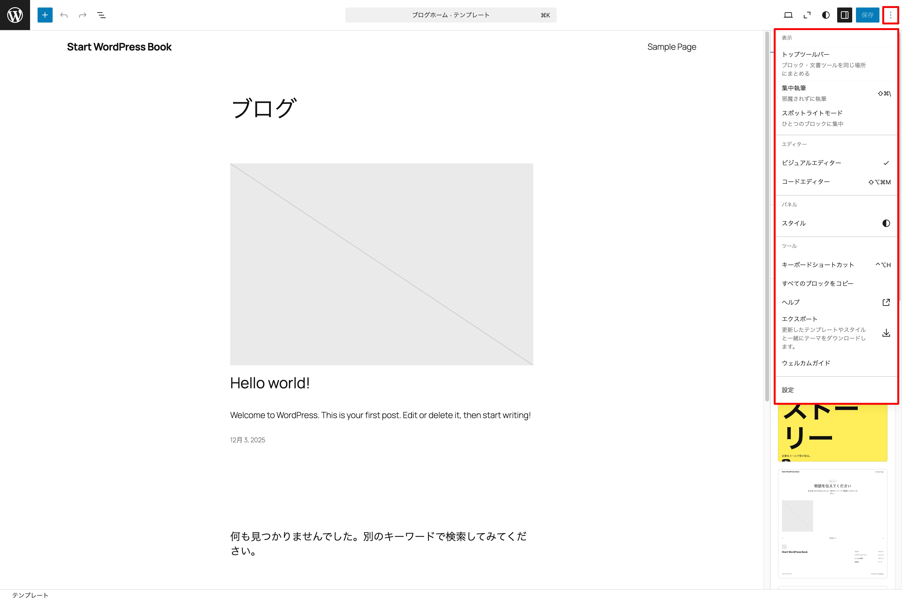{width=91.22mm}

画面右上の３点メニューボタンをクリックするとオプションを確認できます。

### トップツールバー

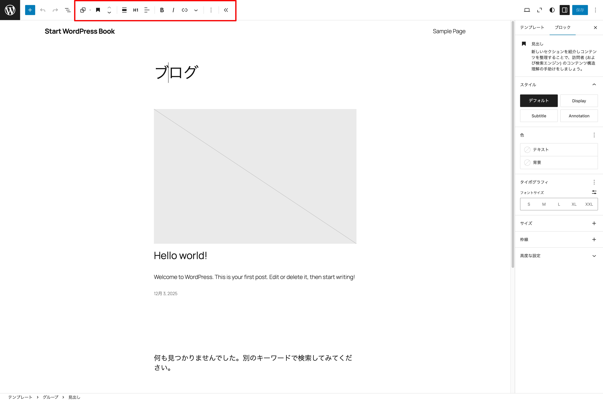{width=91.22mm}

デフォルトではツールバーは選択したブロックの上部に表示されます。この機能を有効にすると、ブロック上部にツールバーは表示されなくなり、画面上部に固定表示となります。

### 集中執筆

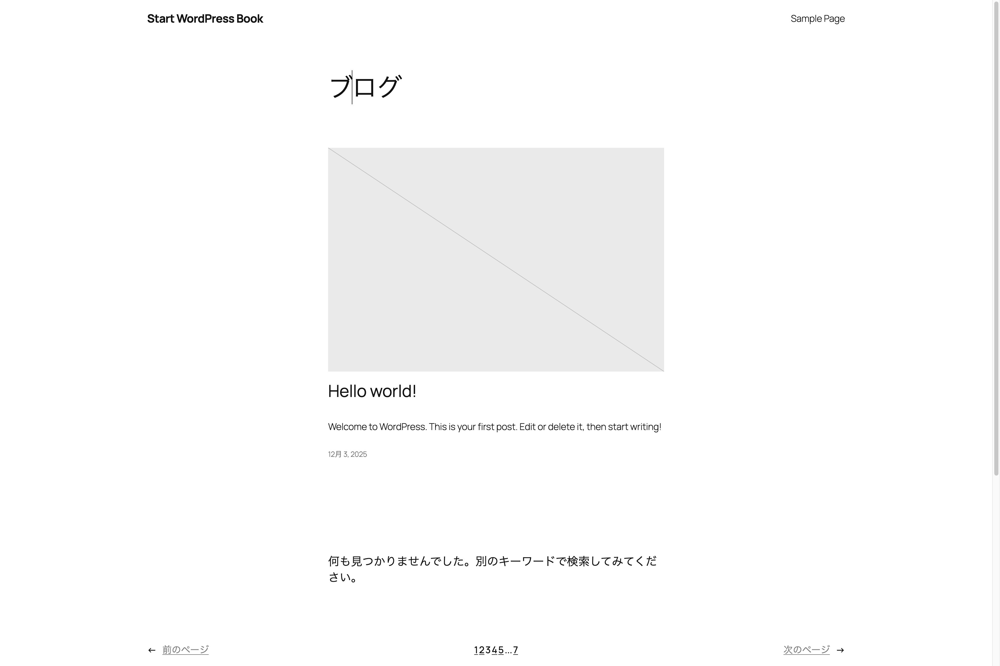{width=91.22mm}

開いているサイドバーと閉じたり、トップツールバー機能がオンになったりし、さまざまなブロックインサーターオプションやツールバーを非表示にして、執筆に集中できる環境になります。

### スポットライトモード

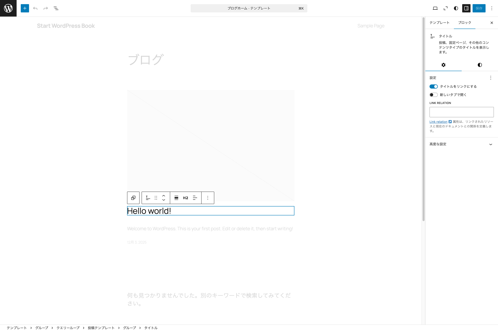{width=91.22mm}

選択しているブロック以外のブロックをグレーアウト表示し、選択しているブロックの編集に集中できるようになります。

### ビジュアルエディター

**デフォルトでは有効**になっています。

WordPress の標準エディターであるブロックエディターのように、実際の表示と同じような見た目のままで編集ができるエディターのことをビジュアルエディターと呼びます。

### コードエディター

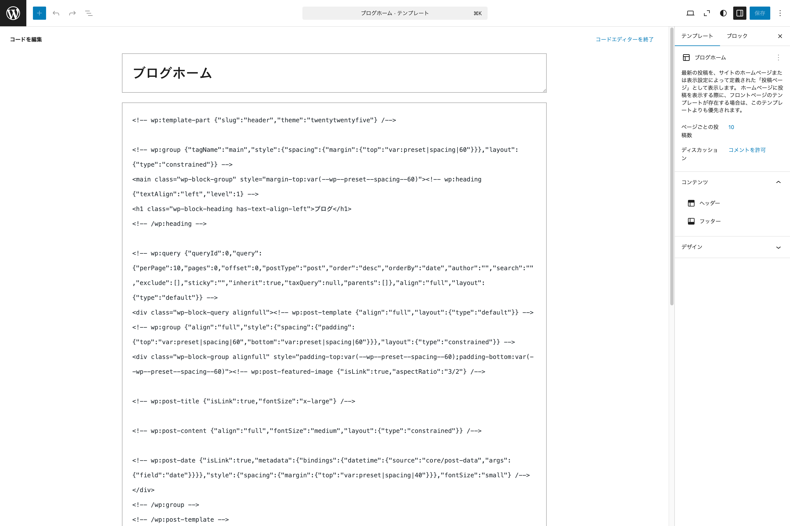{width=91.22mm}

ビジュアルエディターとは違う、もう 1 つのエディターモードです。ブロックが出力する HTML を確認する際に利用したりします。

しかし、ブロックに関連するコメントアウトや属性の変更を不確かな形で行なってしまうと、ビジュアルエディターに戻した際にブロックが壊れる可能性があります。

ですので、一般ユーザーの方は必要以上に利用しない方が良いかもしれません。

### スタイル

前述しているスタイルの設定画面を開きます。

### キーボードショートカット

{width=91.22mm}

WordPress のエディターで利用できるショートカット一覧を表示します。

### すべてのブロックをコピー

選択しているテンプレートに配置されている全てのブロック（テンプレートパーツも含む）をコピーします。

### ヘルプ

WordPress.org 公式サイトのブロックエディターに関するドキュメントページへアクセスします。

### エクスポート

テンプレート、テンプレートパーツ、スタイル設定など、サイトエディターで行った変更を反映したテーマを書き出せます。ZIP 形式の圧縮ファイルでダウンロードできます。

### ウェルカムガイド

サイトエディターを初めて開いた際に表示されたガイドを再度確認できます。

### 設定

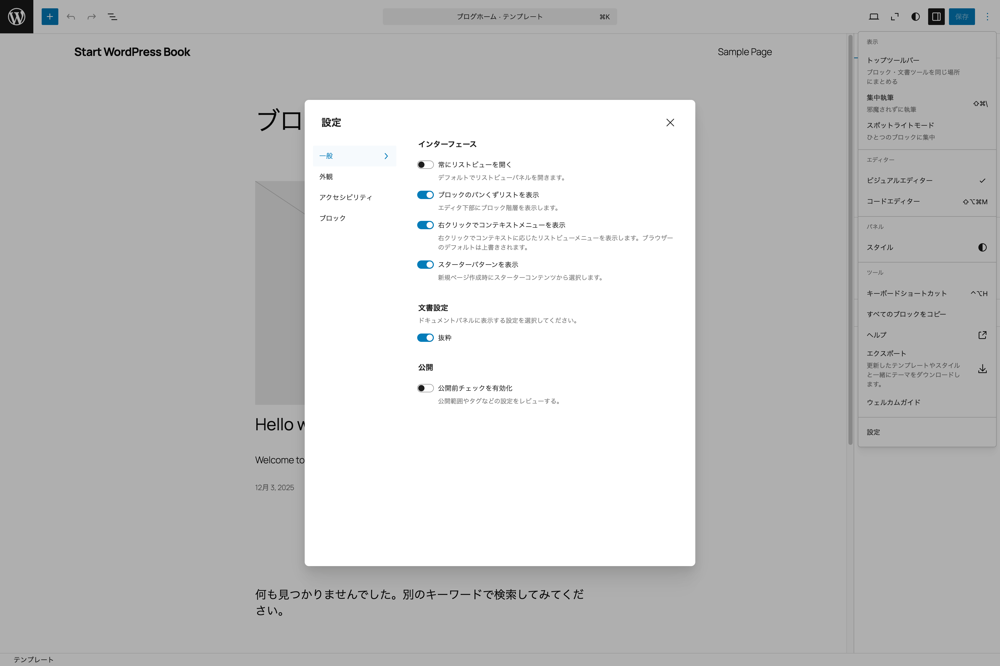{width=91.22mm}

サイトエディターに関する細かな設定ができます。基本はデフォルトで使用することが多いと思いますが、より作業をしやすいように自身に合った設定が可能かどうか確認すると良いでしょう。

#### 一般

- 常にリストビューを開く
- ブロックのパンくずリストを表示
- 右クリックでコンテキストメニューを表示
- スターターパターンを表示
- 抜粋
- 公開前チェックを有効化

#### 外観

- トップツールバー
- 集中執筆
- スポットライトモード

#### アクセシビリティ

- ブロック内にテキストカーソルを含める
- ボタンテキストラベルを表示

#### ブロック

- よく使用されるブロックを表示
- ブロックの可視性を管理