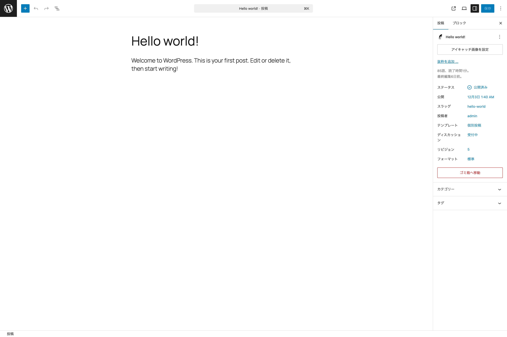
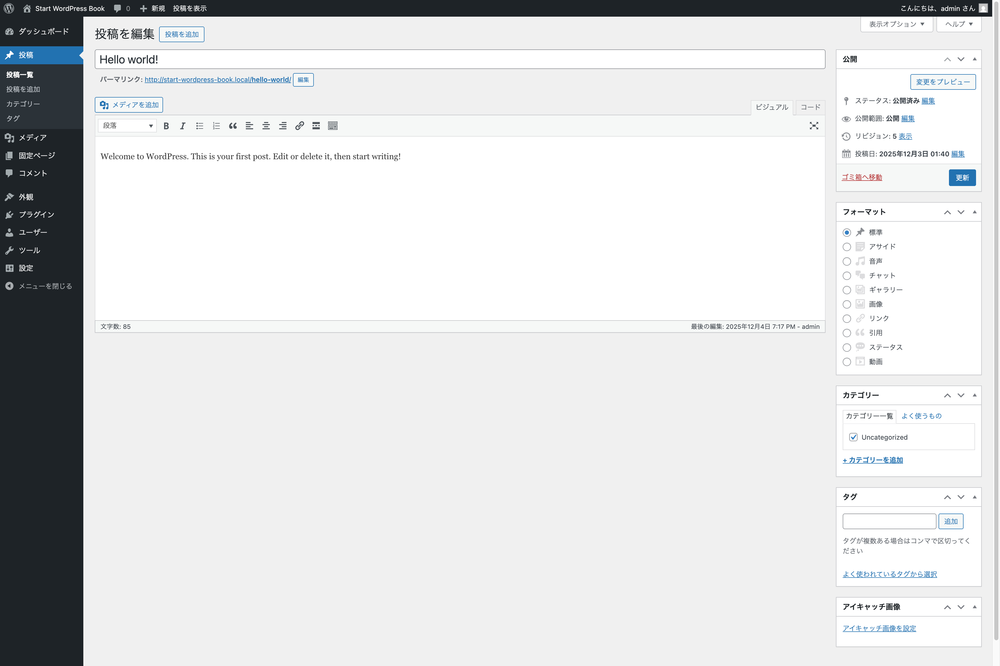
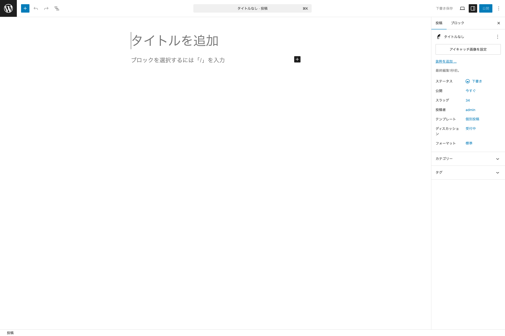
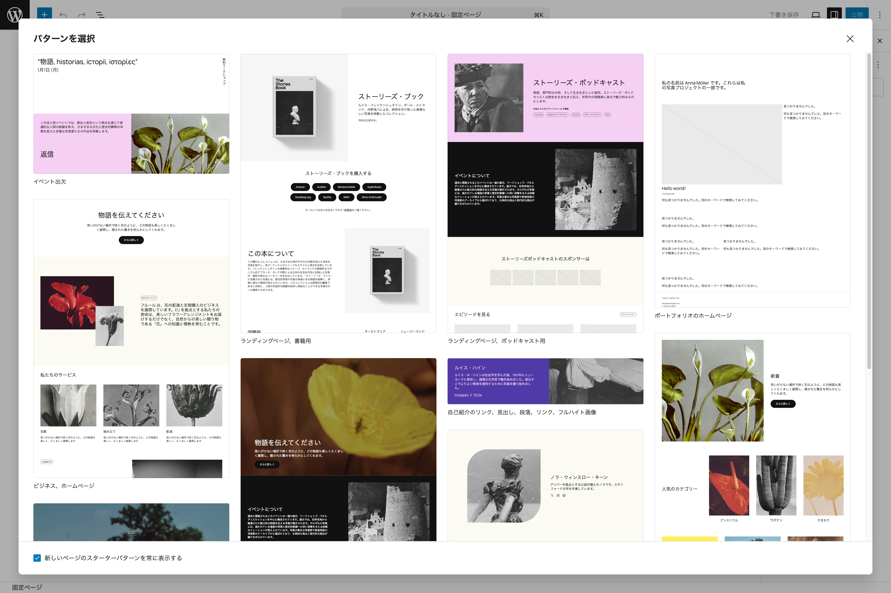

# ブロックエディターとは

{width=91.22mm}

ブロックエディターは「WordPress エディター」「Gutenberg（グーテンベルグ）エディター」などとも呼ばれ、WordPress でコンテンツを公開する際に利用する標準エディターです。2018 年 12 月にリリースされた WordPress 5.0 から標準エディターとして採用されており、それまでのクラシックエディター（ブロックエディターが登場したため、区別がつけられるようにこのように命名された）から代わりました。

{width=91.22mm}

ブロックエディターはブロックを配置し、投稿や固定ページのコンテンツを作ります。ブロックには、段落や画像、見出しやリスト、動画やギャラリーなどさまざまな種類が用意されています。それらを活用してエディターでも実際の表示に近い状態でウェブページを構築できるのが特徴です。

WordPress 本体から提供されているブロック以外を利用したい場合には、プラグインによって追加できます。（テーマによって提供される場合もあります）

# ブロックエディターの各メニュー紹介

{width=91.22mm}

ここからはブロックエディターで利用できるメニューについて紹介していきます。前述しているサイトエディターで紹介しているものは割愛します。また、基本的に**投稿**を作成する際のメニューを紹介します。**固定ページ**を作成する際のみ利用するメニューは、その旨を記載しています。

## スターターパターン挿入モーダル

{width=91.22mm}

固定ページを新規作成する画面を開くと、デフォルトでは最初に**スターターパターン**を選択するモーダルが表示されます。

ここからページの雛形を選択することで、よりスピーディーに固定ページの制作を進められます。また、毎回表示されるのが煩わしい場合は、モーダルの左下のチェックマークを外すことで、次からモーダルは表示されなくなります。

## トップツールバー

### 下書き保存

投稿や固定ページを新規作成した状態は、まだ一度も保存されていない状態になります。その状態の際に表示されるメニューです。

この状態は、**公開**されるまで継続します。一度、下書き保存をクリックすると**保存しました**と表示されますが、新たにコンテンツに変更が生じた際に、**下書き保存**リンクが有効になります。

**公開**状態の投稿や固定ページの編集画面では表示されません。

### 投稿を表示

**固定ページ**の編集画面では**固定ページを表示**となります。 クリックすると**別タブで実際の投稿（または固定ページ）を開きます**。

### 設定

#### 投稿タブ

{width=91.22mm}

編集している投稿（固定ページの場合は固定ページ）に関する情報を設定・編集できます。

##### 投稿情報

- **タイトル** - 編集している投稿または固定ページのタイトルが表示されています。右の３点メニューボタンから**表示**（実際のページを別タブで表示）、**名前を変更**、**ゴミ箱**が選べます。
- **アイキャッチ画像** - 投稿や固定ページのアイキャッチ画像を設定できます。
- **抜粋** - 投稿や固定ページの抜粋文を設定できます。
- **ステータス** - 投稿または固定ページの状態を確認・編集できます。**公開済み**の他、**下書き**、**保留中**、**非公開**、**予約済み**があり、パスワード保護や先頭固定表示の設定も可能です。
- **公開** - 公開日時を確認・編集できます。
- **スラッグ** - スラッグを確認・編集できます。
- **投稿者** - 投稿者を確認・編集できます。
- **テンプレート** - 利用しているテンプレートを確認できます。また、テンプレートの編集や新規作成、表示もこちらから行えます。
- **ディスカッション** - コメント機能の状態を確認・編集できます。**受付中**以外にも**受け付けません**や**ピンバックとトラックバックを許可**するかどうかも設定できます。
- **フォーマット** - 利用しているフォーマットを確認・変更できます。
- **ゴミ箱へ移動** - 投稿や固定ページをゴミ箱へ移動します。

##### カテゴリーとタグ

投稿に紐づけるカテゴリーやタグを選択できます。

#### ブロックタブ

選択しているブロックで設定可能な情報が表示されます。詳しくは**第 5 章「コアブロックを使ってみよう」**で紹介します。

### 公開・保存

投稿や固定ページを新規作成し**下書き保存**も**公開**もしていない状態の場合は**公開**というボタンラベルになります。

一度、公開をしている状態では**保存**というボタンラベルになります。

### オプション

サイトエディターで紹介しているオプションの項目は割愛します。

#### フルスクリーンモード

デフォルトでは有効になています。オフにすると、ダッシュボードを表示している際に通常表示されている左サイドバーが常時表示されます。

#### パターンの管理

サイトエディターのパターンに移動します。

#### 設定

##### 一般

- 文書設定
- カスタムフィールド

##### 外観
        
- テーマスタイルの使用
