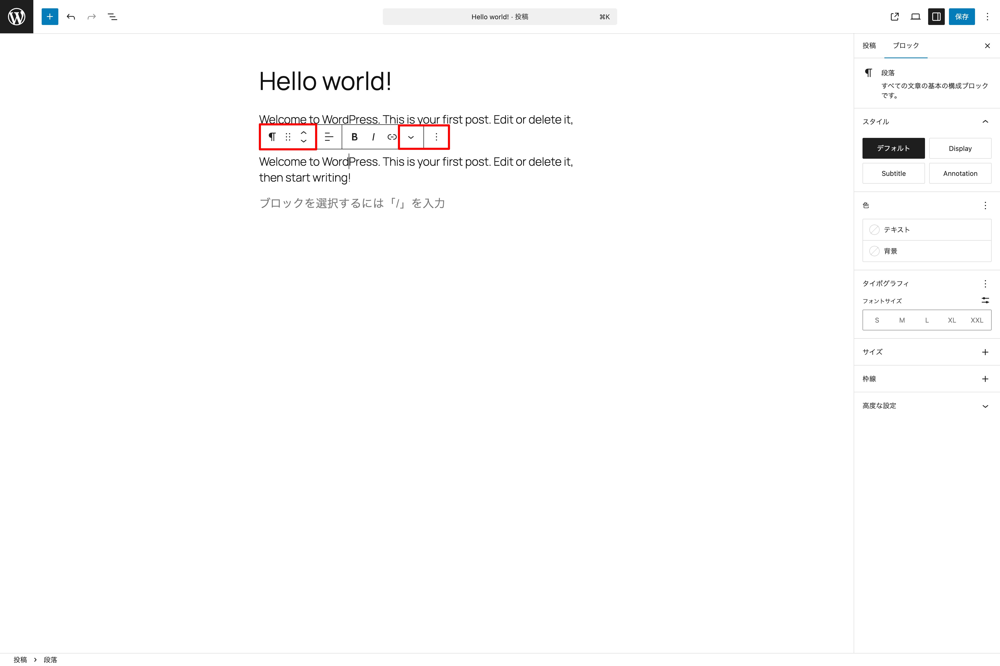
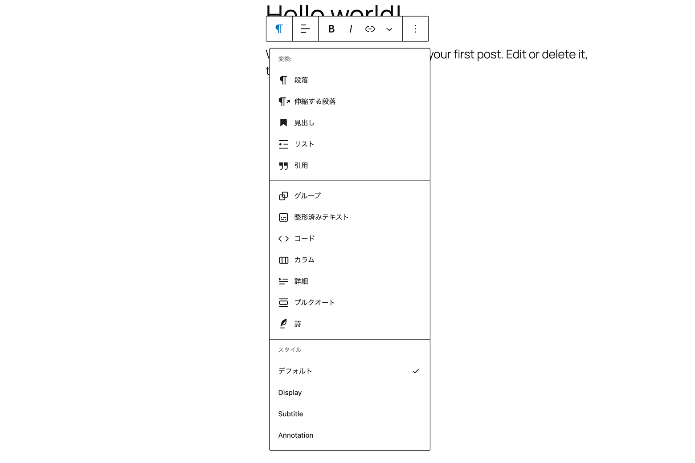
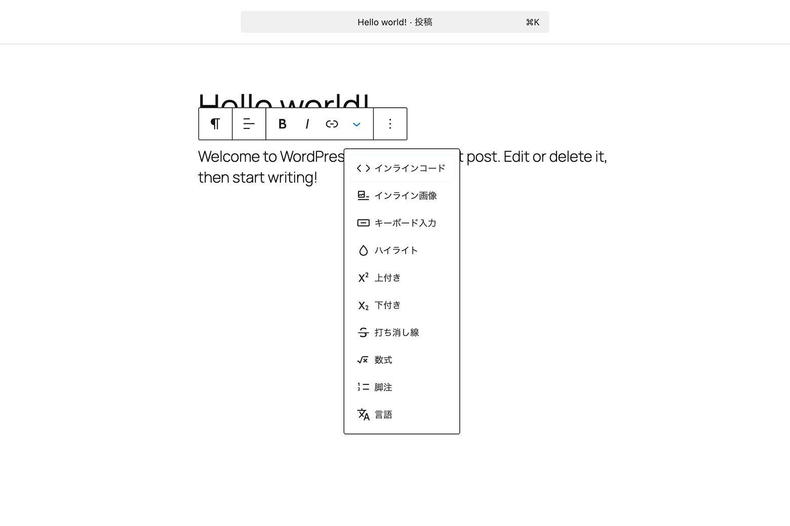
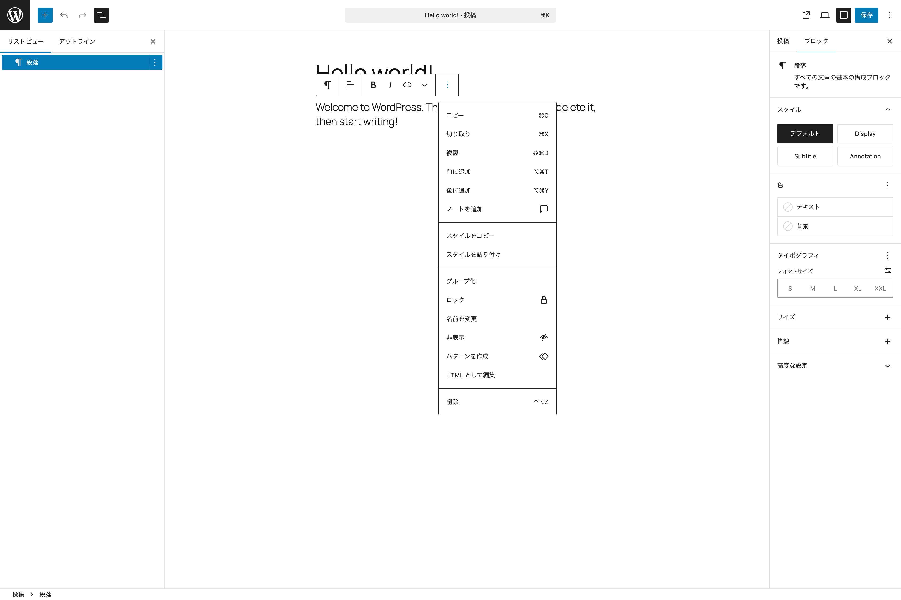
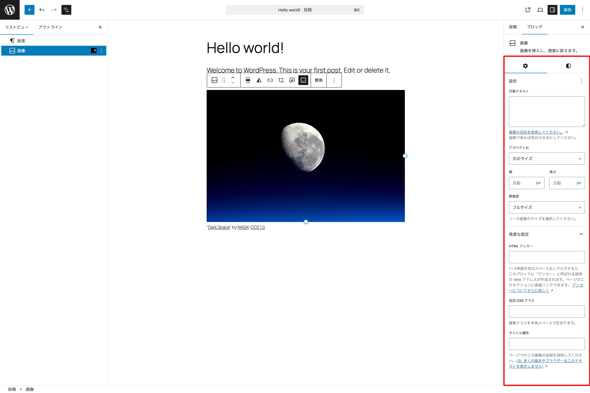
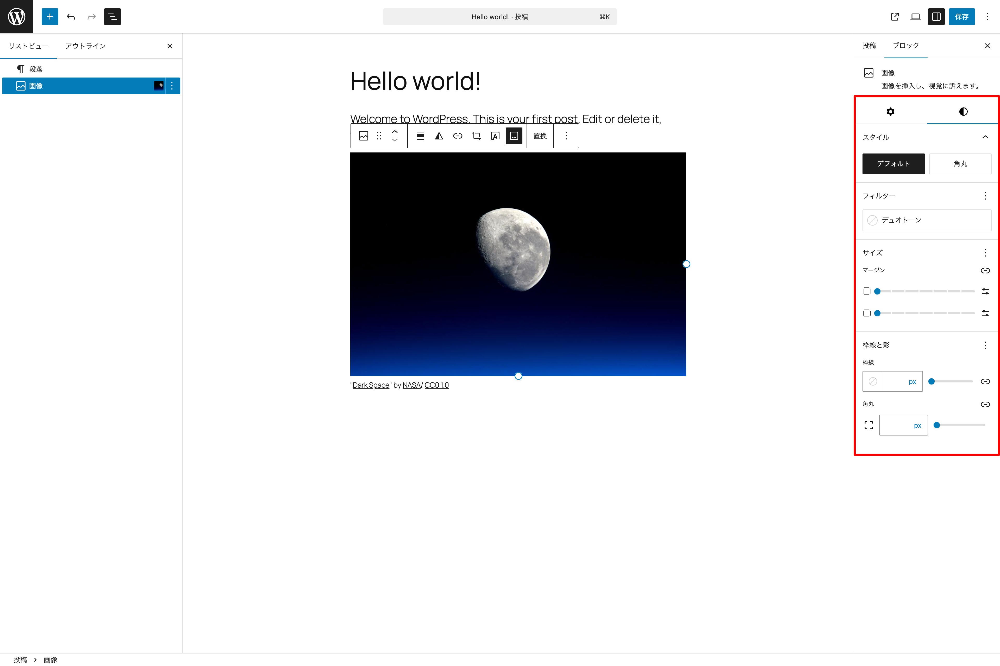

# ツールバーとブロックタブについて

## ツールバーについて

デフォルトではブロックを選択した際に、ブロックの上部に表示されるツールバーですが、選択しているブロックによって利用できる機能に違いがあります。

ここでは、ブロックごとの差があまりない共通部分として考えられる機能をまとめて紹介します。

{width=91.22mm}

### 変換

選択しているブロックによって、別のブロックに変換できるものがあります。

{width=91.22mm}

このアイコンをクリックすると、段落ブロックの場合、上のように変換可能なブロックが表示されます。伸縮する段落、見出し、リスト、引用などといったブロックに変換できます。

### ドラッグハンドル

ブロックの位置をドラッグ＆ドロップで移動させる際に選択すると良いでしょう。ブロックによってはドラッグハンドルを使わなくても移動させられるものもあります。色々なブロックで試してみてください。

### 上下に移動

ブロックの上下の移動を簡単に行えます。

### さらに表示

{width=91.22mm}

- **インラインコード** - テキスト内でコードを表記できます。
- **インライン画像** - テキスト内にインラインで画像を追加できます。
- **キーボード入力** - `<kbd>` で囲う表記ができます。
- **ハイライト** - 選択したテキストとその背景の色を選択できます。
- **上付き** - 選択したテキストを上付きにできます。`` でマークアップされます。
- **下付き** - 選択したテキストを下付きにできます。`` でマークアップされます。
- **打ち消し線** - 選択したテキストに打ち消し線をつけます。`<s>` でマークアップされます。
- **数式** - テキスト内に Latex 記法で数式を挿入できます。
- **脚注** - 脚注を追加できます。追加された注釈はページ下部に追加される新しいブロックにリンクされます。このブロックに新しく注釈の内容を追加すると、自動的にリンクが追加されます。
- **言語** - 選択したテキストの言語を指定できます。`<bdo>` でマークアップされます。

### オプション

{width=91.22mm}

- **コピー** - 選択しているブロックをコピーします。
- **切り取り** - 選択しているブロックを切り取ります。
- **複製** - 選択しているブロックを複製します。
- **前に追加** - 選択しているブロックの前（上）に新しくブロックを追加します。
- **後に追加** - 選択しているブロックの後（下）に新しくブロックを追加します。
- **ノートを追加** - 選択しているブロックにノートを追加します。
- **スタイルをコピー** - 選択しているブロックのスタイルをコピーします。
- **スタイルを貼り付け** - スタイルをコピーしたものを貼り付けます。
- **グループ化** - 選択しているブロックをグループ化（グループブロックで囲う）します。
- **ロック** - 選択しているブロックをロックします。ロックには**全てをロック**、**移動できないようにする**、**削除できないようにする**、**内部のすべてのブロックに適用**が選べます。
- **名前を変更** - リストビューに表示されるブロック名ラベルを変更できます。
- **非表示** - 選択しているブロックを非表示にします。
- **パターンを作成** - 選択しているブロックをパターンに登録します。
- **HTML として編集** - 選択しているブロックの HTML を編集できます。しかし、HTML のルールに則らないとブロックが壊れる危険があります。
- **削除** - 選択しているブロックを削除します。

## ブロックタブ

ここでは任意のブロックを選択した際に右側に表示されるインスペクター（右サイドバー）内の**ブロックタブ**について紹介します。

ブロックによっては**設定タブ**と**スタイルタブ**に分かれた各種設定ができるようになっています。常に全ての項目が表示されていない場合もあるため、各セクションにある３点メニューボタンをクリックして、追加表示できるメニューがないか確認してみましょう。

画像ブロックの設定タブを例に紹介します。

### 設定タブ

{width=91.22mm}

設定タブでは、そのブロックで設定可能な項目が表示されます。また、**高度な設定**という項目があり、こちらの内容もブロックによって異なります。

### スタイルタブ

{width=91.22mm}

スタイルタブでは、そのブロックのスタイリングに関する設定可能な項目が表示されます。

