# 段落ブロック

段落ブロックは、投稿や固定ページにテキストコンテンツを追加するための基本となるブロックです。新しい投稿や固定ページを作成すると、デフォルトで表示されるブロックです。

また、テキストの追加に加えて、テキストコンテンツをカスタマイズするための様々な書籍設定オプションも提供しています。

そして、WordPress 6.9 から段落ブロックのバリエーションブロックとして**伸縮する段落ブロック**が追加されました。ブロックの最大幅またはコンテンツ幅いっぱいにテキストを表示できます。

## ツールバー

### テキストの配置

テキストの配置を変更できます。デフォルトでは**テキスト左寄せ**になっていますが、その他に**テキスト中央寄せ**、**テキスト右寄せ**を選べます。

### 太字

テキストを太字にできます。`Ctrl + B` または `Command + B` というショートカットも用意されています。

### イタリック

テキストを斜体にできます。`Ctrl + I` または `Command + I` というショートカットも用意されています。

### リンク

選択したテキスト部分にリンクを設定できます。

### その他

その他に**さらに表示**でリッチテキストオプションを選択でき、オプションも多く用意されています。

## ブロックパネル

### スタイル

利用できるブロックスタイルがある場合に表示されます。Twenty Twenty-Five を有効化している場合、**Display**、**Subtitle**、**Annotation** の３つのブロックスタイルが提供されます。

### 色

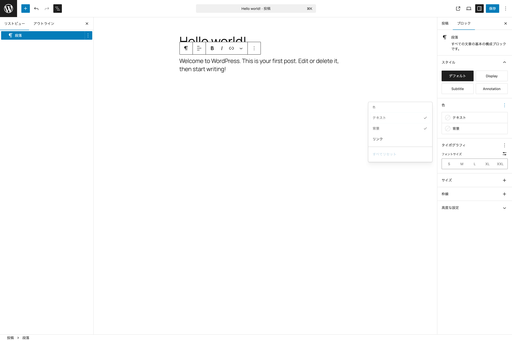{width=91.22mm}

テキストと背景の色を設定できます。３点メニューボタンから**リンク**の色の設定項目を表示できます。

### タイポグラフィ

{width=91.22mm}

フォントとテキストの外観をカスタマイズできます。デフォルトではフォントサイズしか設定できませんが、３点メニューボタンからそれ以外の**フォント**、**外観**、**行の高さ**、**文字間隔**、**装飾**、**方向**、**大文字小文字**、**ドロップキャップ**の設定項目を表示できます。

### サイズ

{width=91.22mm}

パディングやマージンを設定できます。デフォルトでは設定項目は隠れているので３点メニューボタンから選択して表示します。

### 枠線

{width=91.22mm}

枠線や角丸を設定できます。デフォルトでは設定項目は隠れているので３点メニューボタンから選択して表示します。

### 高度な設定

HTML アンカーと追加CSSクラスが設定できます。

> 以後、一度解説したものは省略します。

## 作ってみよう

下の画像のような見た目になるように段落ブロックを使って作ってみましょう。

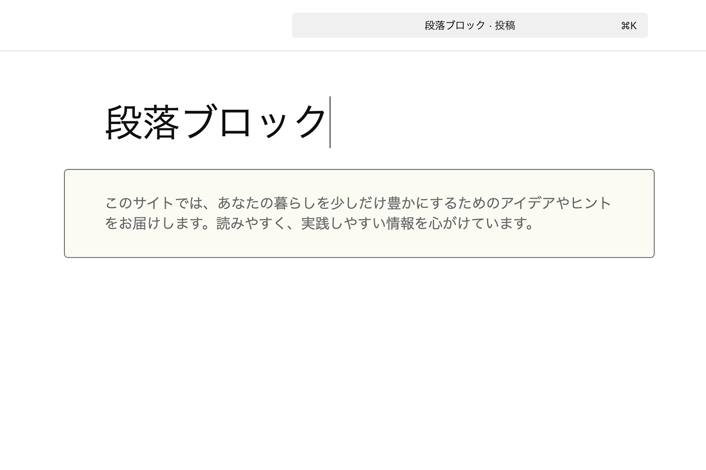{width=91.22mm}

1. **色**でテキストを**アクセント4**に、背景を**アクセント5**に設定
2. **タイポグラフィ**で**フォントサイズ**を**M**に設定
3. **サイズ**で**上下パディング**を**S**に、**左右パディング**を**標準**に設定
4. **枠線**で**色**を**アクセント4**に、**線の太さ**を**1**に設定
5. **角丸**を**5px**に設定

# 見出しブロック

見出しはコンテンツに新しいセクションを作り、ページ上のコンテンツを整理するために役立ちます。そして、見出しをうまく活用できているウェブサイトは閲覧者と検索エンジンにとって読みやすくなります。

見出しレベルは**H1からH6**まであります。

WordPress 6.9 から**伸縮する段落ブロック**と似た**伸縮する見出しブロック**が見出しブロックのバリエーションブロックとして導入されました。

## ツールバー

### 配置

ブロックを幅広または全幅に配置できます。幅広と全幅の配置オプションが利用できるのは有効化しているテーマが対応している場合のみです。

### レベルを変更

ブロックに適応する見出しのレベルを編集できます。H1からH6まで選択できます。

> その他に、 テキストの配置、太字、イタリック、リンクなどがあります。

## ブロックパネル

### スタイル

Twenty Twenty-Five を有効化している場合、**Display**、**Subtitle**、**Annotation** の３つのブロックスタイルが提供されます。

> その他に、色、タイポグラフィ、サイズ、枠線、高度な設定があります。

## 作ってみよう

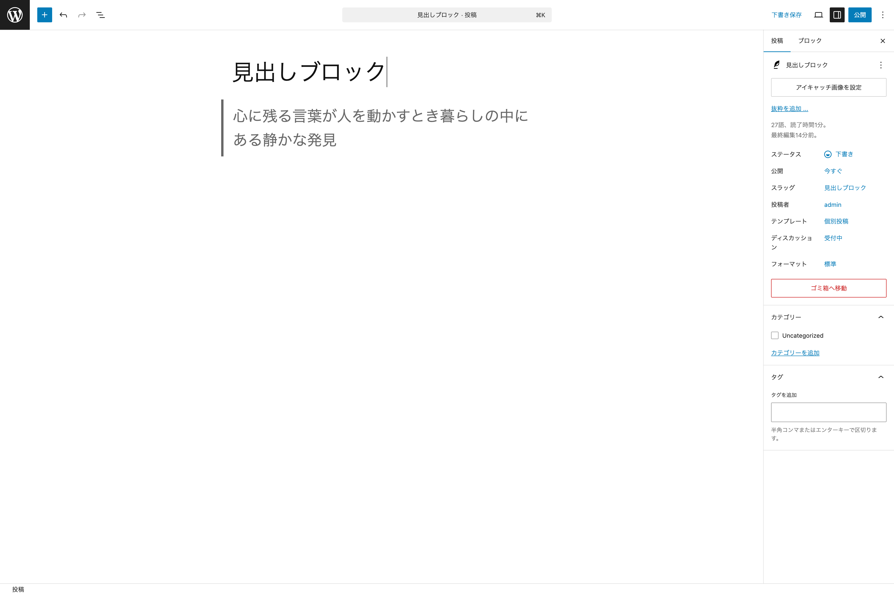{width=91.22mm}

1. **色**でテキストを**アクセント4**に設定
2. **タイポグラフィ**の３点メニューボタンから**行の高さ**を選択し**1.6**に変更
3. **サイズ**で**上下パディング**を**XXS**、**左右パディング**を**XS**に設定
4. **枠線**の**個別に設定する**をクリックして、**左**にだけ色を**アクセント4**、太さを**5px**に設定

# リストブロック

リストブロックを使えば、箇条書きや番号付きのリストを作成できます。 子ブロックとして**リスト項目ブロック**を持ちます。

構造としては、**リストブロック**がリスト全体を囲うブロックとして配置され、その内部に**リスト項目ブロック**がリスト項目の数だけ用意されるという形になります。

## ツールバー

### 順序なしリスト

箇条書きのリストになります。項目を特定の順序で表示する必要がない場合に使用します。

### 順序ありリスト

項目に番号が付けられたリストです。特定の順序で項目を表示する必要がある場合に使用します。

### インデント解除

１つ以上インデントがされているリストの場合に有効になります。

### インデント

先頭のリストではないリスト以外でインデント可能な状態で有効になります。

## ブロックパネル

### スタイル

Twenty Twenty-Five を有効化している場合、**チェック**というブロックスタイルが提供されます。

> その他に、色、タイポグラフィ、サイズ、枠線、高度な設定があります。

# リスト項目ブロック

リストブロックの中でリスト項目に利用されるブロックです。

## ツールバー

### 親ブロックを選択

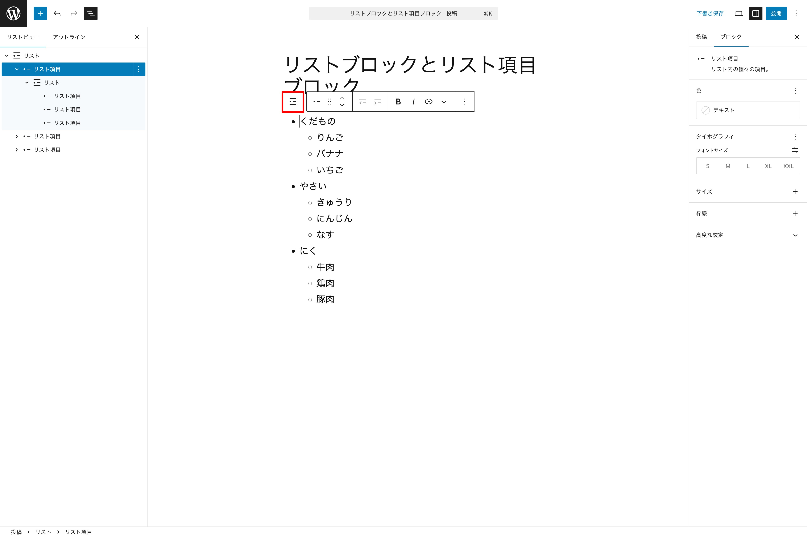{width=91.22mm}

子ブロックを選択している際に、いつでも親ブロックに選択を変更したい場合に利用できます。この場合、リスト項目ブロックを選択している状態で表示され、クリックすることでリストブロックへ選択が切り替わります。

> その他に、インデント解除、インデント、太字、イタリック、リンクなどがあります。

## ブロックパネル

### 色

デフォルトではテキスト色しか表示されていませんが、背景とリンクについては３点メニューボタンより表示を管理できます。

> その他に、タイポグラフィ、サイズ、枠線、高度な設定があります。

## 作ってみよう

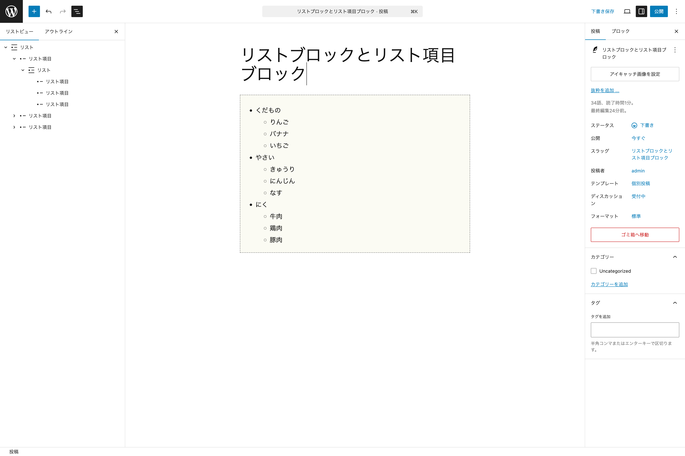{width=91.22mm}

1. 一番外側のリストブロックを選択する
2. **色**で**背景**を**アクセント5**に設定する
3. **タイポグラフィ**で**フォントサイズ**を**M**に設定する
4. **枠線**で**色**を**アクセント4**に、**スタイル**を**波線**に、**線幅**を**1px**に設定

# 画像ブロック

## ツールバー

### 配置

幅広や全幅以外に、**左寄せ**、**中央揃え**、**右寄せ**が選べます。

### デュオトーンフィルターを適応

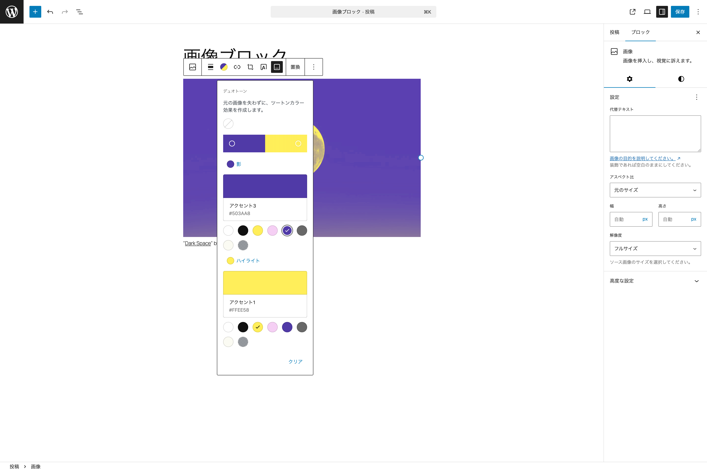{width=91.22mm}

デュオトーンとは、画像の明るい部分と暗い部分に２つの異なる色で表現するフィルター効果です。

上の画像のように、明るい部分にはイエロー、暗い（影）部分にはパープルを指定することで、画像全体の雰囲気を変えています。

テーマによっては、デュオトーンのカラープリセットを用意しているものもあります。

### 切り抜き

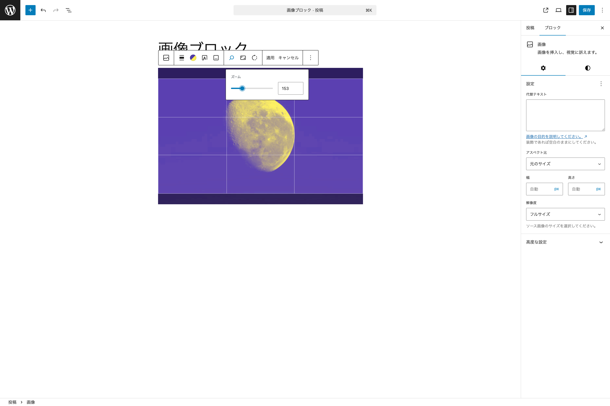{width=91.22mm}

画像の切り抜きができます。メニューを選択すると、新たに**ズーム**、**縦横比**、**回転**というメニューが新たに表示され、それらを設定して**適用**するか**キャンセル**するかも決められます。

- **ズーム** - 画像の拡大表示ができます。
- **縦横比** - 正方形にトリミングしたり、アスペクト比を設定できます。
- **回転** - 画像を回転できます。

### 画像上にテキストを追加

このメニューをクリックすると、画像ブロックが**カバーブロック**に変換されます。

### キャプションを追加

このメニューを有効にすると、画像下にキャプションを入力できるエリアが表示されます。

### 置換

選択されている画像を別の画像に置き換えられます。

> その他に、リンクなどがあります。

## ブロックパネル

### 設定タブ

#### 設定

##### 代替テキスト

アクセシビリティやSEOにとって重要な画像の代替テキストを設定できます。

##### アスペクト比

デフォルトの**元のサイズ**以外に以下のようなものが用意されています。

- 正方形 - 1:1
- 標準 - 4:3
- ポートレイト - 3:4
- クラシック - 3:2
- クラシックポートレイト - 2:3
- ワイド - 16:9
- 縦長 - 9:16

##### 幅と高さ

画像の幅と高さをピクセルで指定できます。

##### 解像度

フルサイズの他に、サムネイルと中サイズなどがあります。

#### 高度な設定

**HTML アンカー**と**追加 CSS クラス**以外に、**タイトル属性**を指定できます。

### スタイルタブ

#### スタイル

**角丸**というブロックスタイルが用意されています。

#### フィルター

ツールバーでも設定できるデュオトーンがこちらからでも設定できます。

#### サイズ

マージンが設定できます。

> その他に、枠線と影が設定できます。

## 作ってみよう

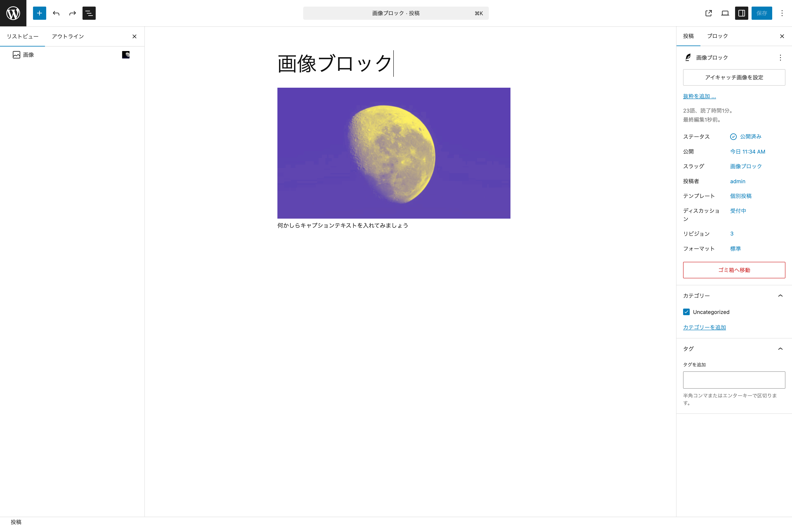{width=91.22mm}

画像は好きなものを使ってください。

1. デュオトーンの**影**に**アクセント3**を、**ハイライト**に**アクセント1**を設定
2. **キャプションを追加**をクリックしてキャプション用テキストを設定
3. **切り取り**で**ズーム**を選択しズームを設定
4. **設定タブ**で**アスペクト比**を**ワイド - 16:9**に設定

# カバーブロック

カバーブロックを使うことで、テキストを画像や動画にオーバーレイ表示させた表現を作ることができます。

## ツールバー

### コンテンツ位置を変更

デフォルトでは中央になっていますが、中央を含む９つの点を選び、コンテンツの位置を指定できます。例えば、左上を指定するとカバーブロックの内部に挿入したブロックは、カバーブロックの左上を基軸に配置できます。

### フルハイト

カバーブロックがブラウザの画面の高さをいっぱいに広がります。

> その他に、配置、デュオトーンフィルターを適応、置換などがあります。

## ブロックパネル
### 設定タブ
#### レイアウト

##### コンテンツ幅を使用するインナーブロック

これを有効にすると、内部に挿入したブロックをテーマが定めたコンテンツ幅に収められます。この機能は、カバーブロックだけではなく、グループブロックやカラムブロックでも利用できます。

例えば、カバーブロックを**配置**で**全幅**にします。その際に、この機能が有効になっていると、内部のコンテンツはカバーブロックと同じように全幅に合わせて広がるのではなく、テーマが定めているコンテンツ幅に収まります。

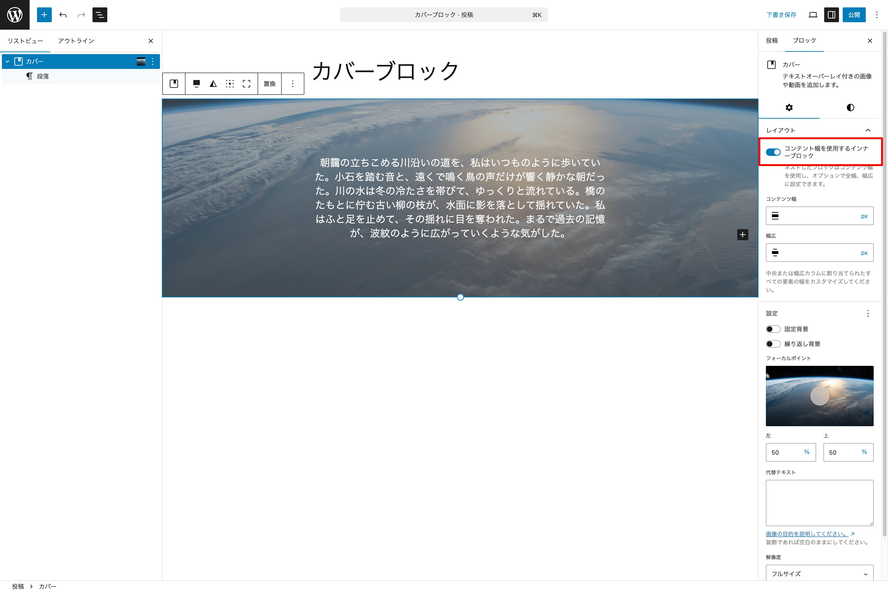{width=91.22mm}

##### コンテンツ幅

上の**コンテンツ幅を使用するインターブロック**を有効にした場合、テーマが定めている幅が採用されますが、**任意の幅にしたい場合**にこちらを入力します。

##### 幅広

幅広の状態で任意のコンテンツ幅を指定したい場合にはこちらに入力します。

#### 設定
##### 固定背景

設定した画像がページに合わせてスクロールします。

##### 繰り返し背景

設定した画像をカバーブロック内で繰り返してパターンを作成します。例えば、小さな画像をカバーブロック内で繰り返し表示したい場合は、このオプションを有効にします。

##### フォーカルポイント

**固定背景**をオフにすると、フォーカルポイントが表示されます。この機能を使うと、写真の中心点を指定して表示させられます。

##### 左・上

フォーカルポイントをマウスで移動させると自動的にフォーカルポイントを示す位置情報が数値で入力されます。手動で指定したい場合は、こちらに直接入力することもできます。

> その他に、代替テキスト、解像度が設定できます。

#### 高度な設定

##### HTML 要素

通常、`div` で囲われますが、それ以外の要素（`header``main``section``article``aside``footer`）も指定できます。

##### 許可されたブロック

内部に配置できるブロックを指定できます。デフォルトでは全てのブロックを挿入できるようになっていますが、ここで指定することで、指定されたブロックしか挿入できなくなります。

> その他に、HTML アンカー、追加 CSS クラスが設定できます。

### スタイルタブ
#### 色
##### 見出し

内部に見出しブロックを配置した際に適応される文字色と背景色を指定できます。

##### オーバーレイ

画像を覆う色を指定できます。

##### オーバーレイの不透明度

オーバーレイの不透明度を指定できます。デフォルトでは 50 になっています。

> その他に、テキスト色が設定できます。また、フィルター、タイポグラフィの設定もできます。

#### サイズ
##### ブロックの間隔

内部に配置したブロック同士の間隔を設定できます。

##### アスペクト比

ブロックのアスペクト比を指定できます。

##### 最小の高さ

最小の高さを指定できます。利用できる単位は `px`、`%`、`em`、`rem`、`vw`、`vh` が利用できます。また、ツールバーで**フルハイト**を指定した場合は、ここの数値は自動的に `100vh` が設定されます。

> その他に、パディング、マージンの設定ができます。

#### 枠線と影

##### 影

３点ボタンメニューから**影**を表示できます。この機能でドロップシャドウを設定できます。

> その他に、枠線と角丸が設定できます。

## 作ってみよう

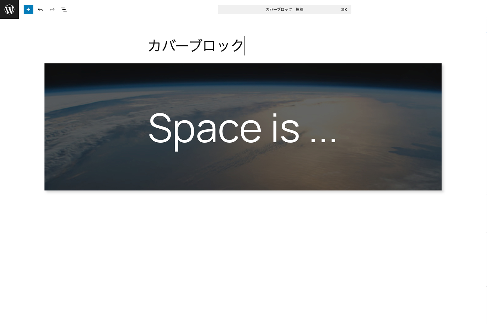{width=91.22mm}

1. カバーブロックに任意の画像を設定
2. **伸縮する見出しブロック**を挿入し、任意のテキストを入力
3. **レイアウト**で**コンテンツ幅を使用するインナーブロック**が有効になっていることを確認
4. **設定**で**固定背景**を有効
5. **オーバーレイ**の色を**コントラスト**に設定
6. **オーバーレイの不透明度**を**70**に設定
7. **枠線と影**で**影**を**Natural**に設定

# メディアとテキスト
## ツールバー
### 配置

#### 垂直配置を変更

垂直位置を、上揃え・中央揃え・下揃えから選択できます。

#### メディアを左に表示とメディアを右に表示

画像（メディア）を左右どちらに表示するかを設定します。デフォルトでは**メディアを左に表示**が選択されています。

> その他に、配置、リンク、置換などがあります。

## ブロックパネル
### 設定タブ
#### 設定
##### メディアの幅

このブロック全体におけるメディア（写真エリア）が占める割合を調整できます。デフォルトでは 50 になっています。

##### モバイルでは縦に並べる

モバイル端末でアクセスした際に、メディアとコンテンツを左右ではなく上下にレイアウトできます。メディアを左右どちらに表示しても、上下にレイアウトした際には**メディアが上**になります。

##### 画像を切り抜いて調整

この機能をオンにするとブロックの高さいっぱいに画像を広げるために切り抜きます。その際に、切り抜いた画像の中央を指定するためにフォーカルポイントが有効になります。

> その他に、代替テキスト、解像度が設定できます。

#### 高度な設定

> HTML アンカー、追加 CSS クラス、許可されたブロックが設定できます。

### スタイルタブ

> 色、タイポグラフィ、サイズ、枠線の設定ができます。

## 作ってみよう

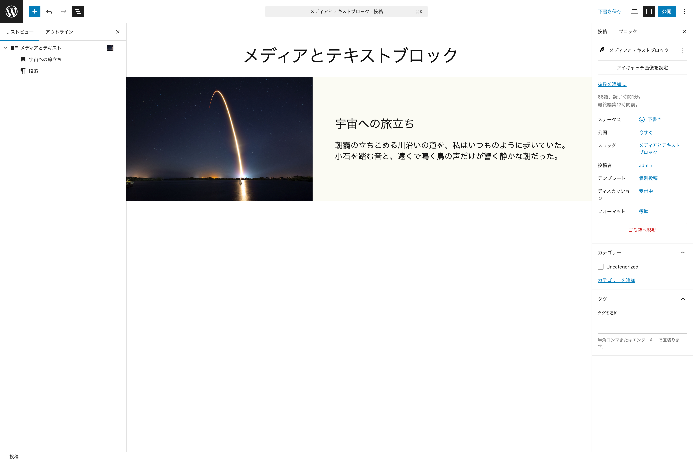{width=91.22mm}

1. 任意の画像とテキスト（見出しとテキスト）を配置
2. **配置**で**全幅**を指定
3. **設定**で**メディアの幅**を**40**に設定
4. **高度な設定**で**許可するブロックを管理**から**見出しと段落**を選択
5. **色**で**背景**を**アクセント5**に設定