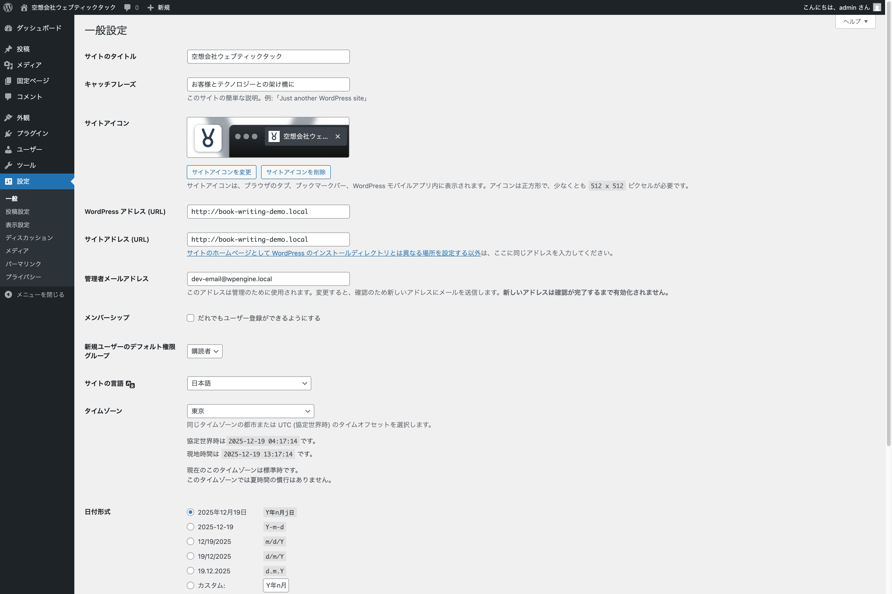

# 制作の準備と基本設定

## 完成ウェブサイトのイメージとウェブサイト構成

本章で作成するウェブサイトの完成イメージは、書籍サポートページで確認いただけます。詳しくは `https://olein-design.com/book` にてご確認ください。

そして、これから制作するウェブサイトのページ構成は以下のようになります。

```
- トップ（固定ページ）
- ブログ（固定ページ）
- 会社概要（固定ページ）
- お問い合わせ（固定ページ）
```

シンプルな構成になっていることがわかるかと思います。その他のページやテンプレートの制作について詳しく知りたい方は、別書『Twenty Twenty-Five でウェブサイトを作ろう』などを参考にしてください。

## 用意する投稿と固定ページ

以下のように投稿データを用意しています。

- 投稿（カテゴリー／お知らせ）：5 件
- 投稿（カテゴリー／note）：10 件

以下のように固定ページを用意しています。

- トップ
- ブログ
- 会社概要
- お問い合わせ

本書サポートページでは、上記の内容と使用する画像をインポートするための情報を用意しています。同じようなデータがなくてもご自身で用意されても良いでしょう。

## インストールするプラグイン

以下のプラグインをインストールしてください。日本語環境で WordPress を使う場合には必須と言ってもよいプラグインです。覚えておきましょう。

- WP Multibyte Patch

## 本書に沿って制作をされる方へ

本書サポートページでは下記データを公開しています。

- WordPress Playground
- WXR ファイル（XML ファイル）

また、本書では作業内容をスクリーンショット画像とテキストで簡素に説明をするだけにしています。詳しい作業方法については、別途動画を用意しています。 詳しくは本書サポートページでご確認ください。

## 各種設定の確認

ここから実際に WordPress を使用して制作を進めていきます。まずは、基本的な項目の設定をしていきます。

### 一般設定

{width=91.22mm}

- サイトのタイトル: `空想会社ウェブティックタック`
- キャッチフレーズ: `お客様とテクノロジーとの架け橋に`
- サイトアイコン: `site-icon.png`
- 日付形式: `Y年n月j日`
- 時刻形式: `H:i`

### 表示設定

{width=91.22mm}

- ホームページの表示：固定ページ
    - ホームページ：トップ
    - 投稿ページ：ブログ

### パーマリンクなど他の設定

パーマリンクや他の各種設定については、ここでは特に指定はしません。しかし、実際に公開するウェブサイトの場合は、他にも事前に設計を考えて設定を行うと良い点もありますので、適宜必要な設定を検討するようにしましょう。