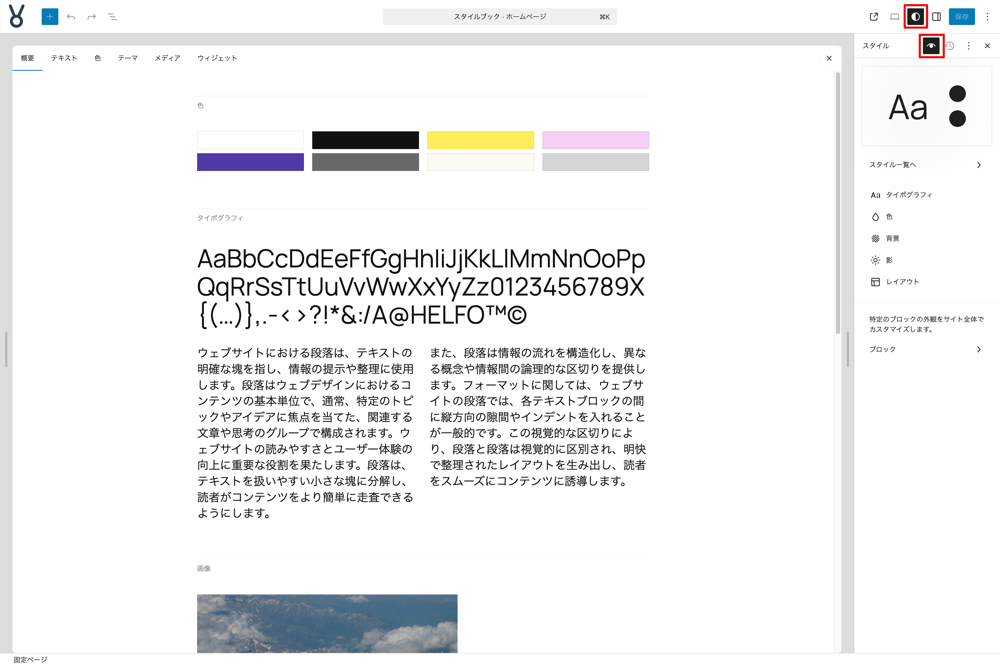

# サイトエディターでのスタイルの設定

ここからは**サイトエディター**での作業を進めていきます。

{width=91.22mm}

## Google Fonts の Noto Sans JP を用意する

### タイポグラフィ

- **フォント**の右上アイコンをクリックする
- **フォントをインストール**タブをクリックする
- **Google Fonts へのアクセスを許可する** というアラートが表示された場合には**許可**する
- **フォント名検索フォーム**より**Noto Sans JP**を探す
- 探したフォントをクリックして**400**と**700**のバリアントにチェックを入れて**インストール**する
- 上部に緑色のチップで正常にインストールされた際に表示されるアラートを確認する
- **ライブラリタブ**に戻り、**テーマ**に配置されているフォント**Fira Code**をクリックする
- 選択されているバリアント（この場合は**Fira Code 300 700**）のチェックを外し**更新**ボタンを押す
- **Manrope**に対しても同じ作業を行う
- フォント設定モーダルを閉じる

### 要素

- **テキスト**をクリックする
- **フォント**から**Noto Sans JP**を選択する
- **フォントサイズ**を**M**に設定する
- **行の高さ**を**1.7**に設定する
- **文字間隔**を**0**に設定する

### 色

- **パレットを編集**をクリックする
- **カスタム**の右側にある**＋**ボタンをクリックする
- 以下の色を設定する

```
- text-color: #333333
- brand-1: #142240
- brand-2: #263F73
- brand-3: #4E8AD9
- brand-4: #77ACF2
- brand-5:　#B3CFF2
```

- **要素**から**テキスト**を選択し、**コントラスト**から**text-color**に変更する
- **要素**から**リンク**を選択し、**デフォルト**の値を**アクセント6**から**brand-2**に変更する
- **要素**から**ボタン**を選択し、**背景**の値を**コントラスト**から**brand-2**に変更する

### レイアウト

- **コンテンツ幅**を**680**に変更する
- **幅広**を**1280**に変更する

### ブロックごとの設定変更

**スタイルブック**を表示して、各ブロックの調整を行います。スタイルブック上部のタブを移動してブロックを見つけクリックすると、インスペクターにそのブロックの設定パネルが開きます。

#### 見出しブロック

- **タイポグラフィ**の**外観**を**ボールド**に変更する

#### 引用ブロック

- **タイポグラフィ**の**外観**を**標準**に変更する

#### コードブロック

- **タイポグラフィ**の**外観**を**標準**に変更する

#### ボタンブロック

日本語環境ではスタイルブックに「ボタン」が２つ存在しますが、ボタンが１つ表示されている方を選択してください。（ちなみにこれは、英語では **Button** と **Buttons** という表記になっているため、翻訳でボタンが 2 つになっているからです。）

- **枠線と影**の**角丸**を**0**に設定する

ここまでに設定してきたブロック以外にも、スタイルブックの他のタブ内のブロックのスタイルを確認して、気になるものがあれば好きなように変更してみてください。