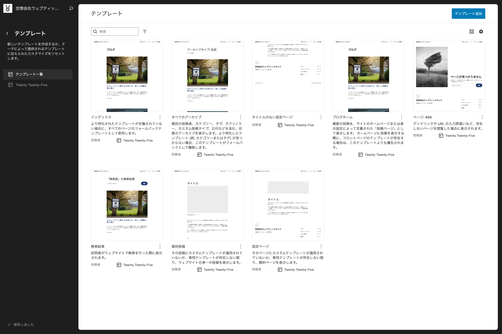
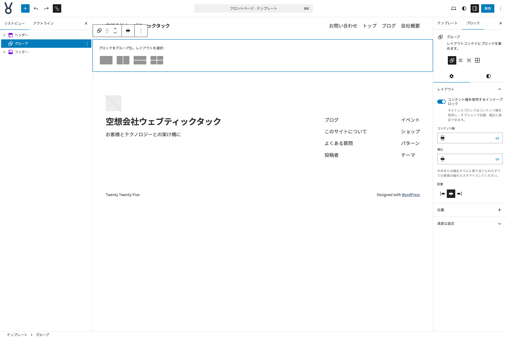
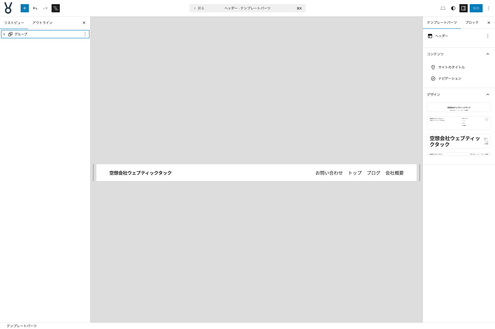
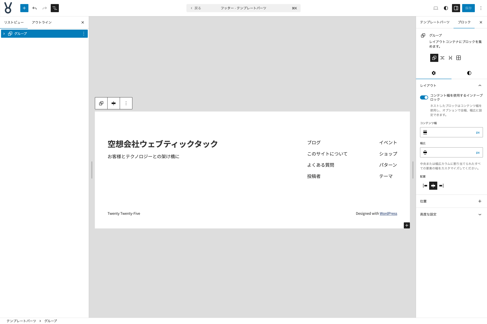
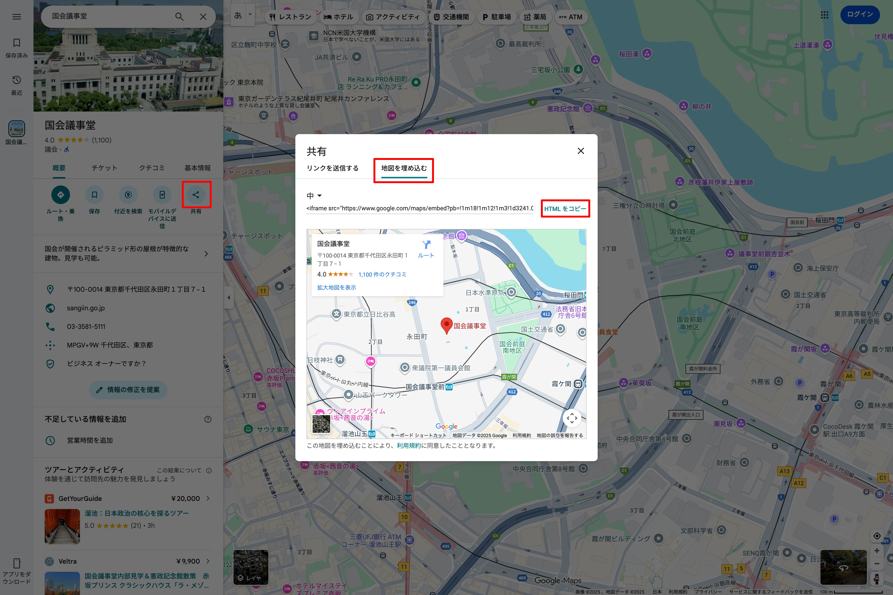

# フロントページのテンプレートを作る

ここからはフロントページのテンプレートを作ります。今回利用しているテーマ Twenty- Twenty-Five は**フロントページのテンプレートを最初からは用意されていません**。

フロントページテンプレートがない場合は**固定ページテンプレート**が自動的に割り当てられます。それでも問題ない場合は作らなくでも問題ありません。

今回は、他の固定ページとトップページのレイアウトを違うものにしたいので、**フロントページテンプレートを作成します**。

{width=91.22mm}

- **サイトエディター左サイドバー**より**テンプレート**を選択する
- テンプレート一覧**右上**の**テンプレート追加**を選択する
- **新しいテンプレートを適用する対象**で**フロントページ**を選択する
- **パターンを選択**するモーダルが表示されるが、右下の**スキップ**を選択する

これで**何もブロックが挿入されていないフロントページテンプレートの編集画面**が表示されます。

- **テンプレートパーツ「ヘッダー」**を挿入する
- その下に**グループブロック**を挿入する
- その下に**テンプレートパーツ「フッター」**を挿入する

{width=91.22mm}

- ヘッダーとフッターに挟まれた位置にある**グループブロック**を選択する
- **設定タブ**の**コンテント幅を使用するインナーブロック**を**無効**にする
- **スタイルタブ**の**上下マージン**を**なし**に設定する
- グループブロックの内部に**コンテンツブロック**を挿入する
- **コンテンツブロック**を選択する
- **設定タブ**の**コンテント幅を使用するインナーブロック**を**有効**にする

## テンプレートパーツ ヘッダーを編集する

{width=91.22mm}

- リストビューなどから**ヘッダー**を選択し、**ツールバー**の**編集**をクリックする

一番外側に配置されている**グループブロック**を選択して以下の設定・作業をします。

- **スタイルタブ**をクリックし、**色**の**背景色**を**brand-2**に設定する
- **色**の**テキスト色**を**ベース**に設定する
- **サイズ**の**上下マージン**を**なし**に設定する

**サイトのタイトル**ブロックを選択して以下の設定・作業をします。

- 前後のどちらかに**サイトロゴ**ブロックを挿入する

**サイトロゴ**ブロックを選択して以下の設定・作業をします。

- **ロゴを選択**をクリックして**メディアライブラリを開く**を選択します。
- メディアライブラリから**site-logo.png**を選択します。
- **設定タブ**の**設定**にある**画像の幅**を**240**に変更します。
- 元からある**サイトのタイトル**ブロックを**削除**します。

**ナビゲーションブロック**を選択して以下の設定・作業をします。

- **リスト表示**タブの**メニュー**にある**固定ページリスト**配下にあるメニュー項目のどれかを選択します。
- **ページリストの編集**というモーダルが表示されるので**編集**をクリックします。
- **固定ページリスト**ブロックがなくなっていることを確認します。
- **メニュー**内のメニュー項目の並び順を、トップ、ブログ、会社概要、お問い合わせの順に並び替えます。
- **メニュー項目:トップ**を選択して**テキスト**を**ホーム**に変更します。

これで**ヘッダー**の編集は終了です。

## テンプレートパーツ フッターを編集する

{width=91.22mm}

- リストビューなどから**フッター**を選択し、**ツールバー**の**編集**をクリックする

一番外側に配置されている**グループブロック**を選択して以下の設定・作業をします。

- **設定タブ**で**高度な設定**の**追加CSSクラス**に**site-footer**と設定する
- **スタイルタブ**をクリックし、**色**の**背景色**を**brand-2**に設定する
- **色**の**テキスト色**を**ベース**に設定する
- **サイズ**の**上パディング**を**標準**に、**下パディング**を**XS**に設定する

デフォルトのフッターに配置されているコンテンツは全て削除して、新しく作り替えます。

- **一番外のグループブロックの一つ内側にあるグループブロック**を削除する
- グループブロックの内部に**カラムブロック**を挿入し、**3カラム:均等割**を選択する

親の**カラムブロック**を選択して以下の設定・作業をします。

- ツールバーの**配置**を**幅広**に設定する

カラムブロックの左の子カラムブロックを選択して以下の設定・作業をします。

- **サイトロゴ**ブロックを挿入する
- **設定**の**画像の幅**を**210**に設定し、**画像にホームへのリンクを付ける**を**無効**にする
- 次に**ソーシャルアイコン**ブロックを挿入する
- **ソーシャルアイコン**ブロックを選択し、**スタイル**を**ロゴのみ**、**色**で**アイコンの色**を**ベース**に設定する
- **＋**をクリックして希望する SNS を選択し、リンク先 URL を設定する（デモでは X、facebook、instagram を配置し、リンク先 URL に `#` を設定しています）
- 次に**段落**ブロックを挿入し、テキストを設置する
- **段落**ブロックを選択し**タイポグラフィ**の**フォントサイズ**を**S**に設定する

カラムブロックの中央の子カラムブロックを選択して以下の設定・作業をします。

- **見出し**ブロックを挿入し、テキストを設置する
- **レベル**を**h4**に設定する
- **テキストの配置**を**テキスト中央寄せ**に設定する
- **サイズ**で**下パディング**を**XXS**に設定する
- **枠線**の３点メニューボタンをクリックし**枠線※*を表示する
- 枠線の下の設定のみ、**色**を**ベース**に、**太さ**を**1px**に設定する
- **段落**ブロックを挿入し、テキストを設置する

Google Map で任意の場所を検索し、次の画像のように**HTMLをコピー**してきます。サンプルでは国会議事堂のマップを表示しています。

{width=91.22mm}

- 次に**カスタムHTML**ブロックを挿入して、コピーした HTML をペーストする
- HTML 内にある `width="600"` を削除する
- `height` の値を `220` に変更する
- `style="border:0;"` に `width:100%` を追記して `style="border:0; width:100%"` となるようにする

カラムブロックの右の子カラムブロックを選択して以下の設定・作業をします。

- 中央の子カラムブロックで作成した見出しブロックをコピーしてペーストし、テキストを置き換える
- **ナビゲーション**ブロックを挿入する
- **設定タブ**の**レイアウト**から**方向**を**縦**に設定する
- **表示**の**オーバーレイメニュー**で**オフ**を設定する

最後に**コピーライト**テキストを設置します。

- カラムブロックの下に**段落**ブロックを挿入し、テキストを設置する
- ツールバーの**テキストの配置**を**テキスト中央**に設定する
- **タイポグラフィ**の**フォントサイズ**を**12px**に設定する

これで**フッター**の編集は終了です。

フッターとコンテンツ部分との間隔をなくすために少し設定を追加します。追加 CSS に以下のコードを追記してください。

```
footer.wp-block-template-part:has(> .site-footer) {
  margin-block-start: 0 !important;
}
```

これでフッターの上部に適応される余白を強制的に無くします。