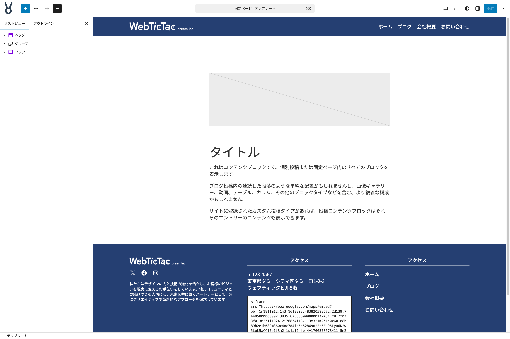

# 固定ページのテンプレートを作る

ここからは**固定ページ**のテンプレートを編集していきます。デフォルトのまま使用しても全く問題はないのですが、少し好みのレイアウトにしたい場合には、テンプレートを編集することで実現できます。

{width=91.22mm}

**テンプレートパーツ ヘッダー**の下にある**グループ**ブロックを選択して以下の設定・作業をします。

- **スタイルタブ**をクリックして**サイズ**の**上下マージン**を**なし**に設定する

**内部のグループブロック**の上に**カバー**ブロックを挿入して以下の設定・作業をします。

- ツールバーより**配置**を**全幅**に設定する
- カバーブロックに設定する画像を選択できるが**アイキャッチ画像を使用**を選択する
- **カバー**ブロックを選択して**色**の**オーバーレイ**を**text-color**に設定する
- **オーバーレイの不透明度**を**70**に設定する
- カバーブロックの内部に**タイトル**ブロックを挿入する
- ツールバーより**レベルを変更**にて**H1**に設定する
- ツールバーより**テキストの配置**を**テキスト中央寄せ**に設定する

**内部のグループブロック**を選択して以下の設定・作業をします。

- **スタイルタブ**の**サイズ**より**パディング**を３点メニューボタンから**リセット**する
- **上下マージン**を**なし**に設定する
- 内部の**投稿のアイキャッチ画像**ブロックと**タイトル**ブロックを削除する（コンテンツブロックのみになる）

これで**固定ページ**テンプレートの編集は終わりです。