# 固定ページ トップのコンテンツを作る

これまででテンプレートの編集は終わり、ここからは**固定ページのトップ**にコンテンツを作っていきます。

本書の流れでこのタイミングでの固定ページコンテンツ作成になっていますが、実際にウェブサイトを制作している際には、他のテンプレート（個別投稿やアーカイブなど）にも編集を加えることがあると思います。必要を感じる場合は、適宜各テンプレートを編集してみてください。

固定ページの編集を始める際に**パターンを選択**するモーダルが表示されますが、今回は何もせず閉じて問題ありません。

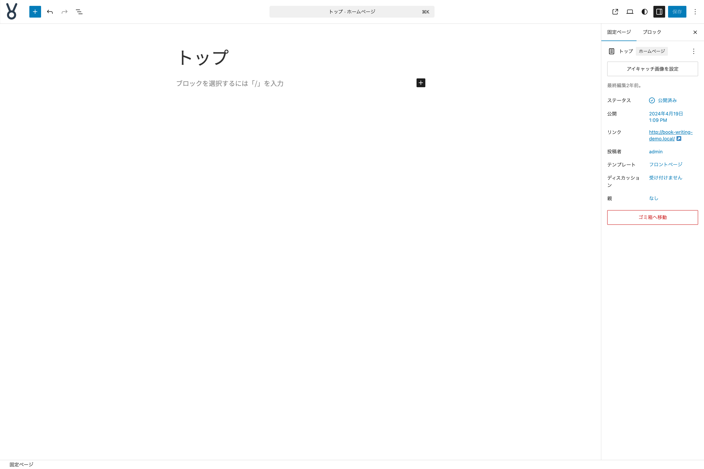{width=91.22mm}

それでは作っていきましょう。

## ヒーローセクションを作る

- **カバー**ブロックを挿入して、画像 `page-front-page-01` を設定する
- ツールバーの**配置**で**全幅**を設定する
- **リストビュー**より**カバー**ブロックを選択して**名前を変更**をクリックする
- **名前**を**ヒーローセクション**に変更する
- **スタイルタブ**で**色**から**オーバーレイ**を**text-color**に設定する
- **サイズ**の**上下マージン**を**なし**に設定する
- **サイズ**の**最小の高さ**を**40vh**に設定する
- カバーブロックの中に**伸縮する見出し**ブロックを挿入して、テキストを設定する
- **テキストの配置**を**テキスト中央寄せ**に設定する
- **タイポグラフィ**の**行の高さ**を**1.4**に設定する

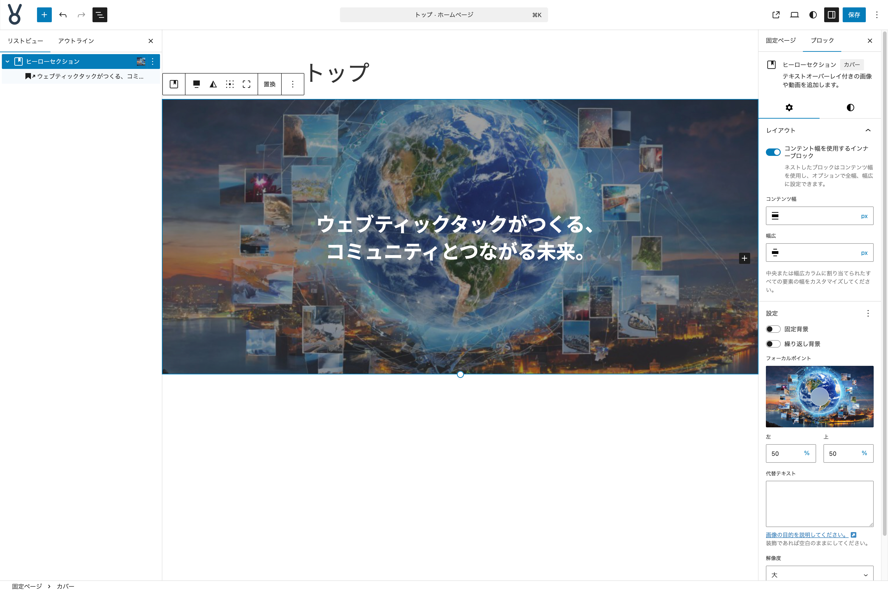{width=91.22mm}

## サービス概要セクションを作る

- ヒーローセクションの下に**グループ**ブロックを挿入する
- このブロックの名前を**サービス概要**に変更する
- **ツールバー**から**配置**を**全幅**に設定する
- **スタイルタブ**で**色**から**背景**を**ベース**に設定する
- **サイズ**で**上下パディング**を**XXL**に設定する
- **サイズ**で**上下マージン**を**なし**に設定する
- **サイズ**で**ブロックの間隔**を**XL**に設定する

このグループブロックの中に**見出し**ブロックを挿入して以下の設定・作業をします。

- テキスト**サービス概要**を設定する
- **ツールバー**から**テキストの配置**を**テキスト中央寄せ**に設定する
- **色**の**テキスト**を**brand-2**に設定する

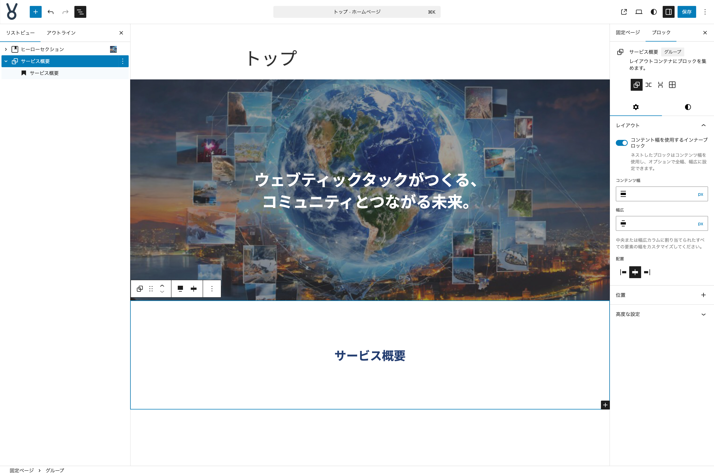{width=91.22mm}

ここまで作ってきた状態は、今後他のセクションを作る際にも雛形として利用できるパーツになります。ですので、この状態を**非同期パターン**に登録しておき、いつでも呼び出せるようにしておきます。

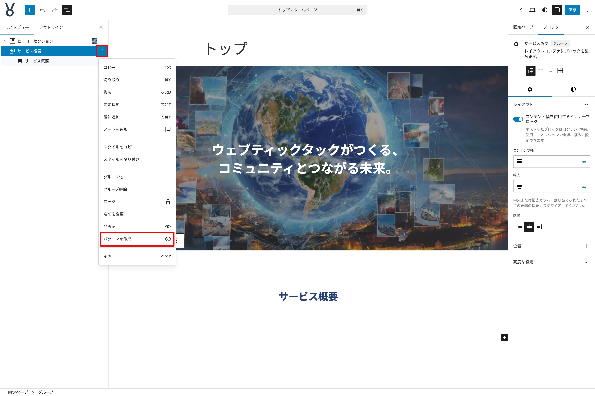{width=91.22mm}

- パターンに登録したいパーツの一番外側のブロック（今回はグループブロック）を選択して３点メニューボタンから**パターンを作成**を選択する
- **名前**を**セクション雛形**、カテゴリーは任意、**同期**のチェックは**無効**にする

これでパターンとして登録できました。引き続き、サービス概要セクションを作ります。

見出しブロックの下に**カラム**ブロック（3 カラム）を挿入して以下の設定・作業をします。

- **ツールバー**より**配置**を**幅広**に設定する

**左の子カラム**ブロックを選択して以下の設定・作業をします。

- **画像**ブロックを挿入し、画像 `service-creative-web-design.jpg` を設定する
- **画像**ブロックを選択し、**設定タブ**の**設定**にある**アスペクト比**を**正方形 - 1:1**を設定する
- **スタイルタブ**で**枠線と影**の**角丸**を**10px**に設定する
- **枠線と影**の３点メニューボタンから**影**を表示させ、**ドロップシャドウ**を**Natural**に設定する
- 次に**見出し**ブロックを挿入し、テキストを設定する
- **ツールバー**の**レベルを変更**で**H3**に設定する
- **色**の**テキスト**を**brand-2**に設定する
- 次に**段落**ブロックを挿入し、テキストを設定する

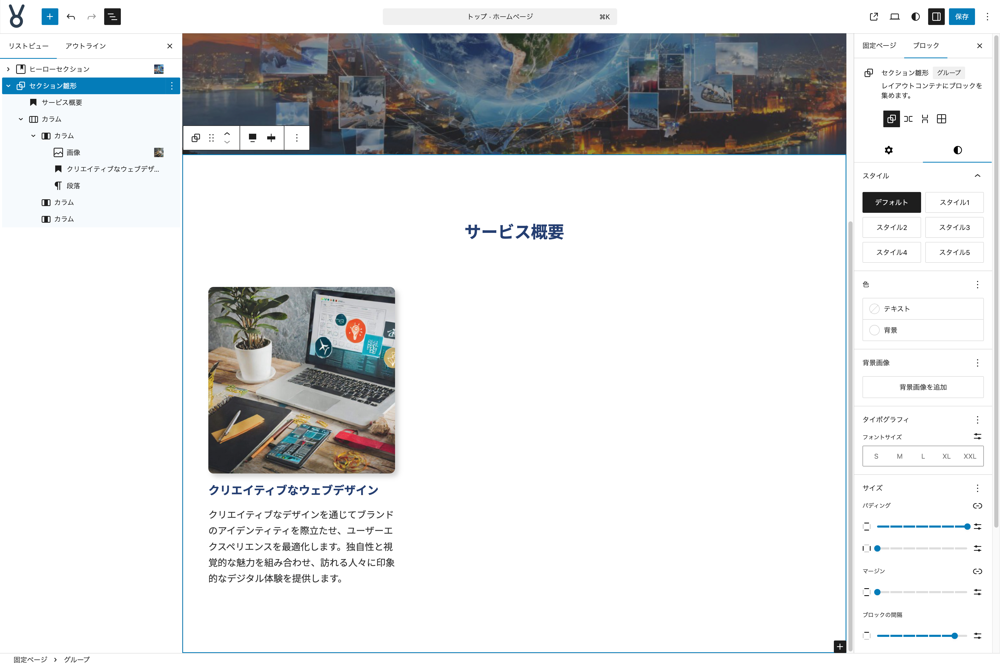{width=91.22mm}

完成した子カラムを選択し、ツールバーなどから 2 つ複製します。空の子カラムは削除して３カラムになるようにします。

そして、新しくできたカラムの情報を書き換えましょう。

- 中央のカラムの画像は `service-new-tech.jpg` に設定する
- 右のカラムの画像は `service-marketing-support.jpg` に設定する
- 各所のテキストを置き換える

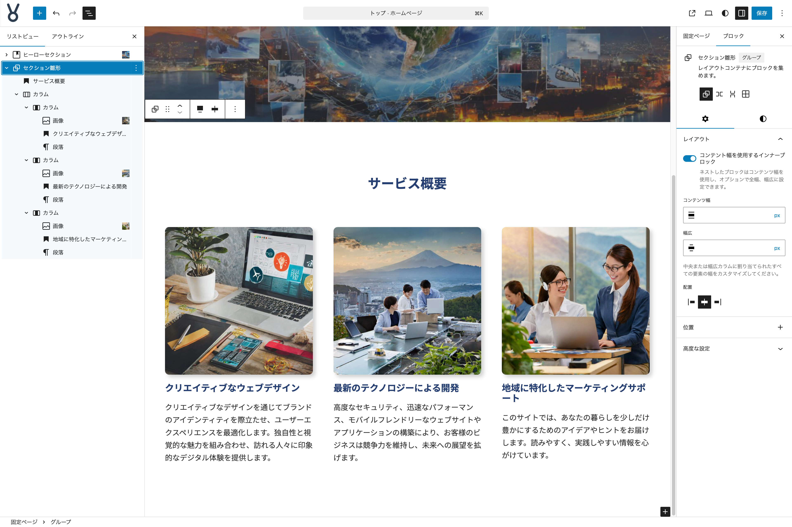{width=91.22mm}

パターン登録した際にグループブロックの名前が**セクション雛形**に変わってしまったので**サービス概要**に変えておきましょう。

これで**サービス概要セクション**が完成しました。

## 特徴と強みセクションを作る

- **インサーター**から**パターン**タブをクリックし、**マイパターン**の中の**セクション雛形**をクリックして挿入する
- **リストビュー**で**サービス概要**となっている名前を**特徴と強み**に変更する
- **グループ**ブロックを選択し、**スタイルタブ**の**色**で**背景**に `#f4f4f4` を設定する
- **見出し**ブロックのテキストを**特徴と強み**に変更する

見出しブロックの下に**グループ**ブロックを挿入して以下の設定・作業をします。

- **グループ**ブロックを選択し、**ツールバー**の**配置**を**幅広**に設定する
- **設定タブ**の**レイアウト**で**コンテント幅を使用するインナーブロック**を**無効**にする
- **スタイルタブ**の**サイズ**で**ブロックの間隔**を**なし**に設定する

この**グループ**ブロックの中に**メディアとテキスト**ブロックを挿入して、以下の設定・作業をします。

- 画像 `page-company-02.jpg` を設定する
- **設定タブ**の**設定**で**画像を切り抜いて調整**を**有効**に設定する
- **スタイルタブ**の**色**で**背景**を**ベース**に設定する
- コンテンツ部分に**見出し**ブロックを挿入し、テキストを設定する
- **レベルを変更**で**H3**に設定する
- 見出しブロックの下に**リスト**ブロックを挿入し、テキストを設定する
- 親の**リスト**ブロックを選択し、**スタイル**で**チェック**を選択する

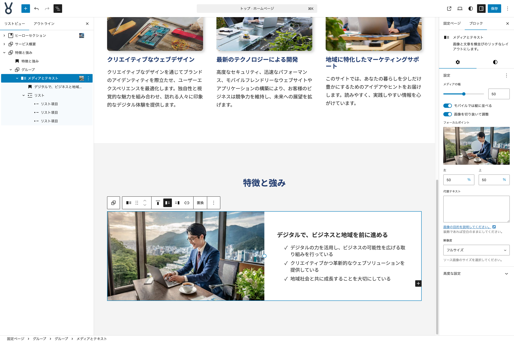{width=91.22mm}

今作った**メディアとテキスト**ブロックを**複製**して、以下の設定・作業をします。

- **ツールバー**より**メディアを右に表示**をクリックする
- **画像**を `page-company-01.jpg` に置き換える
- テキストを置き換える

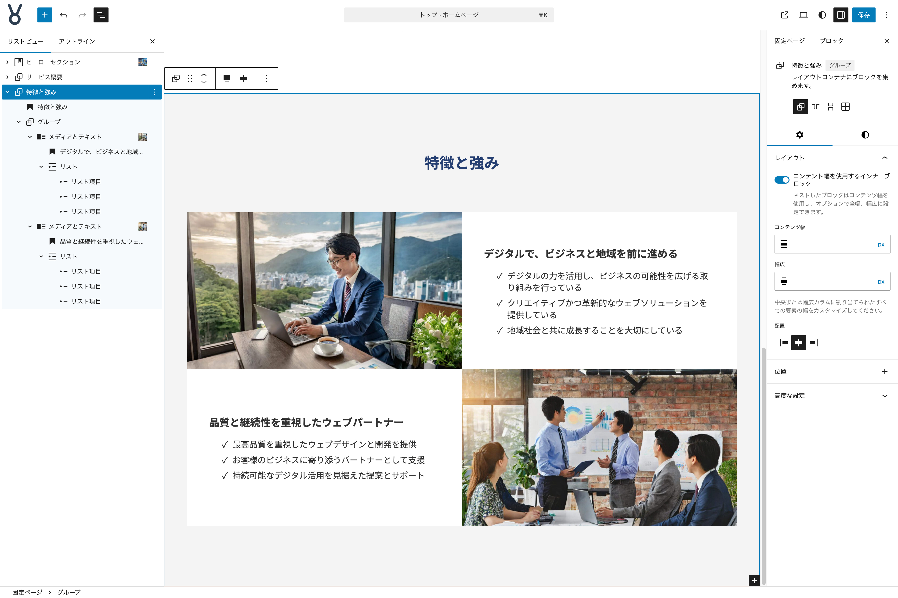{width=91.22mm}

これで**特徴と強みセクション**が完成しました。

## 事業紹介セクションを作る

- **インサーター**から**パターン**タブをクリックし、**マイパターン**の中の**セクション雛形**をクリックして挿入する
- **リストビュー**で**サービス概要**となっている名前を**事例紹介**に変更する
- **見出し**ブロックのテキストを**事例紹介**に変更する

見出しブロックの下に**グループ**ブロックを挿入して以下の設定・作業をします。

- **グループ**ブロックを選択し、**ツールバー**の**配置**を**幅広**に設定する
- **設定タブ**の**レイアウト**で**コンテント幅を使用するインナーブロック**を**無効**にする
- **スタイルタブ**の**サイズ**で**ブロックの間隔**を**標準**に設定する

この**グループ**ブロックの中に、もう 1 つ**グループ**ブロックを挿入して、以下の設定・作業をします。

- **設定タブ**の**レイアウト**で**コンテント幅を使用するインナーブロック**を**無効**にする
- **スタイルタブ**の**サイズ**で**上下パディング・左右パディング**を**XS**に設定する
- **枠線と影**の**枠線**で**色**を**brand-2**、線の太さを**1px**に設定する

この**グループ**ブロックの中に**カラム**ブロックを挿入し、**２カラム**に設定して、以下の設定・作業をします。

- **親のカラム**ブロックを選択し、**垂直配置を変更**で**中央揃え**を設定する
- **左の子カラム**に**画像**ブロックを挿入し、`post-note-thumbnail-01.jpg` を設定する
- **右の子カラム**に**見出し**ブロックを挿入し、テキストを設定する
- **ツールバー**の**レベルを変更**で**H3**に設定する
- 次に**段落**ブロックを挿入し、テキストを設定する
- 次に**ボタン**ブロックを挿入する
- **親のボタン**ブロックを選択し、**項目の揃え位置を変更**を**右揃え**に設定する
- **子のボタン**ブロックを選択し、ラベルに**詳細を見る**を、リンク先 URL を任意で設定する
- **スタイルタブ**の**スタイル**で**輪郭**を設定する
- **色**の**テキスト**を**brand-2**に設定する

これで事例紹介用のカードが用意できました。この下に同じレイアウトのカードを 2 枚並べてレイアウトします。そして、ウェブサイトの運用上今後も事例が増えていくことを想定して、このカードを**同期パターンの上書き機能**を活用して管理できるようにしてみます。

**カラムブロックの外側のグループブロック**（枠線が設定してあるグループブロック）を選択して、３点メニューボタンから**パターンを作成**を選択し、以下の設定・作業をします。

- **名前**に**事例紹介カード**と設定する
- カテゴリー設定は任意とする
- **同期**が**有効**になっているか確認する
- **追加**をクリックする

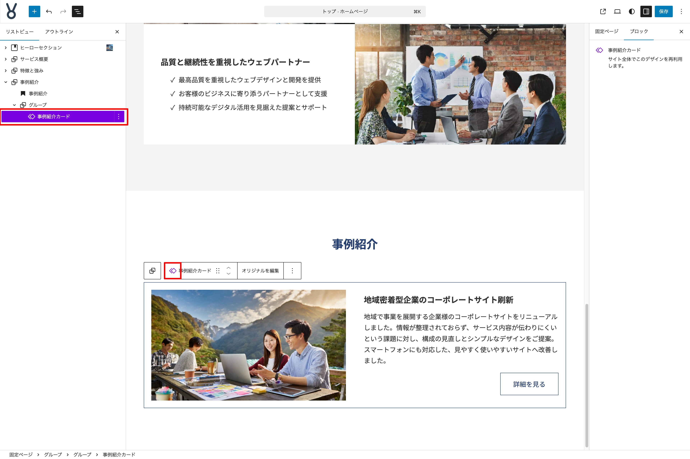{width=91.22mm}

これで**同期パターン**として登録は完了しました。次に、パターン内部のブロックで上書きを可能にしたいブロックに対して設定をします。

登録したパターンを選択し、ツールバーより**オリジナルを編集**を選択して、以下の設定・作業をします。

- 子カラム内の**画像**ブロックを選択する
- **設定タブ**の**高度な設定**より**上書きを有効化**を選択する
- **名前**の入力を求められるので**画像**と設定する
- 続いて、**見出し**ブロック、**段落**ブロック、（子）**ボタン**ブロックにも同じように設定する（以下、登録名前例）
  - 見出し：**タイトル**
  - 段落：**紹介文**
  - ボタン：**ボタン**

登録したパターンを２つ挿入し、上書き可能設定をしたブロックのコンテンツなど情報が書き換えられることを確認しましょう。

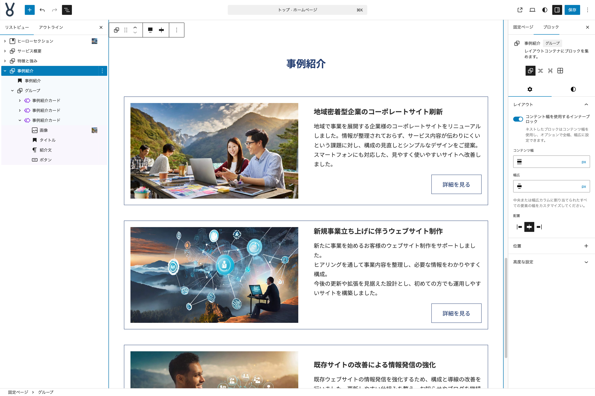{width=91.22mm}

これで**事例紹介セクション**が完成しました。

## よくある質問セクションを作る

- **インサーター**から**パターン**タブをクリックし、**マイパターン**の中の**セクション雛形**をクリックして挿入する
- **リストビュー**で**サービス概要**となっている名前を**よくある質問**に変更する
- **グループ**ブロックを選択し、**スタイルタブ**の**色**で**背景**に `#f4f4f4` を設定する
- **見出し**ブロックのテキストを**よくある質問**に変更する

見出しブロックの下に**グループ**ブロックを挿入して以下の設定・作業をします。

- **グループ**ブロックを選択し、**ツールバー**の**配置**を**幅広**に設定する
- **スタイルタブ**の**サイズ**で**ブロックの間隔**を**なし**に設定する

この**グループ**ブロックに**アコーディオン**ブロックを挿入して、以下の設定・作業をします。

- **アコーディオン**ブロックの見出しとパネルにテキストを設定する
- **アコーディオン**ブロックの**設定タブ**の**設定**にて、**自動で閉じる**を**有効**に設定する
- **アコーディオン項目**ブロックを選択し、**色**の**背景**を**ベース**に設定する
- **アコーディオン見出し**ブロックを選択し、**色**の**テキスト**を**ベース**に、**背景**を**brand-2**に設定する
- **サイズ**の**上下・左右パディング**をそれぞれ**XS**に設定する
- **アコーディオンパネル**ブロックを選択し、**サイズ**の**上下・左右パディング**をそれぞれ**XS**に設定する

これで、１つの質問と答えを表示するパーツが出来上がりました。合計で４つになるように複製をして、それぞれのコンテンツを書き換えましょう。

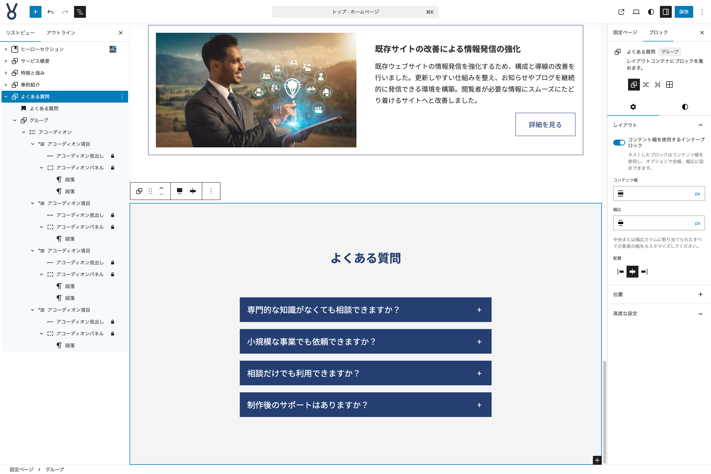{width=91.22mm}

これで**よくある質問セクション**が完成しました。

## ブログセクションを作る

- **インサーター**から**パターン**タブをクリックし、**マイパターン**の中の**セクション雛形**をクリックして挿入する
- **リストビュー**で**サービス概要**となっている名前を**ブログ**に変更する
- **見出し**ブロックのテキストを**ブログ**に変更する

見出しブロックの下に**カラム**ブロックを挿入し、**2カラム: 1/3、2/3に分割**を選択して、以下の設定・作業をします。

- **親のカラム**ブロックを選択し、**配置**を**幅広**に設定する
- **カラム**ブロックの上にある**見出し**ブロックを、ドラッグ＆ドロップで**左の子カラム**に移動する
- **右の子カラム**に**クエリーループ**ブロックを挿入し、**新規**を選択する
- **開始時のバリエーション**は**タイトルと日付**を選択する
- **クエリーループ**ブロック内にある**ページ送り**ブロックは削除する
- **クエリーループ**ブロック内にある**結果なし**ブロックを選択して、表示する投稿が存在しない際に表示するテキストを設定する（例：投稿がありません）
- **クエリーループ**ブロックを選択して、**設定**の**クエリータイプ**を**カスタム**に設定する
- **表示**の**ページあたりの項目数**を**3**に設定する
- **投稿テンプレート**ブロック内の**タイトル**ブロックを選択して、**設定タブ**の**設定**にある**タイトルをリンクにする**を**有効**に設定する
- **タイポグラフィ**の**フォントサイズ**を**M**に設定する
- **タイトル**ブロックと**投稿日**ブロックを前後入れ替える
- **投稿日**ブロックと**タイトル**ブロックを選択して、３点メニューボタンより**グループ化**を選択する
- 作られた**グループ**ブロックを選択し、**設定タブ**より**レイアウト**の**コンテント幅を使用するインナーブロック**を**無効**に設定する
- **スタイルタブ**の**サイズ**にある**ブロックの間隔**を**XXS**に設定する

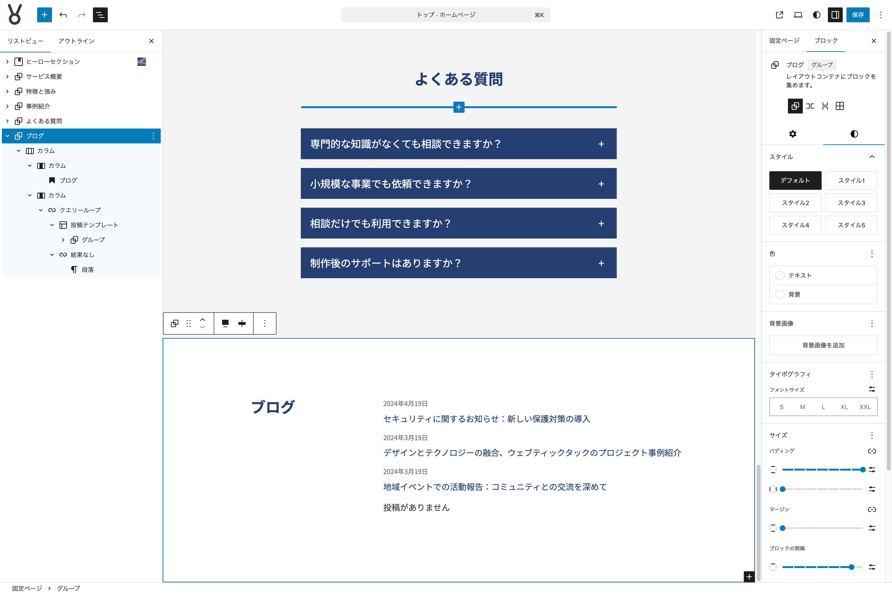{width=91.22mm}

これで**ブログセクション**が完成しました。

## お問い合わせセクションを作る

**カバー**ブロックを挿入して、以下の設定・作業をします。

- **名前**を**お問い合わせ**に変更する
- 画像 `page-contact.jpg` を設定する
- **ツールバー**の**配置**を**全幅**に設定する
- **カバー**ブロックを選択して、**設定タブ**の**設定**にある**フォーカルポイント**を**写真内の人物の顔**に当たるように設定する
- **スタイルタブ**の**色**にある**オーバーレイ**を**text-color**に設定する
- **サイズ**の**上下マージン**を**なし**に設定する
- **カバー**ブロックの内部に**見出し**ブロックを挿入し、テキストを設定する
- **ツールバー**にある**テキストの配置**を**テキスト中央寄せ**に設定する
- 次に**段落**ブロックを挿入し、テキストを設定する
- **ツールバー**にある**テキストの配置**を**テキスト中央寄せ**に設定する
- 次に**ボタン**ブロックを挿入し、テキストを設定する
- 親の**ボタン**ブロックを選択し、**ツールバー**の**項目の揃え位置を変更**を**中央揃え**に設定する
- 子の**ボタン**ブロックを選択し、**スタイルタブ**の**スタイル**で**輪郭**を設定する
- **ツールバー**の**リンク**を**固定ページ:お問い合わせ**に設定する

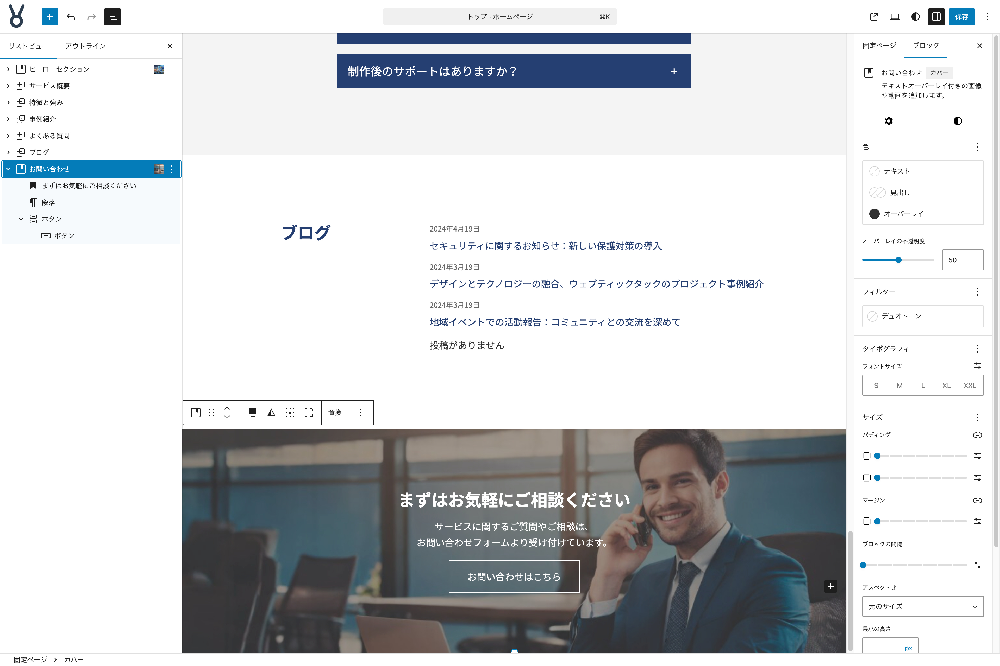{width=91.22mm}

完成した**お問い合わせセクション**は、他の固定ページでも使用したいので**同期パターン**として登録しておきます。

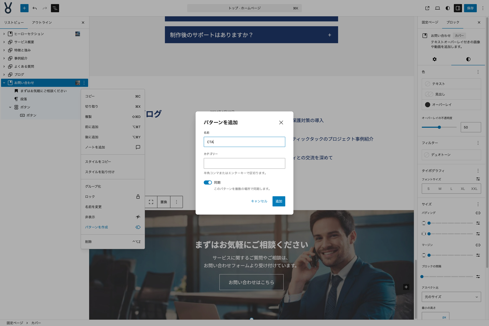{width=91.22mm}

これで**お問い合わせセクション**が完成し、**トップページ**も完成しました。

色々なブロックを活用してコンテンツを作る流れを体験してもらえる内容にしていますので、全体として実用的かどうか、またテキストや写真の内容が最適ではない部分もありますが、ブロックエディターを使ったコンテンツ作りの練習になれば嬉しいです。
