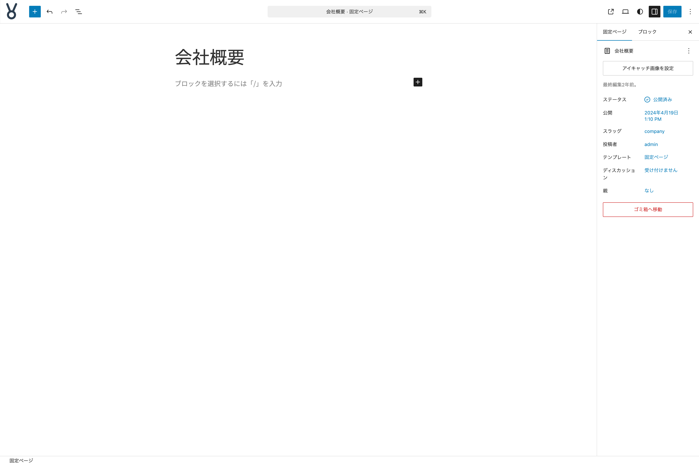
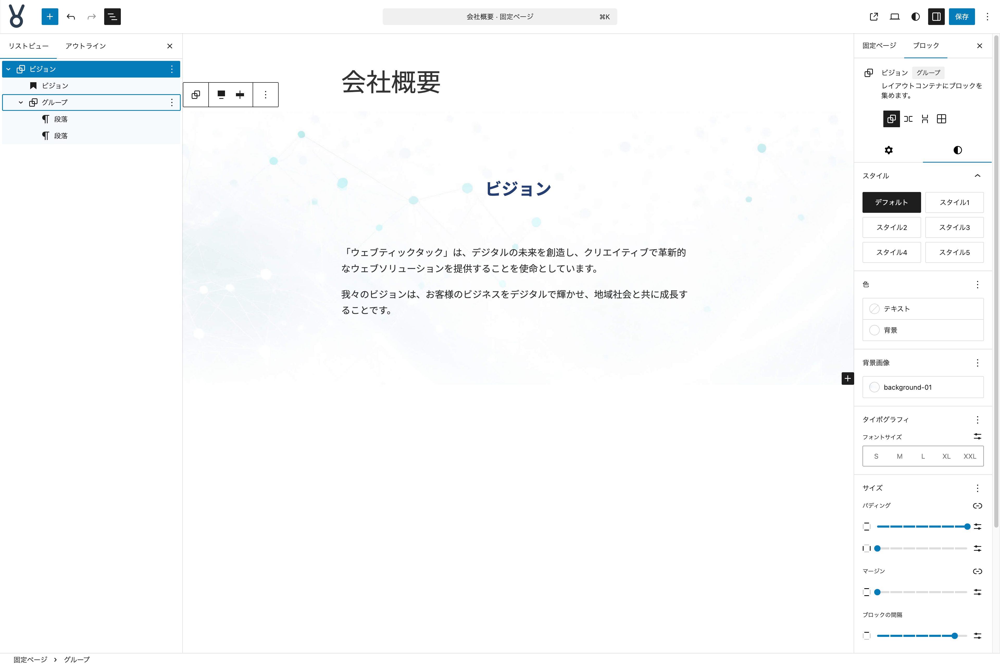
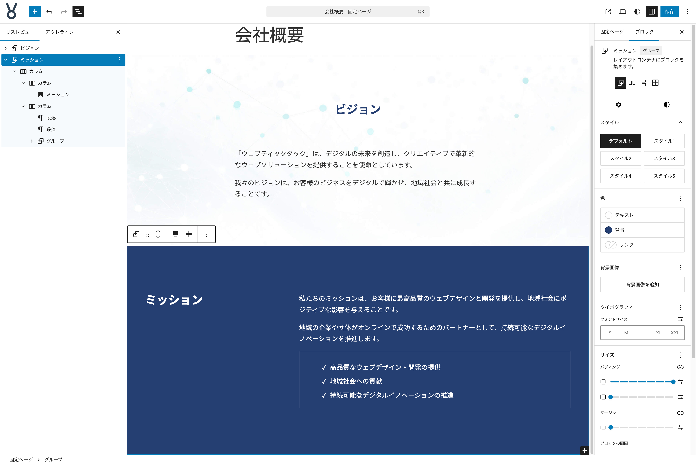
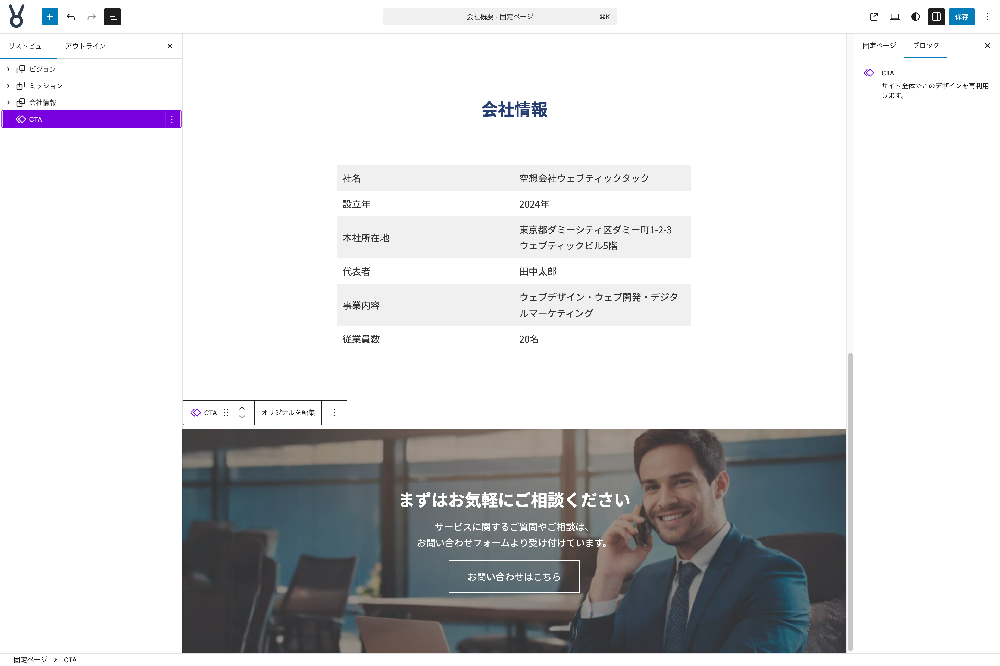

# 固定ページ 会社概要のコンテンツを作る

ここからは**固定ページ 会社概要**のコンテンツを作っていきます。ここでも先ほどのトップページのコンテンツを作り始めた時と同じように、固定ページの編集を始める際に**パターンを選択**するモーダルが表示されますが、何もせず閉じて問題ありません。

{width=91.22mm}

それでは作っていきましょう。

## アイキャッチ画像の設定

- **アイキャッチ画像**に `page-company-01.jpg` を設定する

## ビジョンセクションを作る

- **インサーター**から**パターン**タブをクリックし、**マイパターン**の中の**セクション雛形**をクリックして挿入する
- **リストビュー**で**サービス概要**となっている名前を**ビジョン**に変更する
- **見出し**ブロックのテキストを**ビジョン**に変更する
- **グループ**ブロックを選択して**スタイルタブ**の**背景画像**を `background-01.jpg` に設定する
- **見出し**ブロックの下に**グループ**ブロックを挿入する
- **グループ**ブロックの中に**段落**ブロックを挿入して、テキストを設定する

{width=91.22mm}

これで**ビジョンセクション**が完成しました。

## ミッションセクションを作る

- **インサーター**から**パターン**タブをクリックし、**マイパターン**の中の**セクション雛形**をクリックして挿入する
- **リストビュー**で**サービス概要**となっている名前を**ミッション**に変更する
- **見出し**ブロックのテキストを**ミッション**に変更する
- **グループ**ブロックを選択して**スタイルタブ**の**色**で、**テキスト**を**ベース**に、**背景**を**brand-2**に設定する
- **見出し**ブロックを選択し、**色**の３点メニューボタンから**すべてリセット**を選択する
- **見出し**ブロックの下に**カラム**ブロックを挿入し、**2カラム: 1/3、2/3に分割**レイアウトを選択する
- 親の**カラム**ブロックを選択して、**ツールバー**の**配置**を**幅広**に設定する
- 左の**子カラム**ブロックに、**見出し**ブロックを移動する
- **見出し**ブロックを選択し、**ツールバー**の**テキストの配置**を**テキスト左寄せ**に設定する
- 右の**子カラム**ブロックに**段落**ブロックを挿入して、テキストを設定する
- その下に**リスト**ブロックを挿入して、テキストを設定する
- **リスト**ブロックを選択して**スタイル**で**チェック**を選択する
- **リスト**ブロックを選択して、３点メニューボタンから**グループ化**を選択する
- 上で作成された**グループ**ブロックを選択し、**スタイルタブ**の**サイズ**で**上下パディング**を**XS**に設定する
- **枠線と影**の**枠線**を、**色**を**ベース**に、**太さ**を**1px**に設定する

{width=91.22mm}

これで**ミッションセクション**が完成しました。

## 会社情報セクションを作る

- **インサーター**から**パターン**タブをクリックし、**マイパターン**の中の**セクション雛形**をクリックして挿入する
- **リストビュー**で**サービス概要**となっている名前を**会社情報**に変更する
- **見出し**ブロックのテキストを**会社情報**に変更する
- **見出し**ブロックの下に**テーブル**ブロックを挿入し、**カラム数**は**2**、**行数**は**6**で設定する
- **テーブル**ブロックを選択し**スタイルタブ**の**スタイル**で**ストライプ**を選択する
- **テーブル**ブロックにテキストを設定する

{width=91.22mm}

これで**会社情報セクション**が完成しました。

## 同期パターンを挿入する

トップページのコンテンツを作った際に制作・登録した同期パターンを最下部に設置します。

- **インサーター**から**パターン**タブをクリックし、**マイパターン**の中の**CTA**をクリックして挿入する

{width=91.22mm}

これで**固定ページ 会社情報**が完成しました。
