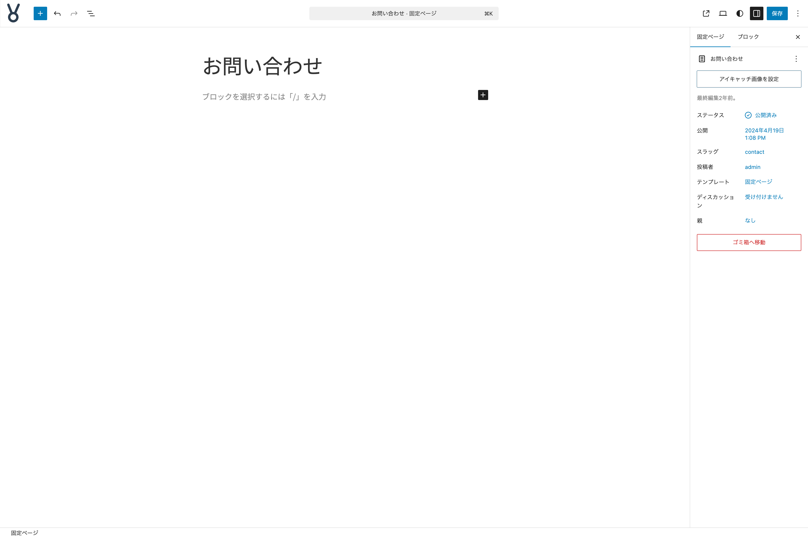
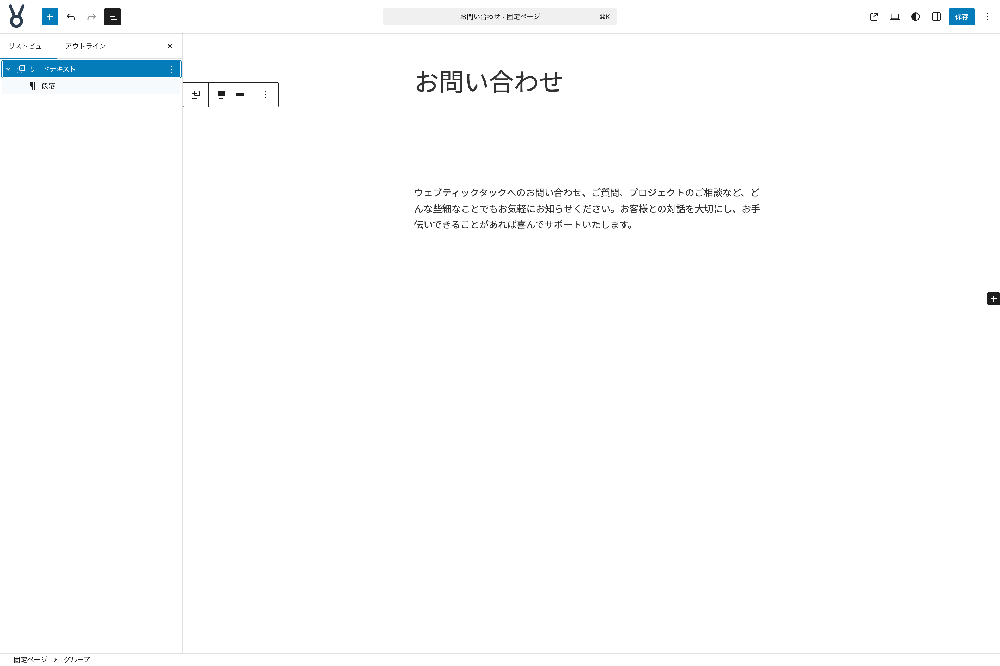
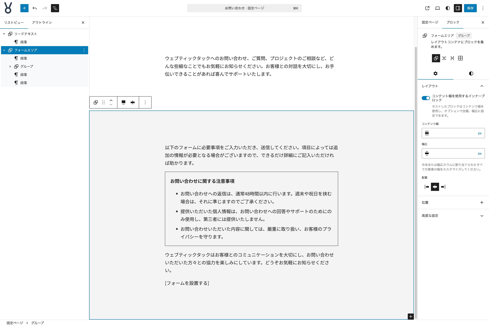

# 固定ページ お問い合わせを作る

ここからは**固定ページ お問い合わせ**のコンテンツを作っていきます。ここでも先ほどのトップページのコンテンツを作り始めた時と同じように、固定ページの編集を始める際に**パターンを選択**するモーダルが表示されますが、何もせず閉じて問題ありません。

{width=91.22mm}

それでは作っていきましょう。

## アイキャッチ画像の設定

- **アイキャッチ画像**に `page-contact.jpg` を設定する

## リードテキストセクションを作る

- **インサーター**から**パターン**タブをクリックし、**マイパターン**の中の**セクション雛形**をクリックして挿入する
- **リストビュー**で**サービス概要**となっている名前を**リードテキスト**に変更する
- **見出し**ブロックを削除して**段落**ブロックを用意する
- **段落**ブロックにテキストを設定する

{width=91.22mm}

これで**リードテキストセクション**の完成です。

## フォームエリアセクションを作る

- 先ほど作成した**リードテキストセクション**を複製する
- **リストビュー**で**リードテキスト**となっている名前を**フォームエリア**に変更する
- **スタイルタブ**で**色**の**背景**を `#f4f4f4` に設定する
- **サイズ**の３点メニューボタンから**ブロックの間隔**を**リセット**する
- 既成の**段落**ブロックにテキストを設定する
- 次に**段落**ブロックと**リスト**ブロックを挿入し、必要なテキストを設置する
- **段落**ブロックは、テキスト全て選択して**ツールバー**から**太字**を選択する
- **段落**ブロックと**リスト**ブロックを選択して**グループ化**する
- 作られた**グループ**ブロックを選択して、**設定タブ**の**レイアウト**で**コンテント幅を使用するインナーブロック**を**無効**に設定する
- **スタイルタブ**の**サイズ**で**上下・左右パディング**を**XS**に設定する
- **枠線と影**の**枠線**で**色**を**text-color**、**線幅**を**1px**に設定する
- 次に**段落**ブロックを挿入して、テキストを設定する

{width=91.22mm}

**[フォームを設置する]**というテキストが入っている場所にフォームを設置することで、実際にお問い合わせページとして機能します。フォームの設置に関しては本書では解説はしません。

これで**固定ページ お問い合わせ**の完成です。