# 管理画面の配色が変化した

WordPress 7.0 から管理画面のデフォルトカラースキーム（配色）が変更されました。

これまで WordPress 3.8 以降採用されてきたカラースキームが「フレッシュ」というものから「モダン」に変更になりました。

これは新しく追加されたわけではなく、少なくとも 6.9 でも選択できるように用意されていたカラースキームで、7.0 ではデフォルトでの設定が変更になったということです。

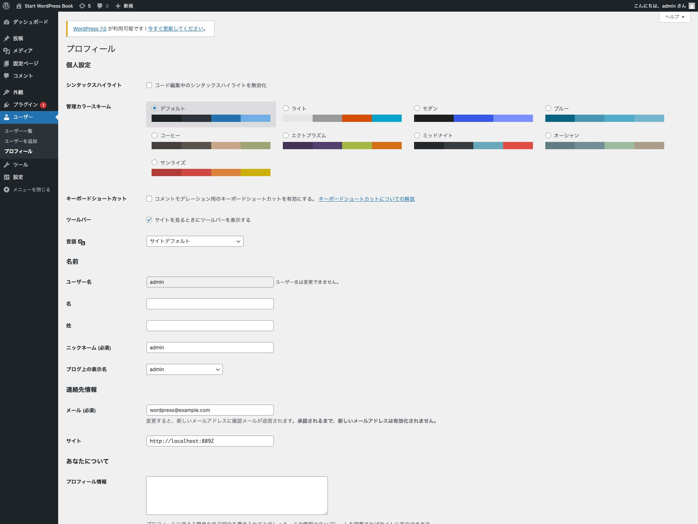{width=91.22mm}

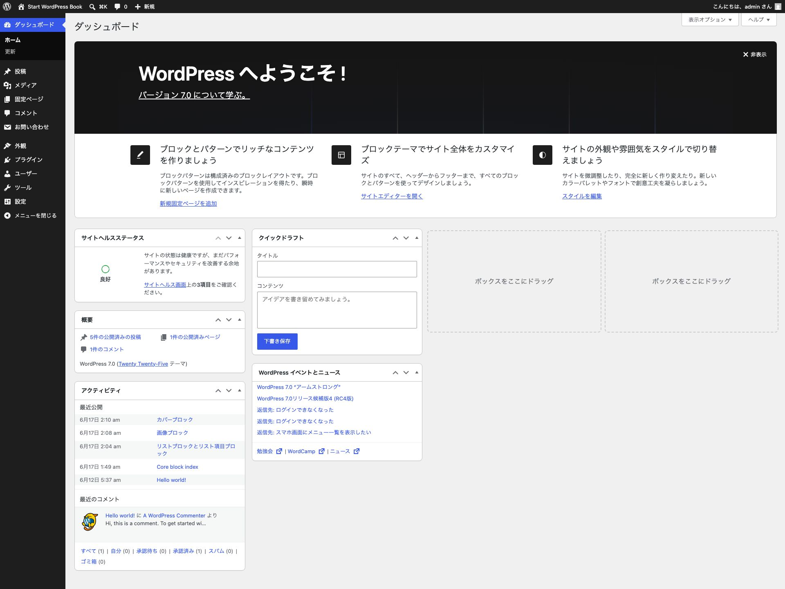{width=91.22mm}

# ビジュアル・リビジョン

これまでは記録されたリビジョン（履歴）から元の状態に戻す際に、下のようなコードベースの情報を確認する必要がありました。

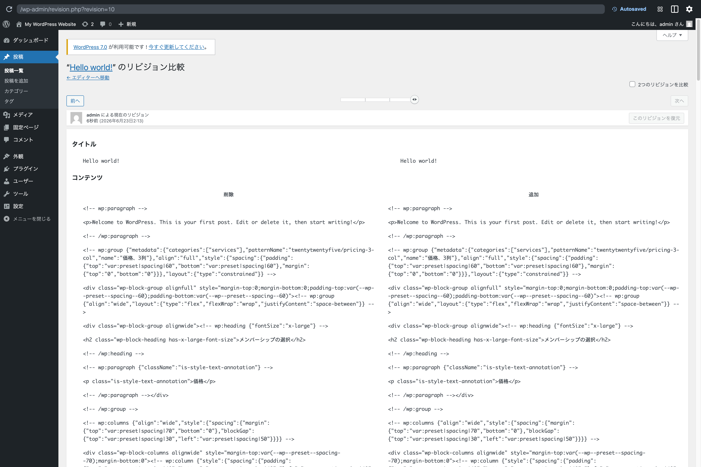{width=91.22mm}

WordPress 7.0 では、これまでのコードベースのリビジョンではなく、視覚的（ビジュアル）に変更点を確認できる「ビジュアル・リビジョン」が導入されました。

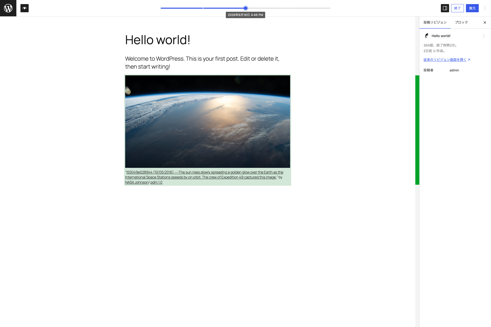{width=91.22mm}

# ナビゲーション・オーバーレイ機能

これまでナビゲーションブロックで構成されたメニューが、PC などのデバイス幅では横並びなどに、タブレットやスマートフォンなどのデバイス幅ではハンバーガーメニューを表示し、タップすることでオーバーレイメニューが表示されました。

しかし、メニュー項目の並び順や、オーバーレイメニューだけに特定のメニュー項目を表示するといったことはできませんでした。

WordPress 7.0 からは、このナビゲーション・オーバーレイがカスタマイズ可能になります。簡単にカスタマイズの流れを紹介します。

まず、ナビゲーションブロックを含むテンプレートパーツにアクセスします。

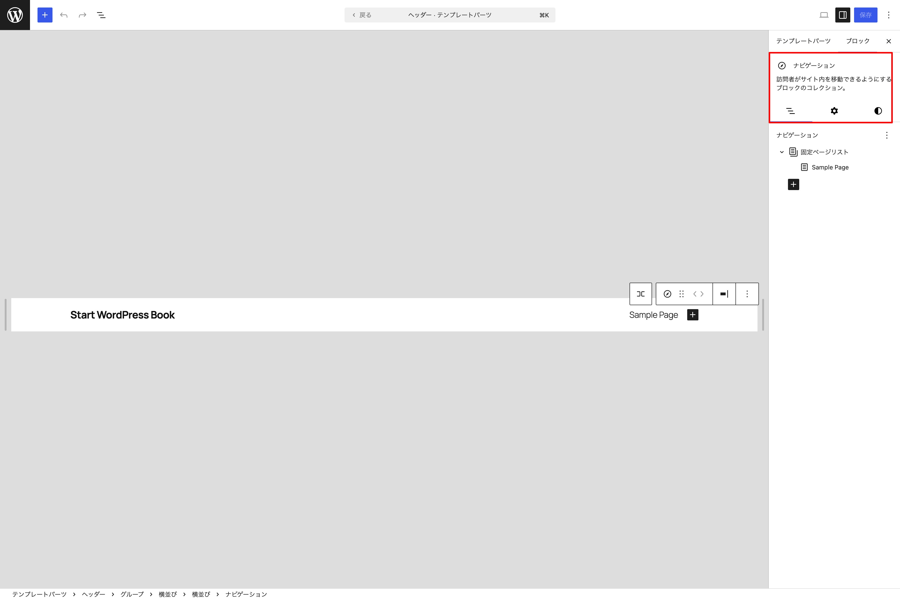{width=91.22mm}

次に、設定タブを開き **オーバーレイを作成** をクリックします。

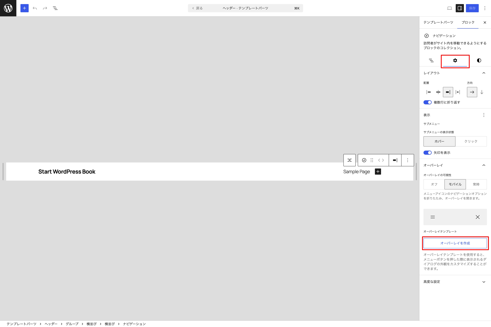{width=91.22mm}

すると、オーバーレイ・ナビゲーションがエディターに表示され、カスタマイズできる状態になります。

以下のように好きなブロックを配置してレイアウトを自由に変更してみましょう。

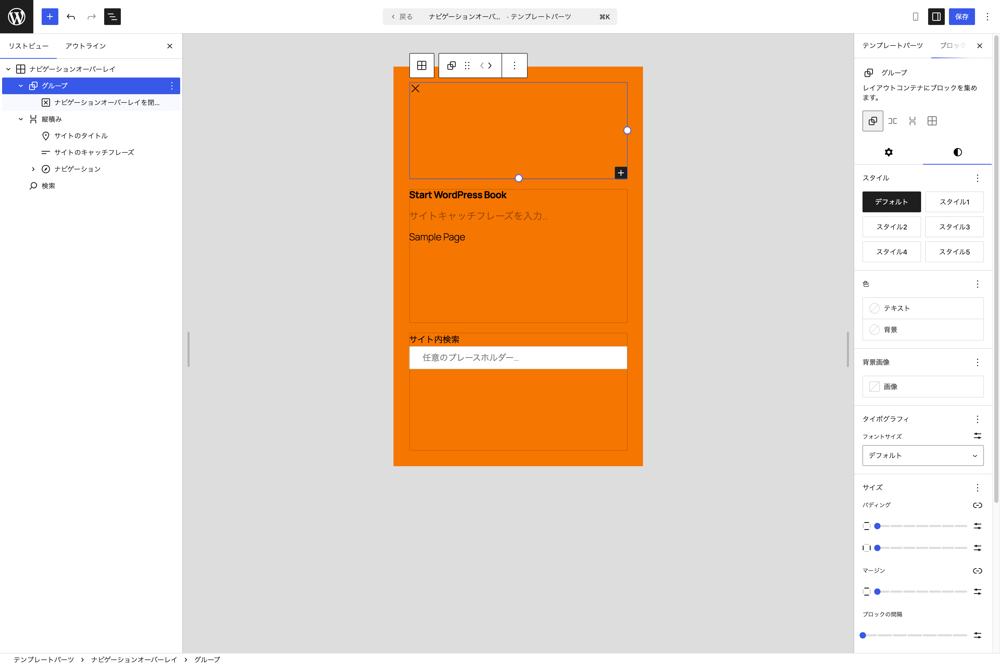{width=91.22mm}

実際の表示をエディター内のプレビュー、またはブラウザで確認してみてください。先ほど作成したオーバーレイ・ナビゲーションがハンバーガーボタンを押すことで表示されることが確認できるでしょう。

# パターン編集方法の変更

WordPress 7.0 から**パターンの編集方法**が変わります。

これまでは非同期パターンにおいては、挿入した後すぐに自由に全ての編集が可能でした。しかし、7.0 からはユーザーは自然に安全な編集範囲にとどまり、意図せずデザインを壊してしまうことがないようになりました。

## コンテンツを素早く編集

パターンを選択すると、個々のブロックのリストではなく、拡張されたインスペクターパネルが表示され、編集可能な箇所に簡単にアクセスできます。

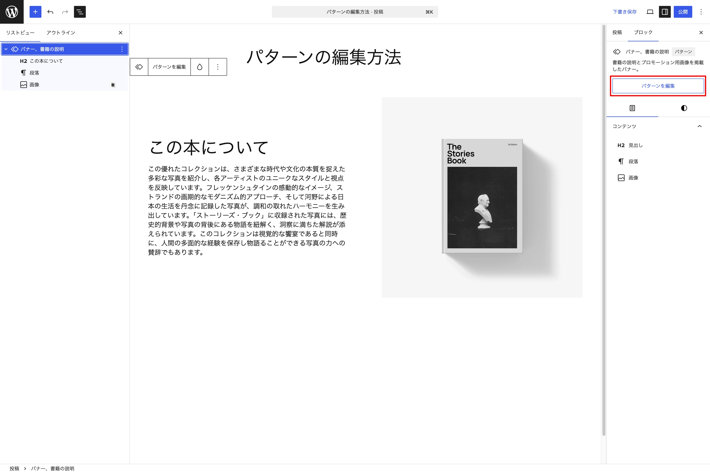{width=91.22mm}

パターンを編集したい場合には、**パターンを編集**ボタンをクリックすることで、自由にブロックの位置を変更などができるようになります。

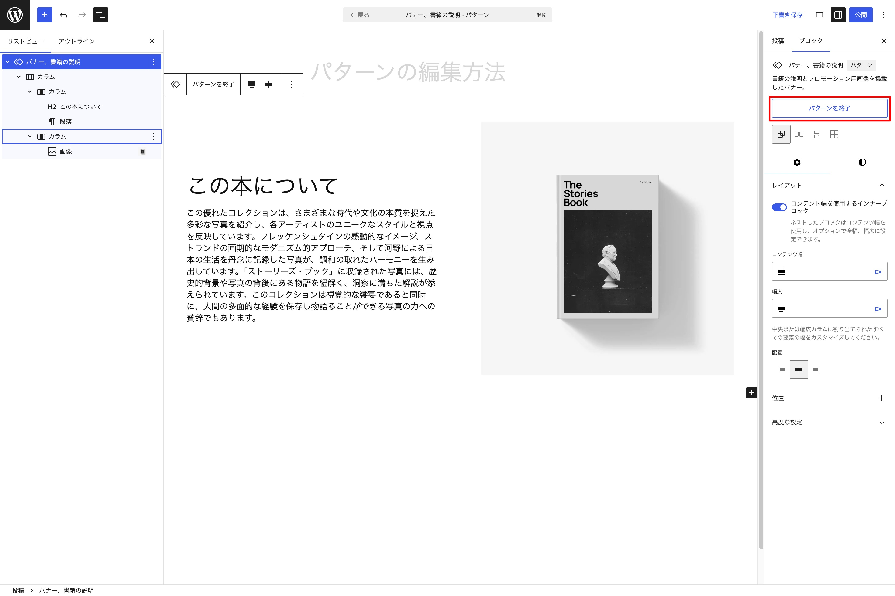{width=91.22mm}

パターンの編集を終えたら**パターンを終了**をクリックすると、パターン編集を終えることができます。

# 新しく追加されたブロック

## パンくずブロック

これまで WordPress コアブロックには、パンくずリストを表示するブロックはなく、別途プラグインなどから機能追加するしかありませんでしたが、7.0 よりコアブロックに追加されるようになりました。

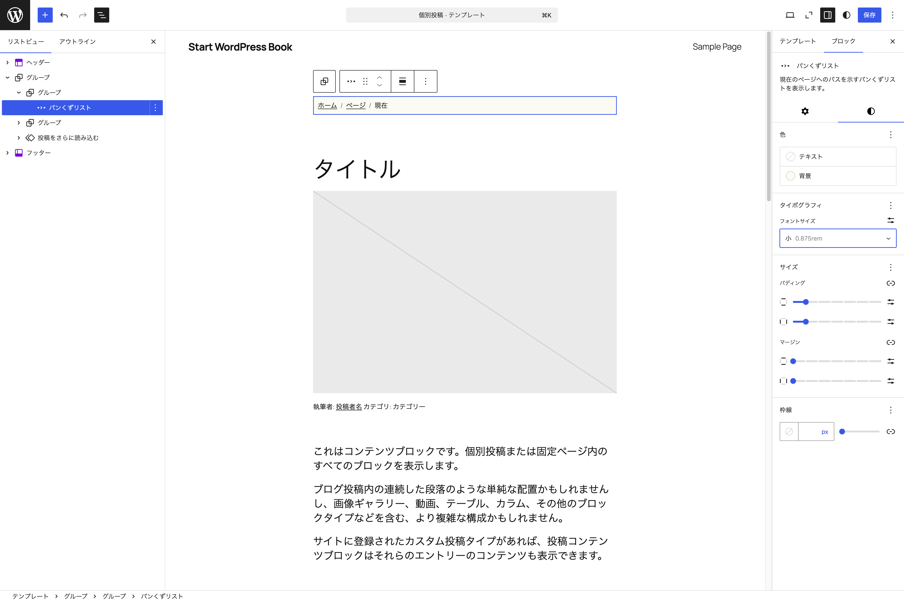{width=91.22mm}

インスペクターでも編集は可能ですが、より細かいカスタマイズもフックを利用することで実現できるようになっています。

## アイコンブロック

あらかじめ用意されている SVG アイコンを簡単に挿入できるアイコンブロックが提供されました。

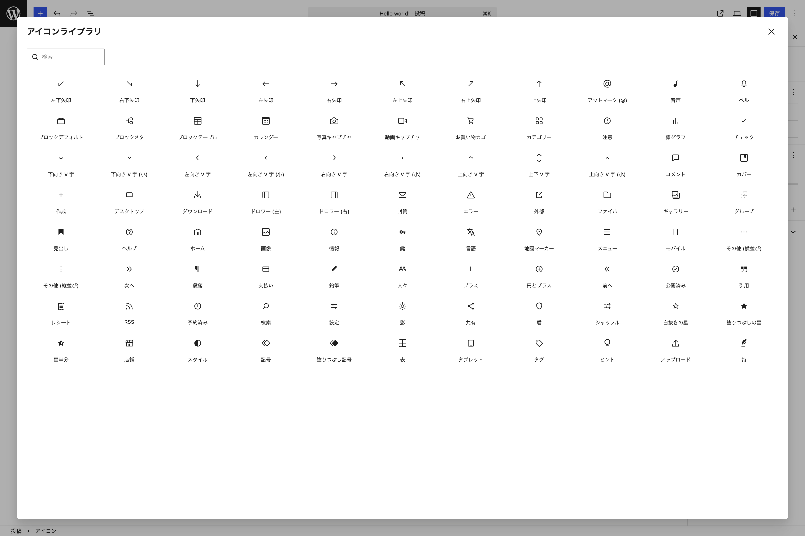{width=91.22mm}

色やサイズなども自由にインスペクターから変更可能なので、さまざまな場面で利用できるでしょう。

# 画面幅ごとにブロックの表示・非表示が切り替え可能に

デスクトップ/タブレット/モバイルで表示・非表示をブロックごとに管理できるようになりました。

管理したいブロックのツールバーのオプションから **非表示** を選択し、非表示にしたいデバイスにチェックを入れます。

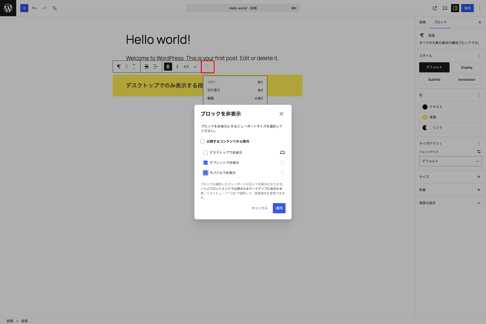{width=91.22mm}

上のようにチェックを入れることで、デスクトップ画面幅時のみ表示されます。タブレットやモバイルの画面幅では非表示になります。